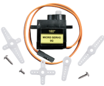
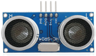
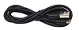

# 产品介绍
首先感谢选择keyes产品,
我们将继续为你提供好的产品和服务!

关于keyes                             
Keyes是KEYES Corporation旗下最畅销的品牌，我们的产品包括Arduino开发板、扩展板、传感器模块；树莓派、micro：bit扩展板和智能小车；以及为各阶段客户设计的完整入门套件。这些入门套件旨在为任何水平的客户学习Arduino、树莓派、micro：bit相关知识。
我们所有产品，均符合国际质量标准，在世界各地不同市场中，得到了极大的赞赏。 
欢迎从我们的官方网站查看更多内容：
http://www.keyes-robot.com

获取资料和售后服务                     
1.KEYES 4WD Raspberry Pi Pico麦克纳姆轮智能小车学习套装资料下载地址：https://pan.baidu.com/s/1EAedGH92ygOZgeq0azM9gg
提取码：Keye   
2. 如果发现某些东西丢失或损坏，或者学习套件时遇到一些困难，keyes会提供免费和快速的支持。如果您有任何疑问，请联系我们我们客服或工作人员。
3. 欢迎提出建议和反馈，我们会根据您的反馈不断更新套件和教程，以使其更好。谢谢！

产品安全                               
1.本产品内含细小的零件（螺丝，铜柱等），请放在儿童接触不到的地方，防止划伤或误食。8岁及以下儿童使用，请在大人监督下使用。
2.本产品包含导电部件(控制板和电子模块），请按照本教程的要求进行操作，不当的操作可能导致过热并且损害零件，请勿触摸并立即断开电路电源（请按照正确的方式安装电池）。

版权                                   
keyes商标和徽标是KEYES DIY ROBOT co.,LTD的版权,任何人和公司在没有授权的情况下，不得复制，售卖，转卖，keyes品牌的产品。如果您有兴趣在当地售卖我们的产品，请联系我们专业的批发销售人员。

1. KEYES 4WD Raspberry Pi Pico麦克纳姆轮智能小车学习套装的介绍：         

您想学习编程还是拥有自己的编程机器人？目前，编程已发展到较低年龄组，每个人都能编程将会是一种趋势。从micro：bit到Arduino和Raspberry Pi，简单的图形编程使每个人编程成为可能。也许您没有听说过，没关系，使用此产品和教程，您可以轻松完成一个多功能编程4wd麦克纳姆轮车，并体验作为Maker的乐趣。
Raspberry Pi Pico作为一款高度集成化、尺寸小巧、携带方便、功能强大且简单的的微型控制器，非常适合中小学生在STEAM教育的课程中使用，通过图形化和代码结合的编程方式可以制作机器人、可穿戴设备、电子互动游戏等。
这个KEYES 4WD Raspberry Pi Pico麦克纳姆轮智能小车是专门为Raspberry Pi Pico设计的智能DIY车，该智能车由具有扩展功能的车体，集成电机驱动等传感器的PCB底板，4个减速直流马达，麦克纳姆车轮，RGB灯光，传感器以及亚克力等组成，这样你就可以自己动手轻松地组装出一台酷炫的麦克纳姆轮4WD智能车。
我们针对这个车做了两个教程，一个是使用Arduino IDE开发的C语言教程，另一个是使用Thonny IDE开发的MicroPython教程。在体验安装和编程的过程中，增强动手能力，学习编程技巧。Python 语言算是一个热门的编程语言，在机器学习中，Python 语言的易用性和便捷性给机器学习带来了很大的便利。MicroPython 是针对 Python 编程语言的重新实现，针对微控制器和嵌入式系统，而C语言能让我们接触更底层的代码。

此外，如果你对本教程和工具包有任何困难或问题，可以随时向我们咨询。

2. 产品说明：
本产品集成了七彩灯，RGB2812灯珠、舵机、超声波功能、循迹功能、红外控制功能和蓝牙控制功能。其中七彩灯、RGB2812灯、电机驱动、三路巡线传感器，红外接收器（为了接收准确，我们在头尾各放置了一个）全部集成到了底板，为我们的安装提供了很大的便利；4个WS2812 RGB灯，可以显示不同颜色；2个七彩灯，可以使用它作为小车的2个方向灯。电机速度是可以通过PWM值调节的。
本产品使用2节18650锂电池串联供电，安装和拆装电池时，注意电池的正负极，务必不要把电池的正负极接反。

3. 产品的特点：          
（1）易于安装
（2）外观精美
（3）扩展性强：配置了Raspberry Pi Pico扩展板，留有很多引脚，可以扩展其他的传感器和模块。
（4）多种控制：红外遥控，手机APP蓝牙控制（苹果和安卓手机/平板都可）等。
（5）学习基础编程：Arduino C 语言编程和MicroPython语言编程，可以接触底层代码。

4. 规格参数:
底板连接器端口输入：DC 6V--9V
驱动板系统运行电压：5V
标准运行功耗：约为2.2W
最大功率：最大输出功率为12W
电机转速：200RPM
工作温度范围：0-50℃
尺寸：134×181×75mm
环保属性：ROHS 

4. KEYES 4WD Raspberry Pi Pico麦克纳姆轮智能小车学习套装的清单:            
当你收到这个KEYES 4WD Raspberry Pi Pico麦克纳姆轮智能小车学习套装的时候，请跟着下面的清单一起清点一下，确保产品完整，如果发现有配件遗漏，请第一时间联系我们的销售人员。

|序号|规格|数量|图片|
| :--: | :--: | :--: | :--: |
| 1 |Raspberry Pi Pico主板|1||
| 2 |Raspberry Pi Pico 扩展板|1||
| 3 |超声波固定亚克力折弯板|1||
| 4 |乐高孔位亚克力舵机固定平台|1||
| 5 |电机垫板|4||
| 6 |电机+线材|4||
| 7 |固定块|4||
| 8 |180度舵机|1||
| 9 |麦克纳姆轮全向轮方向A|2||
| 10 |麦克纳姆轮全向轮方向B|2||
| 11 |麦克纳姆轮小车下板（带电机驱动）|1||
| 12 |六角铜柱双通|4||
| 13 |4265c 十字轴套|4||
| 14 |43093 半摩擦销|4||
| 15 |乐高摩擦销用亚克力垫片|6||
| 16 |M3*6MM 平头 十字螺钉|8||
| 17 |HC-SR04超声波传感器|1||
| 18 |M3*8MM 平头 十字螺钉|8||
| 19 |M3 螺母|8||
| 20 |M3*30MM 圆头 十字螺钉|8||
| 21 |M2螺母| 2 ||
| 22 | M2*8MM 圆头 十字螺钉 |2 ||
| 23 |M1.4 螺母|4||
| 24 |M1.4*10MM 圆头 十字 螺钉|4 ||
| 25 |M2.3*16MM 圆头十字 自攻 螺钉|4||
|26|M1.2*5MM 圆头 十字 自攻螺钉|4||
| 27 |遥控器|1||
| 28 |扎带|5||
| 29 |连接线2P两端反向红黑|1||
| 30 |USB线|1||
|31|连接线5P两端反向白黄红黑|1||
|32|连接线4P两端反向白黄红黑|1||
|33|4P转杜邦母单绿蓝红黑线|1||
|34|连接线3P两端反向黄红黑|2||
|35|十字螺丝刀|1||
|36|3D打印TT联轴器白色|4||
|37|蓝牙模块|1||

