# Arduino C 教程

## 开发环境配置

1. Windows系统：           


1.1. 下载安装Arduino软件：
(1)首先，进入Arduino官方网站：https://www.arduino.cc/ ，点击“**SOFTWARE**”进入下载页面，如下图所示：
 


(2)然后，根据你的操作系统选择并下载相应的安装程序。如果你是Windows用户，请选择安装2.0.3版本Arduino IDE，当点击“**Windows** Win10 and newer,64bits”或“**Windows** MSI installer”，代表下载安装文件(.exe) ，需要手动安装; 当点击“**Windows** ZIP file”，代表直接下载2.0.3版本Arduino IDE，是一个压缩文件，解压就可以直接使用，无需安装。


 点击下面图标，就可直接安装Arduino IDE了。


一般情况下，点击“**JUST DOWNLOAD**”就可以下载了，当然如果你愿意，你可以选择小小的赞助，以帮助伟大的Arduino开源事业。

(3)Arduino软件下载完成后,如果你是点击“**Windows** Win10 and newer,64bits”或“**Windows** MSI installer”下载的(.exe)文件“**arduino-ide_2.0.3_Windows_64bit.exe**” ，需要双击(.exe)文件继续安装，当你收到操作系统的警告时，请点击“**Allow access**”允许驱动程序安装。首先点击“**I Agree**”, 然后选择“Anyone who uses this computer(all users)”后再点击Next。


(4)点击“**Next**”后，如果又出现下面页面，点击“**I Agree**”。


(5)选择安装目录(我们建议保持默认目录)，然后点击“**Install**”。
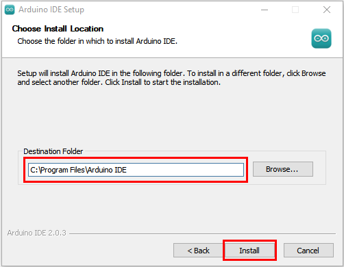

(6)如果出现以下界面，则应选择“**Install**”。


该过程将提取并安装所有必需的文件，以正确执行Arduino软件(IDE)。


(7)安装完成后，会在桌面上生成一个Arduino IDE软件快捷方式。


(8)在电脑桌面上点击Arduino IDE软件快捷方式打开Arduino IDE。


(9)点击“File”→“Preferences”，选择“中文(简体)”之后点击“OK”。这样就对语言进行设置好了。


1.2. Arduino IDE工具栏介绍：
**点击电脑桌面上的图标，打开Arduino IDE。**


 -- 用于检查是否存在任何编译错误。
 -- 用于将程序上传到Arduino板。
 -- 用于编写程序时的单步调试。
 -- 用于从板接收串行数据并将串行数据发送到板的串行监视器。
 -- 用于串口接收的数据转换成动态曲线图。
 -- 用于打开最近保存的示例草图。
 -- 用手动安装开发板。

1.3. 安装开发板Pico
(相关资讯：https://github.com/earlephilhower/arduino-pico)
（1）网络连接良好的情况下，打开Arduino IDE，点击“文件”→“首选项”。

（2）打开下图标出的按钮。
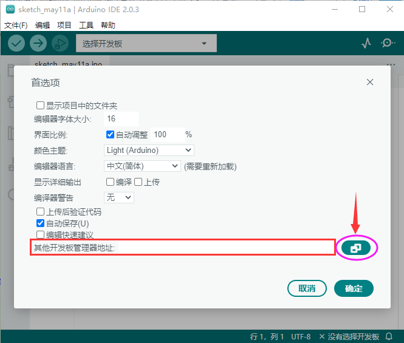
（3）将这个地址：https://github.com/earlephilhower/arduino-pico/releases/download/global/package_rp2040_index.json ，复制粘贴到里面去再点击“**确定**”保存这个地址，如下图：

（4）再点击“**确定**”。

（5）单击“工具”→“开发板”→“开发板管理器...”。

（6）在搜索框中输入<span style="color: rgb(255, 76, 65);">“Pico”</span>，选择“**Raspberry Pi Pico/rp2040 by Earla F.Philhower**”，点击“**安装**”。

（7）安装过程中，当你收到操作系统的安全警告时，请单击**安装**允许设备软件安装。


（8）安装完成后，单击“工具”→“开发板”，就可以看到刚刚安装的开发板Raspberry Pi Pico。


1.4. 安装驱动方法：
（<span style="color: rgb(255, 76, 65);">注意：如果电脑已经安装了驱动程序，则不需要再安装驱动；如果没有，则需要进行以下操作：</span>）

**Windows 10 系统：**

在使用Raspberry Pi Pico主板之前，必须安装驱动程序，否则Raspberry Pi Pico主板将无法与计算机通信。将Raspberry Pi Pico主板用USB线连接到电脑上，一般Windows10系统的电脑会自动识别串口，并安装相应的驱动程序，在设备管理器里可以找到“USB串行设备”。
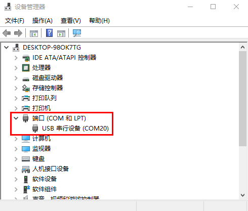

**Windows 7/8 系统：**

如果你的电脑仍在用Windows7/8操作系统，当把Raspberry Pi Pico主板插到USB口后，电脑会发现一个"**Board CDC**"设备，但不能自动识别它，也无法安装驱动。

接下来你就可以参照“**1. 开发环境配置**”文件夹中的文件“**Raspberry Pi Pico win7系统不能识别端口解决办法**”来设置Windows7/8操作系统的驱动安装。


1.5. 上传Arduino兼容的Pico固件：
如果你的Raspberry Pi Pico板是新的，想使用Arduino学习和开发，则需要上传一个Adruino兼容的Raspberry Pi Pico固件。请参考以下步骤配置:

（1）断开Raspberry Pi Pico板与电脑的连接。继续按住Raspberry Pi Pico板上的白色按钮(BOOTSEL)，将Raspberry Pi Pico板连接到电脑。

等待电脑右下角出现Raspberry Pi Pico板对应的盘(RPI-RP2)，几秒钟之后再松开白色按钮(BOOTSEL)。<span style="color: rgb(255, 76, 65);">(注意：盘(RPI-RP2)出现前一定要一直按住白色按钮)</span>

（2）打开Arduino IDE，先单击“**工具**”→“**开发板**”，选择开发板Raspberry Pi Pico，然后再单击“**工具**”→“**端口**”，就可以看见端口“**UF2 Board** ”。


（3）打开Arduino IDE，单击 “**文件**”→“**示例**”→“**01.Basics**”→“**Blink**”。

（4）单击“**工具**”→“**开发板:**”→“**Raspberry Pi Pico/RP2040**”→“**Raspberry Pi Pico**”。

（5）单击“**工具**”→“**端口**”，选择端口“**UF2 Board** ”。

（6）点击上传按钮上传草图（Blink）到 Raspberry Pi Pico。

当草图完成上传时，可以看到以下提示。

（7）Raspberry Pi Pico板上的指示灯开始闪烁。

（8）单击“工具”→“端口”→COMx。COMx的X在不同的电脑上是不同的。请在你的电脑上选择正确的COM口。在这个的例子中，它是COM25。
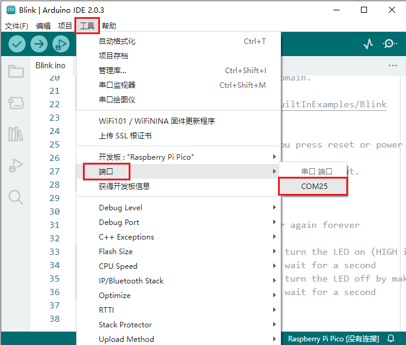

<span style="color: rgb(255, 76, 65);">**特别注意:**</span>

A.每次使用Arduino IDE上传Raspberry Pi Pico的代码程序之前，都需要再次选择开发板(Raspberry Pi Pico)和端口(COMx)，否则可能导致代码上传失败。
B.有时在使用时，Raspberry Pi Pico可能会由于代码丢失固件而无法工作。此时，你可以如上所述步骤重新操作下上传Raspberry Pi Pico的固件。

2.Mac系统:

2.1.下载安装Arduino IDE:
进入Arduino官方网站：https://www.arduino.cc/ ，点击“**SOFTWARE**”进入下载页面，如下图所示：

接下来的操作类似于Windows系统，可以参考上面的Windows系统操作过程。

3.添加arduino库文件

我们提供的Arduino库文件的路径：**..\KEYES 4WD Raspberry Pi Pico 麦克纳姆轮智能小车\3. Arduino C 教程\4. Arduino 库文件**。如下图：


3.1. Windows系统添加库文件的方法：

（1）打开Arduino IDE，在Arduino IDE界面点击“**项目**”→“**包含库**”→“**添加.ZIP库...**”。


（2）找到库文件存放的位置，选中对应的库文件，点击“**打开**”添加即可。库文件只能一个一个的添加。（<span style="color: rgb(255, 76, 65);">注意：库文件需要压缩为 **.ZIP**格式，我们在文件夹中是以 **.ZIP** 格式提供有；这里以“**ir.ZIP**”为演示，其他库文件的添加方法是一样的。</span>）


3.2. MacOS系统的库文件添加方法: 
（1）arduino IDE界面选择“**项目**” > “**包含库**” > “**添加.ZIP库...**”。


（2）找到库文件存放的位置，选中对应的库文件，再点击“打开”，库文件只能一个一个的添加。（<span style="color: rgb(255, 76, 65);">这里以添加“**ir.ZIP**”库文件为例，其他库文件的添加方法一样</span>），如下图：


到这，正常是安装成功的了。


### Raspberry Pi Pico win7/8系统不能识别端口解决办法

按照下面这个步骤操作，第一次上传后没有出现端口。

打开示例代码后，编译前，要特別注意操作的顺序：
(1) 先断开Raspberry Pi Pico USB电源
(2) 按住开发板上白色 BOOTSEL 按鍵，然后插上USB电源 
(3) 点击Arduino IDE下的上传按钮，进行编译并上传至Raspberry Pi Pico开发板。 
(4) 等到编译“正在编译项目...”，下面提示信息出现上传中“正在上传...”，再松开BOOTSEL按键。
(5) 等待至上传完毕“上传完成”才算完成。
第一次上传过程中一定要注意这个顺序，不然则导致上传失败，后面上传选择对应的“端口”直接点击上传即可。上传完成后，就可以看到Raspberry Pi Pico开发板上的LED在闪烁。
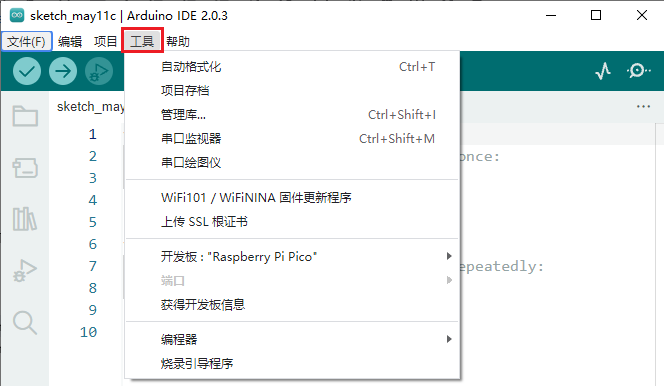


接下来按照下面的操作步骤操作，可以出现串口。
第一步：将Raspberry Pi Pico开发板通过USB线连接到电脑。
第二步：打开我们提供的软件。
第三步：USB ID 红色框内为<span style="color: rgb(255, 76, 65);">2E8A</span> 。     
Driver红色框内为 USB Serial(CDC)，后面的箭头可以选择。

第四步:点击下载，等待下载完毕就成功了，这一步最好关闭杀毒软件。


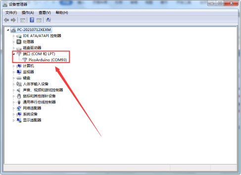
<span style="color: rgb(255, 76, 65);">如果第一次没成功那就拔掉Raspberry Pi Pico板重新再插上，再重新安装一遍。</span>


## 产品安装

安装1

安装所需零件:
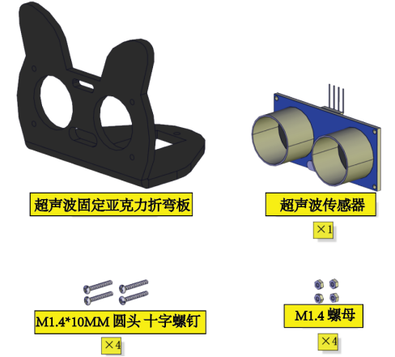

安装:


完成:


安装2

安装所需零件:


安装:


完成:


安装3

安装所需零件：


安装：


完成：


安装4

**舵机初始化：**
安装前需要先设置舵机角度为90°。设置舵机角度时，将舵机连接在Raspberry Pi Pico扩展板的G、V、GIO2，在Raspberry Pi Pico主控板上上传对应代码，外接电源供电后，舵机就转到90°的位置。
| 舵机 | Microbit扩展板 |
| :--: | :--: |
| 棕线 | G |
| 红线 | V |
| 橙线 | G2 |


```
/*
  初始化舵机角度为90°
*/
##define  servo_pin  2      //舵机接GP2

void setup() {
    pinMode(servo_pin, OUTPUT);    //舵机引脚设置为输出模式
    servopulse(servo_pin, 90);  //转动到90°角度
    delay(500);
}

void loop() {

}

void servopulse(int pin, int myangle) {   //脉冲函数
  int pulsewidth = map(myangle, 0, 180, 500, 2500); //将角度映射到脉宽
  //输出脉冲
  digitalWrite(pin, HIGH);        //将舵机接口电平至高
  delayMicroseconds(pulsewidth);  //延时脉宽值的微秒数
  digitalWrite(pin, LOW);         //将舵机接口电平至低
  delay(20 - pulsewidth / 1000);  //周期为20ms
}

```
我们提供的初始化舵机角度的代码位置如下图：


安装所需零件：


安装：
<span style="color: rgb(255, 76, 65);">(注意安装方向)</span>


完成：


安装5

安装所需零件：


安装：


完成：


安装6

安装所需零件：


安装：


完成：


安装7

安装所需零件：


安装：
<span style="color: rgb(255, 76, 65);">（注意电机安装方向，线材方向朝内）</span>


完成：


安装8

安装所需零件：


安装：


完成：


安装9

安装所需零件：


安装：


完成：


安装10

安装准备零件：


安装：


完成：


安装11

安装准备零件：


安装：


完成：


接线

舵机接线：
| 舵机 | Raspberry Pi Pico 扩展板 |
| :--: | :--: |
| 棕线 | G |
| 红线 | 5V |
| 橙线 | G2 |


超声波模块接线：
| 超声波模块 | Raspberry Pi Pico 扩展板 |
| :--: | :--: |
| Vcc | 5V|
| Trig | G3 |
| Echo |G4|
|Gnd|G|


控制红外模块接线：
| 驱动板 |Raspberry Pi Pico 扩展板 |
| :--: | :--: |
| GND | G|
| 5V | 5V |
| S5 | G6|


控制WS2812RGB接线：
| 驱动板 | Raspberry Pi Pico 扩展板 |
| :--: | :--: |
| GND | G|
| 5V | 5V |
| S4 | G7|


控制电机和七彩灯接线:
| 驱动板 | Raspberry Pi Pico 扩展板 |
| :--: | :--: |
| SCL | G21|
| SDA | G20 |
|5V | 5V|
|GND|G|


控制三路循迹模块接线:
| 驱动板 | Raspberry Pi Pico 扩展板 |
| :--: | :--: |
| S1 | G18|
| S2 | G17 |
|S3| G16|
| | |
|GND|G|


电源接线:


电机接到对应的接口上:


电池安装示范:


## 项目课程

### 第00课 板载LED闪烁

1.实验介绍：
Raspberry Pi Pico上有个板载LED，这个LED是固定接在Raspberry Pi Pico上的GP25引脚，在这个项目中，我们将来学习使板载LED闪烁的效果。

2.实验元件：
|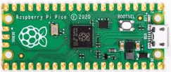|  |
| :--: | :--: |
| Raspberry Pi Pico*1 |USB 线*1 |

3.实验接线：
在本项目中，用USB线将Raspberry Pi Pico和电脑连起来。连接方法请参照文档：<span style="color: rgb(255, 76, 65);">开发环境配置</span>


4.实验代码：
Raspberry Pi Pico板载LED是由GP25控制，当GP25输出高电平时，LED点亮;当输出低时，LED灯关闭。

```
//**********************************************************************
/*
第00课：板载LED闪烁
使PICO主板上的LED闪烁.
*/
##define LED_BUILTIN 25

// 按复位键或单板上电时，设置功能运行一次
void setup() {
  // 初始化数字引脚LED_BUILTIN作为输出模式.
  pinMode(LED_BUILTIN, OUTPUT);
}

// 循环函数会一直运行下去
void loop() {
  digitalWrite(LED_BUILTIN, HIGH);   // 点亮LED (HIGH是高电平)
  delay(1000);                       // 延时1秒
  digitalWrite(LED_BUILTIN, LOW);    // 通过使电压为0来关闭LED
  delay(1000);                       // 延时1秒
}
//*************************************************************************************

```

5.实验结果：
选择好开发板(Raspberry Pi Pico)和端口(COMx)，编译上传代码完成后，利用USB线上电，可以看到的现象是：Raspberry Pi Pico的LED开始闪烁，循环进行。


### 第01课 七彩灯闪烁
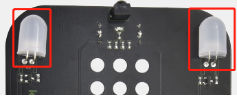

1. 实验说明：
这是一个常用的LED，它是一个七彩LED，它采用7彩自动闪烁LED（外观白色，显示七彩）元件。七色LED模块可自动闪烁内置颜色。可以用来制作相当迷人的灯光效果。这个模块与普通LED驱动相同，当我们给它输入高电平时将自动闪烁七种颜色，而输入低电平时将停止闪烁。
我们已经将7彩LED集成到电机驱动底板，在这个项目中，我们用两个最基本的实验代码分别来控制这个七彩LED。LED模块信号端S为高电平时七彩LED开始自动闪烁，S为低电平时七彩LED熄灭不再闪烁。

2. 相关知识：                                                          


                  
两个七彩灯分别通过三极管来控制，信号端分别接到了P5.4和P5.5，所以我们只要控制这两个引脚输出高低电平即可控制两个七彩灯。

3. 添加库文件：
首先我们先确保安装了库文件，不然代码会编译出错，这里我们用到库文件“<span style="color: rgb(255, 76, 65);">MecanumCar_v2</span>”，如何安装库文件请参考Arduino C 教程中的“<span style="color: rgb(0, 209, 0);">开发环境配置</span>”文件。如果库文件已经添加好了，就跳过这一步骤。


4. 实验代码：
```
/*
  KEYES 4WD Raspberry Pi Pico 麦克纳姆轮智能小车
  第1课
  七彩灯闪烁
*/
##include "MecanumCar_v2.h"
mecanumCar mecanumCar(20, 21);  //sda-->20,scl-->21

void setup() {
  mecanumCar.Init();//初始化电机与七彩灯驱动
}

void loop() {
  mecanumCar.right_led(1);//开启右边七彩灯闪烁
  mecanumCar.left_led(1); //开启左边七彩灯闪烁
  delay(3000);            //延时3000毫秒
  mecanumCar.right_led(0); //关闭右边七彩灯闪烁
  mecanumCar.left_led(0);  //关闭左边七彩灯闪烁
  delay(1000);             //延时1000毫秒
}

```                                                 
5. 实验结果：
安上电池，将电机驱动底板上的电源拨码开关拨到ON一端，开启电源。选择好开发板(Raspberry Pi Pico)和端口(COMx)，编译上传代码完成后，我们就可以看到底板的2个七彩LED闪烁3秒然后熄灭1秒，然后再次闪烁3秒再熄灭一秒。如此反复循环。


6. 代码说明: 
| #include "MecanumCar_v2.h" | 导入MecanumCar_v2的头文件，然后我们才能使用这个库文件的一些接口函数 |
| :--: | :--: |
|void setup() | 一些初始化设置代码，这里的代码只运行一次 |
| mecanumCar mecanumCar(sda, scl); | 创建一个小车驱动的类实例，用来驱动小车的电机和七彩灯，sda接GPIO20，scl接GPIO21，可以更改接线。 |
| void loop() | 主循环，相当于while(1)，这里面的代码反复循环运行 |
| mecanumCar.Init(); | 初始化小车驱动。 |
| mecanumCar.right_led(1); | 参数为1时，输出高电平到右边七彩灯的信号引脚，点亮LED |
| mecanumCar.right_led(0); | 参数为0时，输出低电平到右边七彩灯的信号引脚，熄灭LED |
| mecanumCar.left_led(1); | 参数为1时，输出高电平到左边七彩灯的信号引脚，点亮LED |
| mecanumCar.left_led(0); | 参数为0时，输出低电平到左边七彩灯的信号引脚，熄灭LED |
| delay(1000); | 延时1000毫秒 |

   # 第02课 WS2812RGB


1. 实验说明：                                                                                
在前一个项目中，我们详细的介绍了通过代码控制七彩LED闪烁。这节课我们使用WS2812灯珠来显示真正的多彩灯，理论上我们可以通过编程实现我们想要显示的任意的颜色。
但是这个2812 RGB 驱动原理与我们前面学习过的七彩LED不相同，但是也只需要一个引脚就能控制，这是一个集控制电路与发光电路于一体的智能外控LED光源。每个LED原件其外型与一个5050LED灯珠相同，每个元件即为一个像素点，我们这个电机驱动板上有四个灯珠即四个像素。在本项目中我们控制4个WS2812 RGB灯显示不同的状态。

2. 元件知识： 

这四个像素点灯珠都是串联起来的，其实不论多少个，我们都可以用一个引脚（控制引脚为<span style="color: rgb(255, 76, 65);">G7</span>）控制任意一个灯，并且让它显示任一种颜色。像素点内部包含了智能数字接口数据锁存信号整形放大驱动电路，还包含有高精度的内部振荡器和12V高压可编程定电流控制部分，有效保证了像素点光的颜色高度一致。数据协议采用单线归零码的通讯方式，像素点在上电复位以后，S端接受从控制器传输过来的数据，首先送过来的24bit数据被第一个像素点提取后，送到像素点内部的数据锁存器。这个2812RGB通讯协议与驱动已经在底层封装好了，我们直接调用函数的接口就可以使用。

3. 添加库文件：
首先我们先确保安装了库文件，不然代码会编译出错，这里我们用到库文件“<span style="color: rgb(255, 76, 65);">rgb</span>”，如何安装库文件请参考Arduino C 教程中的“<span style="color: rgb(0, 209, 0);">开发环境配置</span>”文件。如果库文件已经添加好了，就跳过这一步骤。


4. 实验代码1：                                                                               
```
/*
  KEYES 4WD Raspberry Pi Pico 麦克纳姆轮智能小车
  第2.1课
  WS2812
*/
##include "rgb.h"

//创建一个用于控制rgb的类,名为rgb,共4个灯珠,引脚连接到GP7
RGB rgb(7, 4);  //rgb(pin, num);  num = 0-100

void setup() {
  rgb.setBrightness(100);  //rgb亮度(0-255);
  delay(10);
  rgb.clear();  //关闭所有的灯
  delay(10);

  rgb.setPixelColor(0, 255, 0, 0);//第1个灯珠亮红
  rgb.setPixelColor(1, 0, 255, 0);//第2个灯珠亮绿色
  rgb.setPixelColor(2, 0, 0, 255);//第3个灯珠亮蓝
  rgb.setPixelColor(3, 255, 255, 255);//第4个灯珠亮白色
  rgb.show();    //刷新显示
}

void loop() {
}

```
5. 实验结果1：                                                                                
安上电池，将电机驱动底板上的电源拨码开关拨到ON一端，开启电源。选择好开发板(Raspberry Pi Pico)和端口(COMx)，编译上传代码完成后，我们就可以看到底板的4个2812灯珠分别亮起红、绿、蓝、白。


6. 实验代码2：                                                                               
```
/*
  KEYES 4WD Raspberry Pi Pico 麦克纳姆轮智能小车
  第2.2课
  WS2812
*/
##include "rgb.h"
//创建一个用于控制rgb的类,名为rgb,共4个灯珠,引脚连接到GP7
RGB rgb(7, 4);  //rgb(pin, num);  num = 0-100

void setup() {
  rgb.setBrightness(100);  //rgb.亮度(0-255);
  delay(10);
  rgb.clear();  //关闭所有的灯
  delay(10);

}

void loop() {
  uint8_t r = random(0, 255);
  uint8_t g = random(0, 255);
  uint8_t b = random(0, 255);
  for (uint8_t i = 0; i < 4; i++)
  {
    rgb.setPixelColor(i, r, g, b);//第i+1个灯珠颜色为随机(r,g,b)
    rgb.show();    //刷新显示
    delay(100); //等待一会儿
  }
}

```

7. 实验结果2： 
安上电池，将电机驱动底板上的电源拨码开关拨到ON一端，开启电源。选择好开发板(Raspberry Pi Pico)和端口(COMx)，编译上传代码完成后，我们将看到4个灯珠显示不同的颜色，颜色逐渐变化。

8. 代码说明：                                                                               
|#include "rgb.h"|导入rgb的头文件，然后我们才能使用这个库文件的一些接口函数|
| :--: | :--: | 
|RGB rgb(pin, num); | 创建一个2812灯驱动的类实例，用来驱动2812灯，pin接为引脚号，num为灯珠数量，我们这里接的GPIO7,4个灯珠，所以是(7， 4).|
|rgb.setBrightness(100);|设置灯珠亮度为100，范围为0~255，越大越亮 |
| rgb.clear();|关闭所有灯珠 |
|rgb.setPixelColor(num, r, g, b); |设置灯珠的颜色，num为灯珠号，4颗灯珠号分别为0、1、2、3；r,g,b为灯珠显示的颜色|
|rgb.show(); | 刷新显示，如果不调用该函数，设置的颜色不会更新|
|random(0, 255);| 在0~255直接取随机数 |

### 第03课 舵机转动

1. 实验说明：                                                                                
在前面的4WD Raspberry Pi Pico麦克纳姆轮智能小车安装步骤文档中，我们已经设置了舵机角度。舵机是一种可以非常精确地旋转的电机。目前已广泛应用于玩具车、遥控直升机、飞机、机器人等领域。在这个项目中，我们将来学习有关舵机转动。

2. 元件知识： 

**舵机：** 舵机是一种位置伺服的驱动器，主要是由外壳、电路板、无核心马达、齿轮与位置检测器所构成。其工作原理是由接收机或者单片机发出信号给舵机，其内部有一个基准电路，产生周期为20ms，宽度为1.5ms 的基准信号，将获得的直流偏置电压与电位器的电压比较，获得电压差输出。经由电路板上的IC 判断转动方向，再驱动无核心马达开始转动，透过减速齿轮将动力传至摆臂，同时由位置检测器送回信号，判断是否已经到达定位。适用于那些需要角度不断变化并可以保持的控制系统。当电机转速一定时，通过级联减速齿轮带动电位器旋转，使得电压差为0，电机停止转动。
舵机有多种规格，但它们都有三根连接线，分别是棕色、红色、橙色(不同品牌可能有不同的颜色)。棕色为GND，红色为电源正极，橙色为信号线

舵机的伺服系统由可变宽度的脉冲来进行控制，橙色的控制线是用来传送脉冲的。一般而言，PWM控制舵机的基准信号周期为20ms（50Hz），理论上脉宽应在1ms到2ms之间，对应控制舵机角度是0°～180°。但是，实际上更多控制舵机的脉宽范围是0.5ms 到2.5ms，具体需要自己实际调试下。
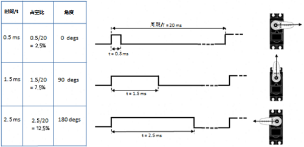
经过实测，舵机的脉冲范围为0.65ms~2.5ms。180度舵机，对应的控制关系是这样的：
|高电平时间|舵机角度|基准信号周期时间（20ms）|
| :--: | :--: | :--: |
|0.65ms|0度|0.65ms高电平+19.35ms低电平|
|1.5ms|90度|1.5ms高电平+18.5ms低电平|
|2.5ms|180度|2.5ms高电平+17.5ms低电平|

舵机的规格参数：
|工作电压：|DC 4.8V〜6V|
| :--: | :--: |
|可操作角度范围：|可操作角度范围：|
|脉波宽度范围：|500→2500 μsec|
|外观尺寸：|22.9*12.2*30mm|
|空载转速：|0.12±0.01 sec/60度（DC 4.8V）  0.1±0.01 sec/60度（DC 6V）|
|空载电流：|200±20mA（DC 4.8V）  220±20mA（DC 6V）|
|停止扭力：|1.3±0.01kg·cm（DC 4.8V）  1.5±0.1kg·cm（DC 6V）|
|停止电流：|≦850mA（DC 4.8V）  ≦1000mA（DC 6V）|
|待机电流：|3±1mA（DC 4.8V）  4±1mA（DC 6V）|
|重量:|9±1g (不带舵机轴)|
|使用温度：|-30℃~60℃|

<span style="color: rgb(255, 76, 65);">这里要注意，不要使用电脑和USB数据线供电，因为如果电流需求大于500mA，会有烧坏舵机的可能，推荐使用电池外置供电。</span>

3. 实验代码1：

```
/*
  KEYES 4WD Raspberry Pi Pico 麦克纳姆轮智能小车
  第3.1课
  舵机转动
*/
##define  servo_pin  2      //舵机接GP2

void setup() {
  pinMode(servo_pin, OUTPUT);    //舵机引脚设置为输出模式
}

void loop() {
  for (uint8_t angle = 0; angle < 180; angle++)
  {
    servopulse(servo_pin, angle); //转动到angle角度
    delay(15);  //等待一会,以免转得太快
  }
  for (uint8_t angle = 180; angle > 0; angle--)
  {
    servopulse(servo_pin, angle); //转动到angle角度
    delay(15);  //等待一会,以免转得太快
  }
}

void servopulse(int pin, int myangle) {   //脉冲函数
  int pulsewidth = map(myangle, 0, 180, 500, 2500); //将角度映射到脉宽
  //输出脉冲
  digitalWrite(pin, HIGH);        //将舵机接口电平至高
  delayMicroseconds(pulsewidth);  //延时脉宽值的微秒数
  digitalWrite(pin, LOW);         //将舵机接口电平至低
  delay(20 - pulsewidth / 1000);  //周期为20ms
}
```
4. 实验结果1：                                                                                
安上电池，将电机驱动底板上的电源拨码开关拨到ON一端，开启电源。选择好开发板(Raspberry Pi Pico)和端口(COMx)，编译上传代码完成后，我们就可以看到舵机从0度到180度之间来回转动了。

5. 添加库文件：
首先我们先确保安装了库文件，不然代码会编译出错，这里我们用到库文件“<span style="color: rgb(255, 76, 65);">Servo</span>”，如何安装库文件请参考Arduino C 教程中的“<span style="color: rgb(0, 209, 0);">开发环境配置</span>”文件。如果库文件已经添加好了，就跳过这一步骤。


6. 实验代码2：

```
/*
  KEYES 4WD Raspberry Pi Pico 麦克纳姆轮智能小车
  第3.2课
  舵机转动
*/
##include <Servo.h>
Servo myservo;    //定义一个舵机类实例

void setup() {
  myservo.attach(2);    //舵机引脚连接到GPIO2
}

void loop() {
  for (uint8_t angle = 0; angle < 180; angle++)//从0到180度
  {
    myservo.write(angle); //转动到angle角度
    delay(15);  //等待一会,以免转得太快
  }
  for (uint8_t angle = 180; angle > 0; angle--)//从180到0度
  {
    myservo.write(angle); //转动到angle角度
    delay(15);
  }
}
```
7.实验结果2  ：                                                                                
安上电池，将电机驱动底板上的电源拨码开关拨到ON一端，开启电源。选择好开发板(Raspberry Pi Pico)和端口(COMx)，编译上传代码完成后，我们就可以看到舵机从0度到180度之间来回转动了。一般我们使用舵机库来驱动，这样使用了定时器更精确。

8. 代码说明：                                                                               
|#define  servo_pin  2|导定义舵机的引脚号为GPIO2|
| :--: | :--: | 
|pinMode(servo_pin, OUTPUT);| 设置连接舵机的引脚为输出模式，设置完后可输出高/低电平。|
|servopulse(servo_pin, angle);|脉冲函数，使连接servo_pin引脚的舵机转动到angle角度位置。|
|map(myangle, 0, 180, 500, 2500);|映射函数，把myangle这个变量从0~180映射到500到2500，比如当myangle为90时，映射出来的值就是1500。 |
|digitalWrite(pin, HIGH);|第一个参数pin为输出的引脚，第二个参数为HIGH时，输出高电平（3.3V）|
|digitalWrite(pin, LOW); | 第一个参数pin为输出的引脚，第二个参数为LOW时，输出低电平（0V）|
|delayMicroseconds(pulsewidth);| 延时pulsewidth微秒 |
|#include <Servo.h>|舵机库文件|
|Servo myservo; |定义一个舵机类实例|
|myservo.attach(2); |舵机引脚连接到GPIO2|
| for (uint8_t angle = 0; angle < 180; angle++)//从0到180度|从0到180度|
|myservo.write(angle);|转动到angle角度|


### 第04课 电机控制


1. 实验说明：                                                                                
要想让小车跑起来那必须要有电机，然后搭配车轮就可以了。我们这个套件上配有4个直流减速电机，即齿轮减速电机，是在普通直流电机的基础上，加上配套齿轮减速箱。齿轮减速箱的作用是，提供较低的转速，较大的力矩。同时，齿轮箱不同的减速比可以提供不同的转速和力矩。这大大提高了直流电机在自动化行业中的使用率，减速电机是指减速机和电机（马达）的集成体，这种集成体通常也可称为齿轮马达或齿轮电机。减速电机广泛应用于钢铁行业、机械行业等。使用减速电机的优点是简化设计、节省空间。
电机的驱动不比LED，它要求的电流比较大，如果我们使用IO口强制驱动电机，要么电机不转动，要么烧坏单片机，所以我们需要一个电机驱动芯片。在电机驱动底板板上已经包含了DRV8833电机驱动芯片，用来控制4个直流减速电机的转动方向和转动速度。下面也有电机驱动底板两个芯片的电路原理图。

2. 相关知识： 


每个芯片控制4个引脚，每两个引脚控制一个电机，这样就使用了8个引脚控制了4个电机了。我们可以看到电机驱动与STC的接线图，我们驱动电机的时候使用IIC协议往STC这个芯片对应的寄存器地址写入脉宽值就可以输出pwm信号给电机驱动芯片了，我们已经写好了电机驱动的库文件，使用的时候只需要调用API函数就可以让小车走了，非常简单。

3. 添加库文件：
首先我们先确保安装了库文件，不然代码会编译出错，这里我们用到库文件“<span style="color: rgb(255, 76, 65);">MecanumCar_v2</span>”，如何安装库文件请参考Arduino C 教程中的“<span style="color: rgb(0, 209, 0);">开发环境配置</span>”文件。如果库文件已经添加好了，就跳过这一步骤。


4. 实验代码：

```
/*
  KEYES 4WD Raspberry Pi Pico 麦克纳姆轮智能小车
  第4课
  舵机转动
*/
##include "MecanumCar_v2.h"
mecanumCar mecanumCar(20, 21);  //sda-->20,scl-->21

void setup() {
  mecanumCar.Init();  //初始化麦轮车驱动
}

void loop() {
  mecanumCar.Advance();
  delay(2000);            //等待2秒
  
  mecanumCar.Back();      //后退
  delay(2000);
  
  mecanumCar.Turn_Left(); //左转
  delay(2000);

  mecanumCar.Turn_Right();//右转
  delay(2000);

  mecanumCar.Stop();      //停止
  delay(1000);
}
```
5. 实验结果：                                                                                
安上电池，将电机驱动底板上的电源拨码开关拨到ON一端，开启电源。选择好开发板(Raspberry Pi Pico)和端口(COMx)，编译上传代码完成后，我们就可以看到小车前进2秒然后后退2秒，然后左转2秒再右转2秒，最后停止一秒，如此反复循环。

6. 代码说明:
|#include "MecanumCar_v2.h"| 导入MecanumCar_v2的头文件，然后我们才能使用这个库文件的一些接口函数|
| :--: | :--: | 
|mecanumCar mecanumCar(sda, scl); |创建一个小车驱动的类实例，用来驱动小车的电机和七彩灯，sda接GPIO20，scl接GPIO21，可以更改接线 |
| mecanumCar.Init(); | 初始化小车驱动 |
| mecanumCar.Advance(); |调用此函数时，4个电机向前转，小车前进 |
| mecanumCar.Back(); | 调用此函数时，4个电机向后转，小车后退 |
| mecanumCar.Turn_Left(); | 调用此函数时，左边2个电机向后转，右边2个电机向前转，小车左旋转 |
| mecanumCar.Turn_Right(); | 调用此函数时，左边2个电机向前转，右边2个电机向后转，小车右旋转 |
| mecanumCar.Stop(); | 调用此函数时，4个电机停止转动，小车停止 |
| delay(2000); | 等待2秒 |


### 第05课 循迹传感器

1.实验说明：                                                                                 
循迹传感器实际上是红外传感器。 在小车驱动底板的前面有3路巡线，此处使用的组件是TCRT5000红外灯管。 其工作原理是利用红外光对颜色的不同反射率，然后将反射信号的强度转换为电流信号。 在检测过程中，黑色在高电平时处于活动状态，而白色在低电平时处于活动状态，即检测到黑色时或者近距离没有检测到物体时输出高电平，检测到白色或者光滑易反射光的物体时输出低电平。 检测高度为0-3厘米。 底板上方还有3个蓝色旋转电位器，通过旋转这些电位器，可以调节传感器的检测灵敏度。

2.相关知识：
- 工作电压: 3.3-5V (DC)
- 接口: 5PIN接口(左边循迹传感器接G16,中间循迹传感器接G17,右边循迹传感器接G18,5V,G)
- 输出信号: 数字信号
- 检测高度: 0-3 cm

**红外循迹传感器：** 红外循迹传感器的红外对管分为两部分，一部分是红外发射端，另一部分是红外接收端。
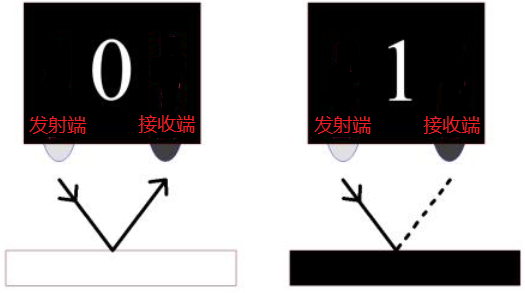
黑线或黑色物体对红外线有很好的吸收效果。当红外循迹发射端向黑线发射时，发射的红外线被吸收而未形成反射信号，红外循迹接收端未接收到信号，这样红外循迹输出高电平(1);白线或白色物体对红外线没有吸收作用，红外循迹发射端的红外信号会反射回接收端，这样红外循迹输出低电平(0)。

下表给出了小车底板上的红外循迹传感器检测不同颜色物体的所有情况下的数值。其中检测到黑线、黑色物体或无物体代表1，检测到白线或白色物体代表0。


|左红外循迹传感器|中间红外循迹传感器|右红外循迹传感器|值（二进制）|
| :--: | :--: |:--:| :--: |
|0|0|0|000|
|0|0|1|001|
|0|1|0|010|
|0|1|1|011|
|1|0|0|100|
|1|0|1|101|
|1|1|0|110|
|1|1|1|111|

<span style="color: rgb(255, 76, 65);">警告：反射式光学传感器(包括红外循迹)应避免在阳光等有红外干扰的环境中使用。阳光中含有许多不可见光，如红外线和紫外线。在强光环境下，反射式光学传感器不能正常工作。</span>

3.实验代码：

```
/*
  KEYES 4WD Raspberry Pi Pico 麦克纳姆轮智能小车
  第5课
  循迹传感器
*/
/*******循迹传感器引脚定义**********/
##define SensorLeft    16   //左循迹传感器输入引脚
##define SensorMiddle  17   //中间循迹传感器输入引脚
##define SensorRight   18   //右循迹传感器输入引脚


void setup() {
  /****循迹传感器接口全部设置为输入模式***/
  pinMode(SensorLeft, INPUT);
  pinMode(SensorMiddle, INPUT);
  pinMode(SensorRight, INPUT);

}

void loop() {
  uint8_t SL = digitalRead(SensorLeft); //读取左边巡线传感器的值
  uint8_t SM = digitalRead(SensorMiddle); //读取中间巡线传感器的值
  uint8_t SR = digitalRead(SensorRight); //读取右边巡线传感器的值
  Serial.print("Left:");  //串口打印信息
  Serial.print(SL);
  Serial.print("  Middle:");
  Serial.print(SM);
  Serial.print("  Right:");
  Serial.print(SR);
  Serial.println(); //换行
  delay(100);
}
```

4.实验结果：                                                                                
安上电池，将电机驱动底板上的电源拨码开关拨到ON一端，开启电源。选择好开发板(Raspberry Pi Pico)和端口(COMx)，编译上传代码完成后，再打开串口监视器，设置波特率为9600，我们可以看到在串口监视器是上打印的三路巡线传感器接收到的数字信号，当我们用白纸去遮挡它的时候，输出0，用黑纸或者悬空小车的时候，输出1：


4.代码说明：

| #define SensorLeft  16 | 传感器引脚接口定义，例如这里我们左边接到GPIO16 |
| :--: | :--: |
| pinMode(SensorLeft, INPUT); | 设置引脚为输入模式，因为我们想要去读取循迹传感器输出的电平信号，所以我们设置为输入模式。 |
|digitalRead(SensorLeft);| 读取引脚的数字电平，当这个引脚为3.3V时我们读取到的值就是1，当这个引脚为0V时，我们读取到的值就是0，读取完我们这里用一个变量SL保存了 |
| Serial.print("Left:");| USB串口监视器不换行打印“Left:” |
| Serial.println(); | USB串口监视器换行打印|

### 第06课 循迹智能车


1. 实验说明：
前面我们学习了循迹传感器和电机驱动的原理和应用，下面我们要结合循迹传感器和电机驱动来做一款循迹小车。
循迹，意思就是循着轨迹，也就是我们经常会看到的走黑线的循迹小车，原理是利用循迹传感器对路面黑色轨迹进行检测，并将路面检测信号反馈给控制主板。控制板对采集到的信号予以分析判断，及时控制驱动电机以调整小车转向，从而使小车能够沿着黑色轨迹自动行驶，实现循迹小车自动寻迹的目的，我们来看看下面的流程图就清晰了：

2.实验原理：
|左红外循迹传感器|中间红外循迹传感器|右红外循迹传感器|值（二进制）|状态|
| :--: | :--: |:--:| :--: | :--: |
|0|0|0|000|停止|
|0|0|1|001|向右转|
|0|1|0|010|直走|
|0|1|1|011|向右转|
|1|0|0|100|向左转|
|1|0|1|101|停止|
|1|1|0|110|向左转|
|1|1|1|111|直走|


3. 实验流程图：


4. 添加库文件：
首先我们先确保安装了库文件，不然代码会编译出错，这里我们用到库文件“<span style="color: rgb(255, 76, 65);">MecanumCar_v2</span>”，如何安装库文件请参考Arduino C 教程中的“<span style="color: rgb(0, 209, 0);">开发环境配置</span>”文件。如果库文件已经添加好了，就跳过这一步骤。


5. 实验代码：

```
/*
  KEYES 4WD Raspberry Pi Pico 麦克纳姆轮智能小车
  第6课
  循迹智能车
*/

##include "MecanumCar_v2.h"
mecanumCar mecanumCar(20, 21);  //sda-->20,scl-->21

/*******循迹传感器引脚定义**********/
##define SensorLeft    16   //左循迹传感器输入引脚
##define SensorMiddle  17   //中间循迹传感器输入引脚
##define SensorRight   18   //右循迹传感器输入引脚


void setup() {
  /****循迹传感器接口全部设置为输入模式***/
  pinMode(SensorLeft, INPUT);
  pinMode(SensorMiddle, INPUT);
  pinMode(SensorRight, INPUT);
  mecanumCar.Init(); //初始化七彩灯与电机驱动
}

void loop() {
  uint8_t SL = digitalRead(SensorLeft);   //读取左边巡线传感器的值
  uint8_t SM = digitalRead(SensorMiddle); //读取中间巡线传感器的值
  uint8_t SR = digitalRead(SensorRight);  //读取右边巡线传感器的值
  if (SM == HIGH) {
    if (SL == LOW && SR == HIGH) {  // 黑色在右边，白色在左边，向右转
      mecanumCar.Turn_Right();
    }
    else if (SR == LOW && SL == HIGH) {  // 黑色在左边，白色在右边，向左转
      mecanumCar.Turn_Left();
    }
    else {  // 两边都是白色，向前走
      mecanumCar.Advance();
    }
  }
  else {
    if (SL == LOW && SR == HIGH) { // 黑色在右边，白色在左边，向右转
      mecanumCar.Turn_Right();
    }
    else if (SR == LOW && SL == HIGH) {  // 白色在右边，黑色在左边，向左转
      mecanumCar.Turn_Left();
    }
    else { // 全是白色，停止走
      mecanumCar.Stop();
    }
  }
}
```

6. 实验结果：
安上电池，将电机驱动底板上的电源拨码开关拨到ON一端，开启电源。选择好开发板(Raspberry Pi Pico)和端口(COMx)，编译上传代码完成后，我们把小车放在跑道循迹图上，小车就能沿着黑线行驶了。

<span style="color: rgb(255, 76, 65);">特别注意：</span>

（1）小车循迹轨道，黑线的宽度必须大于等于3路循迹传感器模块的宽度，小车速度尽量应调低一些。

（2）测试小车时，不要在阳光明媚的太阳底下测试。测试过程中，如果出现问题，可在暗一点的环境中测试。

7. 代码说明: 
| #define SensorLeft 16 | 引脚定义 |
| :--: | :--: |
| pinMode(SensorLeft, INPUT);  | 设置引脚输入输出模式 |
| mecanumCar.Init(); | 初始化电机驱动 |
| SL = digitalRead(SensorLeft); | 读取引脚电平信号，保存给变量 |
| if (SM == HIGH) | 如果读取到高电平 |
| if (SL == LOW && SR == HIGH) | if (SL == LOW && SR == HIGH) |
|else if (SR == LOW && SL == HIGH)|否则如果右边为低电平且左边为低电平|


### 第07课 超声波传感器

1. 实验说明：
小车上有个超声波传感器，超声波传感器是一种非常实惠的距离传感器，它可以检测前方是否存在障碍物，并且检测出传感器与障碍物的详细距离。

它的原理和蝙蝠飞行的原理一样，就是超声波传感器发送出一种频率很高的超声波信号，通常正常人耳朵的听力的声波范围是20Hz~20kHz，人类无法听到。这些超声波的信号若是碰到障碍物，就会立刻反射回来，在接收到返回的信息之后，通过判断发射信号和接收信号的时间差，计算出传感器和障碍物的距离。超声波传感器主要用于各种机器人项目中的物体躲避和测距，也常被用于水位传感，甚至作为一个停车传感器。
在本实验中，我们使用超声波传感器来测量距离，并将数据打印在串口监视器上。根据前面的接线图可知，超声波传感器模块集成端口是接在电机驱动底板上5V G G3 G4集合端口，Trig（T）引脚对应的是G3控制的；Echo（E）引脚对应的是G4控制的。

2. 元件知识：
**HC-SR04超声波传感器：** 像蝙蝠一样使用声纳来确定与物体的距离，它提供了精准的非接触范围检测，高精度和稳定的读数。它的操作不受阳光或黑色材料的影响，就像精密的照相机(在声学上像布料这样比较软的材料很难被探测到)。它带有超声波信号发射端和信号接收端。

我们看下超声波传感器模块的图片，两个像眼睛一样的东西，一个就是信号发射端（TRIG），一个就是信号接收端（ECHO）。    
   

**参数：**
- 工作电压:+5V DC
- 静态电流: <2mA
- 工作电流: 15mA
- 有效角度: <15°
- 距离范围: 2cm – 400 cm
- 精度: 0.3 cm
- 测量角度: 30 degree
- 触发输入脉宽: 10us

**原理：**

最常用的超声测距的方法是回声探测法，如图：

超声波发射器向某一方向发射超声波，在发射时刻的同时计数器开始计时，超声波在空气中传播，途中碰到障碍物面阻挡就立即反射回来，超声波接收器收到反射回的超声波就立即停止计时。超声波也是一种声波，其声速V与温度有关。一般情况下超声波在空气中的传播速度为340m/s，根据计时器记录的时间t，就可以计算出发射点距障碍物面的距离s，即：s=340t/2：
(1)采用IO口TRIG触发测距，给至少10us的高电平信号;
(2)模块自动发送8个40khz的方波，自动检测是否有信号返回；
(3)有信号返回，通过ECHO输出一个高电平，单片机读取到高电平持续的时间就是超声波从发射到返回的时间。

超声波模块的电路图：


3. 实验代码：

```
/*
  KEYES 4WD Raspberry Pi Pico 麦克纳姆轮智能小车
  第7课
  超声波传感器
*/
/*******超声波传感器接口*****/
##define EchoPin  4  //ECHO引脚连接到GPIO4
##define TrigPin  3  //TRIG引脚连接到GPIO3

void setup() {
  pinMode(EchoPin, INPUT);    //ECHO引脚设置为输入模式
  pinMode(TrigPin, OUTPUT);   //TRIG引脚设置为输出模式
}

void loop() {
  float distance = get_distance();  //获取距离保存在distance变量
  Serial.print("ditance:");
  Serial.print(distance);
  Serial.println("cm");
  delay(100);
}

float get_distance(void) {    //超声波测距
  float dis;
  digitalWrite(TrigPin, LOW);
  delayMicroseconds(2);
  digitalWrite(TrigPin, HIGH); //给TRIG引脚至少10us的高电平以触发
  delayMicroseconds(10);
  digitalWrite(TrigPin, LOW);
  dis = pulseIn(EchoPin, HIGH) /58.2;  //计算出距离
  delay(50);
  return dis;
}

```

4. 实验结果：
安上电池，将电机驱动底板上的电源拨码开关拨到ON一端，开启电源。选择好开发板(Raspberry Pi Pico)和端口(COMx)，编译上传代码完成后，打开串口监视器，设置波特率为9600，我们可以在串口监视器中看超声波模块测得的距离，移动小车看到距离也在发生变化，如下图：


5. 代码说明: 

| #define EchoPin 4   #define TrigPin 3| 超声波引脚接口定义，Trig接GPIO3，Echo接GPIO4 |
| :--: | :--: |
|pinMode(EchoPin, INPUT); pinMode(TrigPin, OUTPUT); |Echo引脚设置为输入模式，Trig引脚设置为输出模式 |
| pulseIn(EchoPin, HIGH); | 这是arduino自带的一个函数，返回Echo引脚高电平的时间，单位为us。 |
| pulseIn(EchoPin, HIGH) /58.2; | 根据Echo高电平时间来计算声波往返路程，从而计算出前方障碍物的距离。 |


### 第08课 超声波跟随智能小车


1. 实验说明：                                                                                
前面我们学习了使用循迹传感器和电机来制作了一个自动巡线智能小车，这节课我们使用超声波传感器和电机来制作一个自动跟随智能小车，我们通过超声波传感器检测智能车和前方障碍物的距离，然后根据这一个数据控制两个电机的转动，从而控制智能车的运动状态，我们来看看下面的程序流程图就很清晰了：

2. 实验流程图：                                                  

                           
3. 添加库文件：
首先我们先确保安装了库文件，不然代码会编译出错，这里我们用到库文件“<span style="color: rgb(255, 76, 65);">MecanumCar_v2</span>”和“<span style="color: rgb(255, 76, 65);">Servo</span>”，如何安装库文件请参考Arduino C 教程中的“<span style="color: rgb(0, 209, 0);">开发环境配置</span>”文件。如果库文件已经添加好了，就跳过这一步骤。


4. 实验代码：

```
/*
  KEYES 4WD Raspberry Pi Pico 麦克纳姆轮智能小车
  第8课
  超声波跟随智能小车
*/
##include "MecanumCar_v2.h"
##include "Servo.h"

mecanumCar mecanumCar(20, 21);  //sda-->20,scl-->21
Servo myservo;    //定义一个舵机类实例

/*******超声波传感器接口*****/
##define EchoPin  4  //ECHO 引脚连接到 GPIO4
##define TrigPin  3  //TRIG 引脚连接到 GPIO3

void setup() {
  pinMode(EchoPin, INPUT);    //ECHO引脚设置为输入模式
  pinMode(TrigPin, OUTPUT);   //TRIG引脚设置为输出模式
  myservo.attach(2);  // 舵机连接到GPIO2
  myservo.write(90); //转动到90度
  mecanumCar.Init(); //初始化七彩灯与电机驱动
}

void loop() {
  int distance = get_distance();  //获取距离保存在distance变量
  Serial.println(distance);
  if (distance < 15)  //后退的范围
  {
    mecanumCar.Back();
  }
  else if (distance < 25)  //停止的范围
  {
    mecanumCar.Stop();
  }
  else if (distance < 45) //前进的范围
  {
    mecanumCar.Advance();
  }
  else  //其它情况停止
  {
    mecanumCar.Stop();
  }
}


/*********************超声波测距*******************************/
int get_distance(void) {    //超声波测距
  int dis;
  digitalWrite(TrigPin, LOW);
  delayMicroseconds(2);
  digitalWrite(TrigPin, HIGH); //给TRIG至少10us的高电平以触发
  delayMicroseconds(10);
  digitalWrite(TrigPin, LOW);
  dis = pulseIn(EchoPin, HIGH) / 58.2; //计算出距离
  delay(30);
  return dis;
}

```

5. 实验结果：
安上电池，将电机驱动底板上的电源拨码开关拨到ON一端，开启电源。选择好开发板(Raspberry Pi Pico)和端口(COMx)，编译上传代码完成后，小车就能直线跟随了，注意这里只是直线跟随。我们用手掌放在超声波前面，慢慢向前，小车就会跟着我们的手掌移动。

<span style="color: rgb(255, 76, 65);">注意：</span>障碍物只能在小车的正前方移动，不能拐弯。

6. 代码说明: 

| myservo.write(90);| 让舵机转动到90度位置 |
| :--: | :--: |
| int distance = get_distance();  | 定义一个整数变量用来保存测得的距离，后面根据这个距离来控制小车行驶 |
|| 测得的前面距离小于15cm时，小车后退 |
|| 否则前面距离小于25cm时，小车停止 |
|| 否则前面距离小于45cm时，小车前进 |
|| 否则前面距离大于45cm时，小车停止 |


### 第09课 超声波避障智能小车


1. 实验说明：                                                                                
在上个项目中，我们制作了一个超声波跟随智能车。实际上，利用同样的硬件，同样的接线方法，我们只需要更改一个测试代码就可以将跟随智能车变为避障智能车。超声波避障智能车，就是通过超声波传感器检测前方障碍物的距离，然后舵机云台转动检测到左右两边的距离，然后根据这一个数据控制四个电机的转动，从而控制智能车的运动状态，从而实现避障。
我们来看看下面的程序流程图就很清晰了：

2. 实验流程图： 


3. 添加库文件：
首先我们先确保安装了库文件，不然代码会编译出错，这里我们用到库文件“<span style="color: rgb(255, 76, 65);">MecanumCar_v2</span>”和“<span style="color: rgb(255, 76, 65);">Servo</span>”，如何安装库文件请参考Arduino C 教程中的“<span style="color: rgb(0, 209, 0);">开发环境配置</span>”文件。如果库文件已经添加好了，就跳过这一步骤。


4. 实验代码：

```
/*
  KEYES 4WD Raspberry Pi Pico 麦克纳姆轮智能小车
  第9课
  超声波避障智能小车
*/
##include "MecanumCar_v2.h"
##include "Servo.h"

mecanumCar mecanumCar(20, 21);  //sda-->20,scl-->21
Servo myservo;    //定义一个舵机类实例

/*******超声波传感器接口*****/
##define EchoPin  4  //ECHO 引脚连接到 GPIO4
##define TrigPin  3  //TRIG 引脚连接到 GPIO3

int distance_M, distance_L, distance_R;

void setup() {
  myservo.attach(2);    //舵机引脚连接到GP2
  pinMode(EchoPin, INPUT);    //ECHO引脚设置为输入模式
  pinMode(TrigPin, OUTPUT);   //TRIG引脚设置为输出模式
  myservo.write(90); //转动到90度
  delay(100);
}

void loop() {
  distance_M = get_distance();  //获取距离保存在distance变量
  if (distance_M < 15) {//当测到前方的距离小于15cm时
    mecanumCar.Stop();  //机器人停止
    delay(500); //延时500ms
    myservo.write(180);  //超声波云台左转
    delay(500); //延时500ms
    distance_L = get_distance();  //把超声波测到左边的距离赋给变量 distance_L
    delay(100); //稳定读取值
    myservo.write(0); //超声波云台右转
    delay(500); //延时500ms
    distance_R = get_distance(); //把超声波测到右边的距离赋给变量 distance_R
    delay(100); //稳定读取值

    myservo.write(90);  //回到90度位置
    delay(500);
    if (distance_L > distance_R) { //左边的距离大于右边时
      mecanumCar.Turn_Left();  //机器人左转
      delay(300);  //左转700ms
    } else {
      mecanumCar.Turn_Right(); //机器人右转
      delay(300);
    }
  }
  else { //如果测到前方的距离>=15cm时，机器人前进
    mecanumCar.Advance(); //前进
  }
}

/*********************超声波测距*******************************/
int get_distance(void) {    //超声波测距
  int dis;
  digitalWrite(TrigPin, LOW);
  delayMicroseconds(2);
  digitalWrite(TrigPin, HIGH); //给TRIG至少10us的高电平以触发
  delayMicroseconds(10);
  digitalWrite(TrigPin, LOW);
  dis = pulseIn(EchoPin, HIGH) / 58.2; //计算出距离
  delay(30);
  return dis;
}
```

5. 实验结果：
安上电池，将电机驱动底板上的电源拨码开关拨到ON一端，开启电源。选择好开发板(Raspberry Pi Pico)和端口(COMx)，编译上传代码完成后，小车就能自动避障了，注意这里速度不要调得太大。当小车行驶过程中前方遇到障碍物，小车将停止，然后舵机云台转动到左边，测下左边障碍物的距离；然后舵机云台转动到右边，测下右边障碍物的距离，然后判断左边与右边障碍物的距离，哪边距离更远，小车就往那边转弯，然后继续行驶。

6. 代码说明: 
| myservo.write(90); | 让舵机转动到90度位置 |
| :--: | :--: |
| int distance = get_distance();  | 定义一个整数变量用来保存测得的距离，后面根据这个距离来控制小车行驶 |
|| 超声波转动到左边，测左边的距离，保存 |
|| 超声波转动到右边，测右边的距离，保存 |
| if (distance_L > distance_R) |判断左右两边距离，谁更大 |
|| 如果前方距离大于等于15cm时，小车继续直行 |


### 第10课 红外遥控的原理

1. 实验简介：
红外遥控在日常生活中随处可见，它被用来控制各种家电，如电视、音响、录影机和卫星信号接收器。红外遥控是由红外发射和红外接收系统组成的，也就是一个红外遥控器、红外接收器和一个能解码的单片机组成的，小车上有个红外接收器。

在本实验中，使用红外接收器和红外遥控器相结合，读取红外遥控器上的按键值并将按键值打印在串口监视器上。

2. 元件知识：
**红外(IR)遥控器：** 是一种具有一定数量按钮的设备。按下不同的按钮会使位于遥控器前端的红外发射管以不同的编码发送红外信号。红外遥控技术应用广泛，如电视、空调等。因此，在当今科技发达社会，红外遥控技术使你切换电视节目和调节空调温度都很方便。
我们使用的遥控器如下所示：
该红外遥控器采用NEC编码，信号周期为110ms。


**红外(IR)接收器：** 它是一种元件，可以接收红外光，所以可以用它来检测红外遥控器发出的红外光信号。红外接收器解调接收到的红外光信号，并将其转换回二进制，然后将信息传递给微控制器。
红外信号调制过程图：
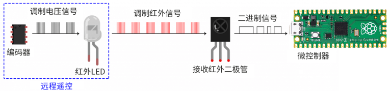

**原理：** 遥控器发射的38KHz红外载波信号是由遥控器里的编码芯片对其进行编码。它是（NEC协议）以一段引导码，用户码，用户反码，数据码，数据反码组成，利用脉冲的时间间隔来区别是0还是1信号(560us低电平+560us高电平时被认为是信号0，560us低电平+1680us高电平时被认为是信号1)，而编码就是由这些0 、1信号组成。同一个遥控器的用户码是不变的，用数据吗不同来分辨遥控器按的键不同。当按下遥控器按键时，遥控器发送出红外载波信号，红外接收器接收到信号时程序对载波信号进行解码，通过数据码的不同来判断按下的是哪个键。单片机由接收到的01信号进行解码，由此判断遥控器按下的是什么键，为了方便接收数据，我们在小车前后都板载了红外接收头，我们这里是接到了Raspberry Pi Pico的GPIO6。


3. 添加库文件：
首先我们先确保安装了库文件，不然代码会编译出错，这里我们用到库文件“<span style="color: rgb(255, 76, 65);">ir</span>”和“<span style="color: rgb(255, 76, 65);">MecanumCar_v2</span>”，如何安装库文件请参考Arduino C 教程中的“<span style="color: rgb(0, 209, 0);">开发环境配置</span>”文件。如果库文件已经添加好了，就跳过这一步骤。


4. 实验代码1：
```
/*
  KEYES 4WD Raspberry Pi Pico 麦克纳姆轮智能小车
  第10.1课
  红外遥控
*/

##include "ir.h"

IR IRreceive(6);//红外接收接GP6

void setup(){
}

void loop() {
  int key = IRreceive.getKey();
  if (key != -1) {
    Serial.println(key);
  }
}
```

5. 实验结果1：
安上电池，将电机驱动底板上的电源拨码开关拨到ON一端，开启电源。选择好开发板(Raspberry Pi Pico)和端口(COMx)，编译上传代码完成后，打开串口监视器，设置波特率为9600，拿出遥控器，对准红外接收器按下遥控器上的按键（即：发送信号），即可看相应按键的键值，如果按键时间过长，容易出现乱码。


我们通过得出的数值，做了一个红外遥控器按键值表，方便以后使用。


<span style="color: rgb(255, 76, 65);">特别注意：</span>

（1）有些红外遥控不带电池，需要自己配置，电池型号为CR2025。
（2）测试前需要确保红外遥控是OK的，有一个小诀窍测试红外遥控是否OK。打开手机摄像头拍照，红外遥控多准手机摄像头按下按键。如果在手机上看到有紫光闪烁，就代表红外遥控是OK的。

6. 实验代码2：
使用一个OK键来控制七彩灯的亮灭
```
/*
  KEYES 4WD Raspberry Pi Pico 麦克纳姆轮智能小车
  第10.2课
  红外遥控控制LED
*/
##include "MecanumCar_v2.h"
mecanumCar mecanumCar(20, 21);  //sda-->20,scl-->21
##include "ir.h"

IR IRreceive(6);//红外接收接GP6
bool flag = true;

void setup(){
  mecanumCar.Init();//初始化电机与七彩灯驱动
}

void loop() {
  int key = IRreceive.getKey();
  if (key == 64 && flag == true) {
    mecanumCar.right_led(1);
    mecanumCar.left_led(1);
    flag = false;
  }else if (key == 64 && flag == false) {
    mecanumCar.right_led(0);
    mecanumCar.left_led(0);
    flag = true;
  }
}
```
7. 实验结果2：
安上电池，将电机驱动底板上的电源拨码开关拨到ON一端，开启电源。选择好开发板(Raspberry Pi Pico)和端口(COMx)，编译上传代码完成后，按下遥控器上的OK键，七彩灯点亮；再次按下遥控器上的OK键，七彩灯熄灭。如此反复循环。

8. 代码说明: 
| #include "ir.h" | 导入红外接收的库文件 |
| :--: | :--: |
| IR IRreceive(6);  | 红外接收模块接GP6 |
| int key = IRreceive.getKey(); | 定义一个整型变量，用来保存红外遥控的键值 |
| if (key != -1) | 没有接收到红外遥控信号时，返回的键值是-1，所以我们当值不等于-1时打印 |
| Serial.println(key);| 换行打印键值 |
|| 如果按下了OK键并且flag为true，将flag置为false，用来下次熄灭|
| | 如果按下了OK键并且flag为false，将flag置为true，用来下次点亮 |


### 第11课 红外遥控智能车


1. 实验说明：                                                                                   
前面我们已经测试出红外遥控器各个按键对应的键值，这个项目我们就是使用红外遥控器来控制小车了，我们可以通过代码设置（键值），让对应的按键控制智能车对应的运动状态。

2. 实验流程图：
                                                        

                        
3. 添加库文件：
首先我们先确保安装了库文件，不然代码会编译出错，这里我们用到库文件“<span style="color: rgb(255, 76, 65);">ir</span>”和“<span style="color: rgb(255, 76, 65);">MecanumCar_v2</span>”，如何安装库文件请参考Arduino C 教程中的“<span style="color: rgb(0, 209, 0);">开发环境配置</span>”文件。如果库文件已经添加好了，就跳过这一步骤。


4. 实验代码：
```
/*
  KEYES 4WD Raspberry Pi Pico 麦克纳姆轮智能小车
  第11课
  红外遥控智能车
*/
##include "MecanumCar_v2.h"
mecanumCar mecanumCar(20, 21);  //sda-->20,scl-->21

/****引入红外遥控头文件***/
##include "ir.h"

IR IRreceive(6);//红外接收接GP6

void setup()
{
  mecanumCar.Init(); //初始化七彩灯与电机驱动
}

void loop() {
  int key = IRreceive.getKey();
  if (key != -1) {
    Serial.println(key);
    switch (key)
    {
      case 64: mecanumCar.Stop();       break;  //停止
      case 70: mecanumCar.Advance();    break;  //前进
      case 21: mecanumCar.Back();       break;  //后退
      case 68: mecanumCar.Turn_Left();  break;  //左转
      case 67: mecanumCar.Turn_Right(); break;  //右转
    }
  }
}

```

5.实验结果：
安上电池，将电机驱动底板上的电源拨码开关拨到ON一端，开启电源。选择好开发板(Raspberry Pi Pico)和端口(COMx)，编译上传代码完成后。这样，红外遥控对准扩展板的红外接收头，按下按键，即可控制小车运动。其中，按键控制小车前进，按键控制小车向左转，按键控制小车向右转，按键控制小车后退，按键控制小车停止。

<span style="color: rgb(255, 76, 65);">注意：</span>测试时，红外遥控需正对小车扩展板后面的红外接收头，距离最好不超过5米左右，我们在车底板前后各使用一个红外接收，使得更容易接收到正确信号。

6. 代码说明:
| | Switch语句，配合case使用，当括号里的变量为case后面的值时，执行case后面的语句 | 
| :--: | :--: | 
| case 64: mecanumCar.Stop();   |匹配到64时，执行小车停止程序 |
| case 70: mecanumCar.Advance(); | 匹配到70时，执行小车前进程序 |
| case 21: mecanumCar.Back(); | 匹配到21时，执行小车后退程序 |
| case 68: mecanumCar.Turn_Left(); | 匹配到68时，执行小车左转程序 |
|case 67: mecanumCar.Turn_Right(); | 匹配到67时，执行小车右转程序|


### 第12课 读取蓝牙数据


1. 实验说明：                                                                                
我们这个套件中有一个DX-BT24 5.1蓝牙模块，这个款蓝牙模块配置 256Kb 空间，遵循 V5.1 BLE蓝牙规范。支持AT指令，用户可根据需要更改串口波特率、设备名称等参数，使用灵活。支持UART接口，并支持蓝牙串口透传， 具有成本低、体积小、功耗低、收发灵敏性高等优点，只需配备少许的外围元件就能实现其强大功能。
在前面课程中，我们只是基本让该套件的模块/传感器实现单个功能，那我们能不能把所有功能合在一起呢？当然可以，在这一课程中，我们使用BT24蓝牙模块用一个代码把小车所有模块都结合起来，这里包含前面课程中讲到的除了红外遥控的所有功能，我们利用手机APP连接蓝牙模块，从而操控各种功能，简单方便。我们先通过APP连接蓝牙来读取APP界面上各按钮发送的控制字符。

2. 模块相关资料：                                                                              
- 蓝牙协议：Bluetooth Specification V5.1 BLE
- 工作频率：2.4GHz ISM band
- 通信接口：UART
- 供电电源：5V/3.3V
- 通信距离: 40m
- 外观尺寸：27(L)mm x 13 (W)mm x 2(H) mm
- 蓝牙名称：BT24
- 串口参数：9600、8数据位、1停止位、无校验、无流控
- 工作温度：MIN:-40℃ - MAX:+85℃

DX-BT24模块同时支持BT5.1 BLE协议，可以同具备BLE蓝牙功能的Android/iOS设备直接连接，支持后台程序常驻运行。主要用于短距离的数据无线传输领域。避免繁琐的连接线连接，能直接替代串口线。BT24模块成功应用领域：
 ※ 蓝牙无线数据传输；		 ※ 手机、电脑周边设备；  ※ 手持 POS 设备； ※ 医疗设备无线数据传输；	 
 ※ 智能家居控制；  ※ 蓝牙打印机； ※ 蓝牙遥控玩具； ※ 共享单车；

蓝牙接口说明：

①STATE：状态脚
②RX：接收脚
③TX：发送脚
④GND：接地脚
⑤VCC：电源脚
⑥EN：使能脚
将蓝牙模块连接到开发板：
| 开发板 | BT24蓝牙模块 |
| :--: | :--: |
| TX | RX|
| RX | TX |
| VCC | 5V |
| GND(G) | GND |

3. 安装Android（或iOS）手机/平板蓝牙APP                                                   
我们设计控制4WD Raspberry Pi Pico 麦克纳姆轮智能小车的APP控件如下图所示：


当Micro:bit主板上的蓝牙模块与Android（或iOS）系统手机/平板上的蓝牙APP通过蓝牙连接好后，按下控制键，Android（或iOS）系统手机/平板上的APP通过蓝牙就会发送相应的数值。编程时，可以为控制键设置相应的值。所以在实验中，我们会对每个控制键进行测试，在串口监视器中得到相应的值。

**Android系统APP安装步骤：**

1.下载mecanum_robot.apk文件
A. 我们资料包中有提供Android apk安装包，在下图位置：
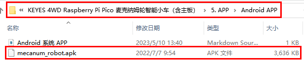
现将文件夹中的keyes arm.apk文件转移到安卓系统手机或平板电脑上。

B.或者，使用手机浏览器中的扫描功能对着二维码扫描识别或者输入网址：http://8.210.52.206/mecanum_robot.apk 进行下载，识别成功后就可以进入下载mecanum_robot.apk页面，点击“**下载**”下载mecanum_robot应用程序。


2.点击“**允许**”进入安装界面，点击“**继续安装**”就可以安装好mecanum_robot应用程序。


3.点击“**打开**”或点击手机桌面上的应用程序mecanum_robot就可以打开APP，界面如下所示：


4.先<span style="color: rgb(255, 76, 65);">开启手机/平板的蓝牙</span>，再打开App，点击APP界面右上角的按钮（控件）进行蓝牙搜索，在搜索结果中寻找“BT24”对话框，在“BT24”对话框中点击“connect”即可连接蓝牙。当对话框的“connect”变成“is connected”，说明蓝牙连接成功。


 
**IOS系统APP安装步骤：**
a.打开App Store。


b.在搜索框输入**mecanum_robot**，点击搜索，再点击“”，就可以下载mecanum_robot的蓝牙APP。。

c.下载安装完APP后，点击“**打开**”或点击手机桌面上的应用程序mecanum_robot就可以打开APP，界面如下所示：


接下来连接蓝牙，其步骤和上面的Android系统APP类似。
                                                                             
4. 实验代码：

```
/*
  KEYES 4WD Raspberry Pi Pico 麦克纳姆轮智能小车
  第12课
  读取蓝牙数据
*/

char ble_val;
void setup() {
  Serial1.begin(9600);  //设置蓝牙串波特率为9600
}

void loop() {
  if (Serial1.available())//如果接收区非空
  {
    char ble_val = Serial1.read();//读取蓝牙数据
    Serial.println(ble_val);//USB串口打印读取到的数据
  }
}
```
<span style="color: rgb(255, 76, 65);">上传代码之前，确保蓝牙模块已经从扩展板上拔下来，否则会导致代码上传不成功。</span>

5. 实验结果：                                                                                
安上电池，将电机驱动底板上的电源拨码开关拨到ON一端，开启电源。选择好开发板(Raspberry Pi Pico)和端口(COMx)，编译上传代码完成后。插上蓝牙，注意蓝牙不要插反了。打开手机APP连接好蓝牙和打开串口监视器，对准蓝牙模块按下手机APP上的按钮，我们可以看到APP按钮对应的控制字符，如下图。


6. 代码说明: 

|char ble_val; |定义一个char类型的变量 |
| :--: | :--: |
|Serial1.begin(9600); |设置蓝牙串口波特率为9600，这里要注意Serial和Serial1的区别，因为我们用的串口0所以使用Serial1，使用串口1时则需使用Serial2，而Serial为USB串口，即串口监视器使用。 |
|if (Serial1.available())|如果接收到蓝牙数据，这个值就不为0|
|char ble_val = Serial1.read(); | 读取蓝牙串口的数据，因为我们发生的是字符数据，所以定义一个char类型的变量来保存。 |
| |请注意这两句代码的区别，上面这句是输出到串口监视器，后面这句是输出数据到蓝牙模块。 |


### 第13课 蓝牙APP控制智能车


1. 实验说明：                                                                                
在上一课程中，我们已经介绍了蓝牙APP的使用和各按钮的功能，并且通过蓝牙APP连接蓝牙来读取了APP界面上各按钮发送的控制字符，在本课程中，主要是通过蓝牙APP连接蓝牙实现APP控制4WD智能车的多种功能。

2. 添加库文件：
首先我们先确保安装了库文件，不然代码会编译出错，这里我们用到库文件“<span style="color: rgb(255, 76, 65);">MecanumCar_v2</span>”、“<span style="color: rgb(255, 76, 65);">rgb</span>”、“<span style="color: rgb(255, 76, 65);">ir</span>”和“<span style="color: rgb(255, 76, 65);">Servo</span>”，如何安装库文件请参考Arduino C 教程中的“<span style="color: rgb(0, 209, 0);">开发环境配置</span>”文件。如果库文件已经添加好了，就跳过这一步骤。


3. 实验代码：                                                                                

```
/*
  KEYES 4WD Raspberry Pi Pico 麦克纳姆轮智能小车
  第13课
  蓝牙APP控制智能车
*/

##include "MecanumCar_v2.h"
##include "rgb.h"
##include "ir.h"
##include "Servo.h"

mecanumCar mecanumCar(20, 21);  //sda-->20,scl-->21
RGB rgb(7, 4);  //rgb(pin, num);  num = 0-100
Servo myservo;
IR IRreceive(6);//红外接收接GP6

/*******超声波传感器接口*****/
##define EchoPin  4  //ECHO 引脚接到 GPIO4
##define TrigPin  3  //TRIG 引脚接到 GPIO3

/*******循迹传感器引脚定义**********/
##define SensorLeft    16   //左循迹传感器输入引脚
##define SensorMiddle  17   //中间循迹传感器输入引脚
##define SensorRight   18   //右循迹传感器输入引脚

String speed_str;
int color_num = 0;
char ble_val;

void setup() {
  /*蓝牙串口默认设置为UART0,TX为GPIO0*/
  /*蓝牙串口默认设置为UART0,RX为GPIO1*/
  Serial1.begin(9600);  //设置蓝牙串波特率为9600

  pinMode(EchoPin, INPUT);    //ECHO引脚设置为输入模式
  pinMode(TrigPin, OUTPUT);   //TRIG引脚设置为输出模式

  /****循迹传感器接口全部设置为输入模式***/
  pinMode(SensorLeft, INPUT);
  pinMode(SensorMiddle, INPUT);
  pinMode(SensorRight, INPUT);

  myservo.attach(2);  // 舵机接到GPIO2上
  myservo.write(90);
  delay(500);

  rgb.setBrightness(100);  //rgb的亮度(0-255);
  delay(10);
  rgb.clear();  //关闭所有的LED
  delay(10);
  rgb.show();

  mecanumCar.Init(); //初始化七彩灯与电机驱动
}

void loop() {
  int key = IRreceive.getKey();
  if (key != -1) {
    //Serial.println(key);
    switch (key)
    {
      case 64: mecanumCar.Stop();       break;  //停止
      case 70: mecanumCar.Advance();    break;  //前进
      case 21: mecanumCar.Back();       break;  //后退
      case 68: mecanumCar.Turn_Left();  break;  //左转
      case 67: mecanumCar.Turn_Right(); break;  //右转
    }
  }
  if (Serial1.available())//如果接收缓冲区非空
  {
    ble_val = Serial1.read();//读取蓝牙数据
    Serial.println(ble_val);//串口打印读取到的数据
    switch (ble_val)
    {
      /*********************小车行驶************************/
      case 's': mecanumCar.Stop();       break;  //停止
      case 'a': mecanumCar.Advance();    break;  //前进
      case 'c': mecanumCar.Back();       break;  //后退
      case 'b': mecanumCar.Turn_Left();  break;  //左转
      case 'd': mecanumCar.Turn_Right(); break;  //右转
      case 'k': mecanumCar.L_Move();     break;  //左移
      case 'h': mecanumCar.R_Move();     break;  //右移
      case 'l': mecanumCar.LU_Move();    break;  //左上移
      case 'j': mecanumCar.LD_Move();    break;  //左下移
      case 'g': mecanumCar.RU_Move();    break;  //右上移
      case 'i': mecanumCar.RD_Move();    break;  //右下移
      case 'e': mecanumCar.drift_left(); break;  //左漂移
      case 'f': mecanumCar.drift_right(); break; //右漂移

      case 'p': Line_Tracking();   break;  //循迹
      case 'q': ult_following();   break;  //跟随
      case 'r': ult_avoiding();    break;  //避障

      /*********************小车灯光*************************/
      case 't': mecanumCar.right_led(1);  mecanumCar.left_led(1); break;  //开七彩灯
      case 'u': mecanumCar.right_led(0);  mecanumCar.left_led(0); break;  //关七彩灯
      case 'm': color_num++; showColor(); break;  //切换2812灯珠颜色
      case 'o': rgb.clear(); break;  //关闭2812灯珠
      case 'n': color_num--; showColor(); break;  //切换2812灯珠颜色
      /*********************小车调速*************************/
      case 'v':   /*读左前方电机M2的速度*/
        Serial1.readStringUntil('#');  //第一次接收到的速度值为空，先空读
        speed_str = Serial1.readStringUntil('#');  //第二次接收到速度数据，保存
        speed_Upper_L = String(speed_str).toInt();      //速度值为字符串格式，需要转换为整型
        speed_Upper_L = map(speed_Upper_L, 0, 100, 0, 255);  //从0~100映射到0~255
        //Serial.println(speed_Upper_L);  //串口调试
        break;
      case 'w':   /*读左后方电机M3的速度*/
        Serial1.readStringUntil('#');
        speed_str = Serial1.readStringUntil('#');
        speed_Lower_L = String(speed_str).toInt();
        speed_Lower_L = map(speed_Lower_L, 0, 100, 0, 255);
        //Serial.println(speed_Lower_L);
        break;
      case 'x':   /*读右前方电机M1的速度*/
        Serial1.readStringUntil('#');
        speed_str = Serial1.readStringUntil('#');
        speed_Upper_R = String(speed_str).toInt();
        speed_Upper_R = map(speed_Upper_R, 0, 100, 0, 255);
        //Serial.println(speed_Upper_R);
        break;
      case 'y':   /*读右后方电机M4的速度*/
        Serial1.readStringUntil('#');
        speed_str = Serial1.readStringUntil('#');
        speed_Lower_R = String(speed_str).toInt();
        speed_Lower_R = map(speed_Lower_R, 0, 100, 0, 255);
        //Serial.println(speed_Lower_R);
        break;

      default: break;
    }
  }
}


/*********************RGB2812显示*******************************/
void showColor() {
  //  Serial.print("color num:"); //用于USB串口调试
  //  Serial.println(color_num);
  //  这里设置只了7种颜色，可以自己添加
  if (color_num > 6)color_num = 0;
  if (color_num < 0)color_num = 6;
  switch (color_num) {
    case  0:
      for (int i = 0; i < 4; i++) {
        rgb.setPixelColor(i, 255, 0, 0);  //第i个灯珠亮红色
      }
      rgb.show();                        //显示
      break;
    case  1:
      for (int i = 0; i < 4; i++) {
        rgb.setPixelColor(i, 255, 80, 0); //第i个灯珠亮橙色
      }
      rgb.show();                        //显示
      break;
    case  2:
      for (int i = 0; i < 4; i++) {
        rgb.setPixelColor(i, 255, 255, 0); //第i个灯珠亮黄色
      }
      rgb.show();                        //显示
      break;
    case  3:
      for (int i = 0; i < 4; i++) {
        rgb.setPixelColor(i, 0, 255, 0);   //第i个灯珠亮绿色
      }
      rgb.show();                        //显示
      break;
    case  4:
      for (int i = 0; i < 4; i++) {
        rgb.setPixelColor(i, 0, 0, 255);   //第i个灯珠亮蓝色
      }
      rgb.show();                        //显示
      break;
    case  5:
      for (int i = 0; i < 4; i++) {
        rgb.setPixelColor(i, 0, 255, 255); //第i个灯珠亮靛色
      }
      rgb.show();                        //显示
      break;
    case  6:
      for (int i = 0; i < 4; i++) {
        rgb.setPixelColor(i, 160, 32, 240);//第i个灯珠亮紫色
      }
      rgb.show();                        //显示
      break;
    default : break;
  }
}

/*********************循迹*******************************/
void Line_Tracking(void) {   //循黑线
  while (1)
  {
    uint8_t SL = digitalRead(SensorLeft);   //读取左边巡线传感器的值
    uint8_t SM = digitalRead(SensorMiddle); //读取中间巡线传感器的值
    uint8_t SR = digitalRead(SensorRight);  //读取右边巡线传感器的值
    if (SM == HIGH) {
      if (SL == LOW && SR == HIGH) {  // 黑色在右边，白色在左边，向右转
        mecanumCar.Turn_Right();
      }
      else if (SR == LOW && SL == HIGH) {  // 黑色在左边，白色在右边，向左转
        mecanumCar.Turn_Left();
      }
      else {  // 两边都是白色，向前走
        mecanumCar.Advance();
      }
    }
    else {
      if (SL == LOW && SR == HIGH) { // 黑色在右边，白色在左边，向右转
        mecanumCar.Turn_Right();
      }
      else if (SR == LOW && SL == HIGH) {  // 白色在右边，黑色在左边，向左转
        mecanumCar.Turn_Left();
      }
      else { // 全是白色，停止
        mecanumCar.Stop();
      }
    }
    if (Serial1.available())//如果接收缓冲区非空
    {
      ble_val = Serial1.read();//读取蓝牙数据
      if (ble_val == 's') {
        mecanumCar.Stop();
        break;
      }
    }
  }
}

/*********************超声波跟随*******************************/
void ult_following(void)
{
  while (1)
  {
    int distance = get_distance();  //获取距离保存在distance变量
    //Serial.println(distance);
    if (distance <= 15)  //后退的范围
    {
      mecanumCar.Back();
    }
    else if (distance <= 25)  //停止的范围
    {
      mecanumCar.Stop();
    }
    else if (distance <= 45) //前进的范围
    {
      mecanumCar.Advance();
    }
    else  //其它情况停止
    {
      mecanumCar.Stop();
    }
    if (Serial1.available())//如果接收缓冲区非空
    {
      ble_val = Serial1.read();//读取蓝牙数据
      if (ble_val == 's') {
        mecanumCar.Stop();
        break;
      }
    }
  }
}

/*********************超声波避障*******************************/
void ult_avoiding(void)
{
  int distance_M, distance_L, distance_R;
  while (1)
  {
    distance_M = get_distance();  //获取距离保存在distance变量
    if (distance_M < 20) {//当测到前方的距离小于20cm时
      mecanumCar.Stop();  //机器人停止
      delay(500); //延时500ms
      myservo.write(180);  //超声波云台左转
      delay(500); //延时500ms
      distance_L = get_distance();  //把超声波测到左边的距离赋给变量distance_L
      delay(100); //稳定读取值
      myservo.write(0); //超声波云台右转
      delay(500); //延时500ms
      distance_R = get_distance(); //把超声波测到右边的距离赋给变量distance_R
      delay(100); //稳定读取值

      myservo.write(90);  //回到90度位置
      delay(500);
      if (distance_L > distance_R) { //左边的距离大于右边时
        mecanumCar.Turn_Left();  //机器人左转
        delay(300);  //左转700ms
      } else {
        mecanumCar.Turn_Right(); //机器人右转
        delay(300);
      }
    }
    else { //如果测到前方的距离>=20cm时，机器人前进
      mecanumCar.Advance(); //前进
    }
    if (Serial1.available())//如果接收缓冲区非空
    {
      ble_val = Serial1.read();//读取蓝牙数据
      if (ble_val == 's') {
        mecanumCar.Stop();
        break;
      }
    }
  }
}

/*********************超声波测距*******************************/
int get_distance(void) {    //超声波测距
  int dis;
  digitalWrite(TrigPin, LOW);
  delayMicroseconds(2);
  digitalWrite(TrigPin, HIGH); //给TRIG至少10us的高电平以触发
  delayMicroseconds(10);
  digitalWrite(TrigPin, LOW);
  dis = pulseIn(EchoPin, HIGH) / 58.2; //计算出距离
  delay(30);
  return dis;
}
```
<span style="color: rgb(255, 76, 65);">上传代码之前，确保蓝牙模块已经从扩展板上拔下来，否则会导致代码上传不成功。</span>

4. 实验结果：                                                                                
安上电池，将电机驱动底板上的电源拨码开关拨到ON一端，开启电源。选择好开发板(Raspberry Pi Pico)和端口(COMx)，编译上传代码完成后。插上蓝牙，注意蓝牙不要插反了。你就可以使用手机APP来控制如下玩法：（<span style="color: rgb(255, 76, 65);">有关APP的具体下载安装方法及使用方法，请参考**第12课 读取蓝牙数据** </span>）
（1）点击开启七彩灯，再次点击这个按钮七彩灯就会关闭。
（2）点击会进入循迹模式，当想退出该模式时，再次点击该按钮。
（3）点击会进入跟随模式、当想退出该模式时，再次点击该按钮。
（4）点击会进入避障模式，当想退出该模式时，再次点击该按钮。
（5）拉动这两个条幅回改变左边两个电机的速度，右边也是相同的操作方法。
<span style="color: rgb(255, 76, 65);">注意：</span>是用来进行调速的，当进行调速时，应该拖动拉条；不能点击，如果点击的话可能调速不成功。
（6）这几个按钮是用来切换底板下面4个2812灯珠颜色的，中间按钮为关闭功能。
（7）剩下其他的按钮全都是用来操控小车行驶的，跟其他按钮不同的是，这些按钮当我们按下时小车行驶，松开按钮时小车停止。
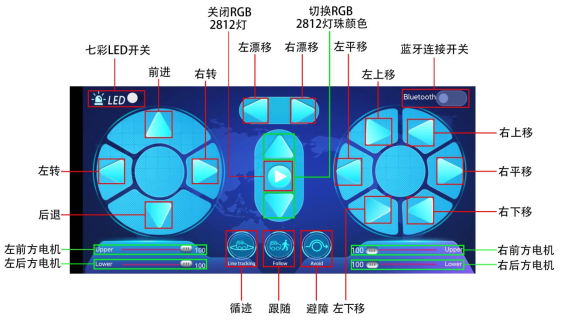

5. 代码说明:
|char ble_val; |定义一个char类型的变量 |
| :--: | :--: |
|Serial1.begin(9600); |设置蓝牙串口波特率为9600，这里要注意Serial和Serial1的区别，因为我们用的串口0所以使用Serial1，使用串口1时则需使用Serial2，而Serial为USB串口，即串口监视器使用。 |
|if (Serial1.available())|如果接收到蓝牙数据，这个值就不为0|
|char ble_val = Serial1.read(); | 读取蓝牙串口的数据，因为我们发生的是字符数据，所以定义一个char类型的变量来保存。 |
| |请注意这两句代码的区别，上面这句是输出到串口监视器，后面这句是输出数据到蓝牙模块。 |
|Serial1.readStringUntil('#');|读取蓝牙发送的一串字符串，遇到“#”停止读取，注意我们这里连续使用两条这样的语句，是因为我们进行调速时，发送的字符串比如为V#50#，所以我们第一次读到的是“V”（遇到#则停止）,第二次读到的值为“50”，注意这里读到的是字符串而不是整数值|
|String(speed_str).toInt();|将读取到的数字字符串转换为整数值|
|map(speed_Upper_L, 0, 100, 0, 255);|因为我们APP上发送的速度值为0~100，所以我们得将它映射到0~255的范围中|
||这四个变量我们没有直接定义，因为它是包含在"MecanumCar_v2.h"头文件中，分别代表四个电机的速度值，范围为0~255|


