# Python 教程


## 开发环境设置

在开始构建项目之前，你需要首先做一些准备，这是非常重要的，你不能跳过。

一、安装Thonny(重要)：
Thonny是一个免费、开源的软件平台，体积小，界面简单，操作简单，功能丰富，是一个适合初学者的Python IDE。在本教程中，我们使用这个IDE在整个过程中开发Raspberry Pi Pico。Thonny支持多种操作系统，包括Windows, Mac OS,  Linux。
1.下载Thonny软件：
(1) 进入软件官网：https://thonny.org 下载Thonny软件，最好下载最新版的，否则可能不支持Raspberry Pi Pico。
(2) Thonny的开源代码库：https://github.com/thonny/thonny
请按照官网的指导安装或点击下面的链接下载安装。(请根据您的操作系统选择相应的选项.)
|操作系统|下载链接/方法|
| :--: | :--: |
|MAC OS：|https://github.com/thonny/thonny/releases/download/v3.2.7/thonny-3.2.7.pkg|
|Windows：|https://github.com/thonny/thonny/releases/download/v3.2.7/thonny-3.2.7.exe|
|Linux：|最新版本:
```
Binary bundle for PC (Thonny+Python): 
bash <(wget -O - https://thonny.org/installer-for-linux) 
With pip:
pip3 install thonny
Distro packages (may not be the latest version):
Debian, Rasbian, Ubuntu, Mint and others:
sudo apt install thonny
Fedora:
sudo dnf install thonny
```
|


2.Windows上安装Thonny软件：
A.下载后的Thonny图标如下。


B.双击“thonny-4.0.2.exe”，会出现下面对话框，我这里是选择“”进行操作的。你也可以选择“”进行操作的。


C.如果您不熟悉电脑软件安装，您可以一直单击“**Next**”直到安装完成。


D.如果您需要更改Thonny软件的安装路径，可以单击“**Browse...**”进行修改。选择安装路径后，单击“**OK**”。
如果您不想更改安装路径，只需单击“**Next**”；然后又继续单击“**Next**”。


E.选中“**Create desktop icon**”，Thonny软件会在你的桌面上生成一个快捷方式，方便你稍后打开Thonny软件。


F.单击“**Install**”安装软件。


G.在安装过程中，您只需等待安装完成，千万不要点击“**Cancel**”，否则将无法安装成功。


H.一旦看到如下界面，就表示已经成功安装了Thonny软件，点击“**Finish**”就可以。


I.如果你在安装过程中选择了“**Create desktop icon**”，则可以在桌面上看到如下图标。


二、Thonny软件基本配置                                          
A.双击Thonny软件的桌面图标，可以看到如下界面，同时还可以进行语言选择(<span style="color: rgb(255, 76, 65);">这里选择简体中文</span>)和初始设置。设置完了点击“**Let’s go！**”。


B.选择“**视图**”→“**文件**”和“**Shell**”。


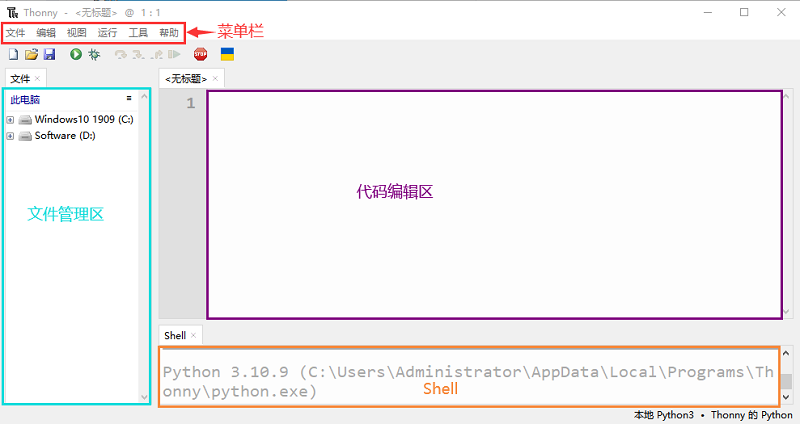


三、安装驱动方法
（<span style="color: rgb(255, 76, 65);">注意：如果电脑已经安装了驱动程序，则不需要再安装驱动；如果没有，则需要进行以下操作：</span>）

**Windows 10 系统：**

在使用Raspberry Pi Pico主板之前，必须安装驱动程序，否则Raspberry Pi Pico主板将无法与计算机通信。将Raspberry Pi Pico主板用USB线连接到电脑上，一般Windows10系统的电脑会自动识别串口，并安装相应的驱动程序，在设备管理器里可以找到“USB串行设备”。


**Windows 7/8 系统：**

如果你的电脑仍在用Windows7/8操作系统，当把Raspberry Pi Pico主板插到USB口后，电脑会发现一个"Board CDC"设备，但不能自动识别它，也无法安装驱动。

首先找到我们提供的名为“pico-serial.inf”的文件,这个文件格式就是驱动文件，然后在设备管理器中，手动添加这个驱动程序给无法识别设备。打开电脑的“设备管理器”，我们双击或者右键单击“更新驱动程序软件”。

点击“浏览计算机以查找驱动程序软件”。

假设我们的驱动文件放在电脑桌面，我们点击“浏览...”找到文件对应的文件夹，点击“下一步”。

我们选择这个文件夹，然后点击确定，驱动安装成功。

这个时候再打开设备管理器，我们就可以看到Raspberry Pi Pico的驱动程序已经安装成功了，端口的位置多了一个Pi Pico Serial Port。

在拨下Raspberry Pi Pico主板前，最好先点“运行“菜单里的“**停止/重启后端进程**”或者点击界面右边的红色按钮，将Raspberry Pi Pico板断开连接，然后再拨出，会更好一些。


四、更新Micropython固件（重要）                               
要在Raspberry Pi Pico板上运行MicroPython程序，我们需要先烧入一个固件到Raspberry Pi Pico板中。
1.为什么我们需要更新固件
Raspberry Pi Pico板可以用C语言和MicroPython语言编程，并且Raspberry Pi Pico板出厂时没有MicroPython固件，使用MicroPython编程之前需要下载MicroPython固件。

<span style="color: rgb(255, 76, 65);">注意：</span>MicroPython固件只需要下载一次，当使用MicroPython编程时不需要再次下载。如果你已经下载了用C语言编写的 .uf2 程序固件，则MicroPython固件将会被覆盖，那下次你使用MicroPython时，你需要按照以下步骤更新Raspberry Pi Pico板的固件。

2.下载Micropython固件
方法1：Raspberry Pi Pico的官网：https://www.raspberrypi.com/documentation/microcontrollers/

A. 单击上面的链接，你可以看到以下界面：

B. 滚动鼠标，你又可以看到以下内容：

C. 单击“MicroPython(Getting started MicroPython)”进入固件下载页面。


方法2：通过单击下载链接：https://micropython.org/download/rp2-pico/rp2-pico-latest.uf2 ，可以直接下载。

方法3：如果你因为网络问题或其他原因无法下载，可以使用我们准备的 .uf2 文件，它位于以下文件路径：


3.烧入MicroPython固件的步骤
①连接microUSB线一端到你的电脑USB口。

②长按“Raspberry Pi Pico板”上的**白色按钮（BOOTSEL）**。然后，通过microUSB线另一端将Raspberry Pi Pico板与电脑连接。
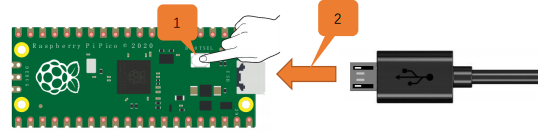
③松开按钮，当连接成功时，在你的电脑上打开[设备管理器]，电脑将自动识别可移动磁盘(RPI-RP2)，如下所示:

④复制文件（rp2-pico-20230510-unstable-v1.20.0-62-g4e4bdbd19.uf2）到可移动磁盘(RPI-RP2)，并等待它完成，就像复制文件到U盘一样。


⑤当固件烧入完成后，Raspberry Pi Pico板会自动重启。之后，你可以运行Micropython。


五、Thonny软件连接上Raspberry Pi Pico板                         
 1.打开Thonny软件，点击“<span style="color: rgb(255, 76, 65);">运行</span>”并选择“<span style="color: rgb(255, 76, 65);">选择解释器…</span>”


2.选择“<span style="color: rgb(255, 76, 65);">Micropython (一般)</span>”或“<span style="color: rgb(255, 76, 65);">Micropython (Raspberry Pi Pico)</span>”均可。如何选择“**Micropython(Raspberry Pi Pico)**”? 如下所示：


3.选择“<span style="color: rgb(255, 76, 65);">USB-SERIAL (COMx)</span>”，“<span style="color: rgb(255, 76, 65);">COMx</span>”的编号在不同的电脑之间可能会有所不同。你只需要确保选择“<span style="color: rgb(255, 76, 65);">USB-SERIAL (COMx)</span>”就行。

<span style="color: rgb(0, 209, 0);">**如何确定你的Raspberry Pi Pico板与电脑通信的端口?**</span>

步骤1: 当你的Raspberry Pi Pico板没有连接到电脑时，打开Thonny软件，点击“<span style="color: rgb(255, 76, 65);">运行</span>”，选择“<span style="color: rgb(255, 76, 65);">选择解释器...</span>”，弹出对话框，点击“<span style="color: rgb(255, 76, 65);">端口</span>”，可以查看当前连接的端口，如下图所示:


步骤2: 关闭对话框。将Raspberry Pi Pico板连接到电脑，再次单击“<span style="color: rgb(255, 76, 65);">运行</span>”并选择“<span style="color: rgb(255, 76, 65);">选择解释器...</span>”。单击弹出窗口中的“<span style="color: rgb(255, 76, 65);">端口</span>”，查看当前端口。现在又增加了一个端口，那么这个端口是用来与电脑通信的。


4.选择“<span style="color: rgb(255, 76, 65);">Micropython(Raspberry Pi Pico)</span>”和“<span style="color: rgb(255, 76, 65);">端口</span>”后，单击“<span style="color: rgb(255, 76, 65);">确认</span>”。
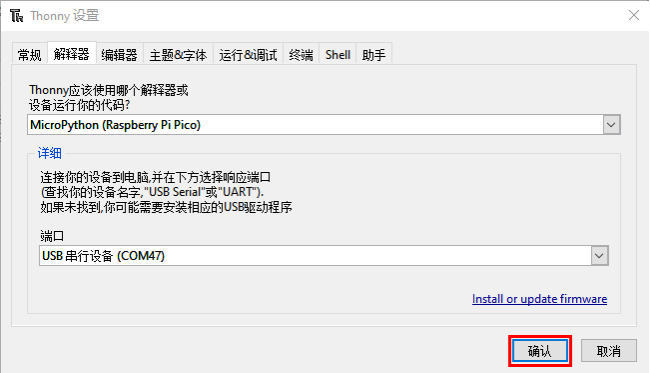

5.当在Thonny软件上显示以下消息时，表明Thonny软件已成功连接到Raspberry Pi Pico板。

到目前为止，所有的准备工作都已就绪。


六、测试代码(重要)                                               
1.测试Shell命令
在“Shell”窗口输入“print(Hello World!)”，按键盘上的“Enter”键。


2.在线运行代码：
要在线运行Raspberry Pi Pico，你需要把Raspberry Pi Pico板连接到电脑上。这样就可以使用Thonny软件编译或调试程序。
**优点：**
（1）你可以使用Thonny软件编译或调试程序。
（2）通过“Shell”窗口，你可以查看程序运行过程中产生的错误信息和输出结果，并可以在线查询相关功能信息，帮助改进程序。
**缺点：**
（1）要在线运行Raspberry Pi Pico，你必须将Raspberry Pi Pico板连接到一台电脑上并和Thonny软件一起运行。
（2）如果Raspberry Pi Pico板与电脑断开连接，当它们重新连接时，程序将无法再次运行。

**基本操作：**
（1）打开Thonny软件，并且单击“<span style="color: rgb(255, 76, 65);"></span>”。

（2）在新弹出的窗口中，点击“<span style="color: rgb(255, 76, 65);">此电脑</span>”。

在新的对话框中，进入文件夹(即路径)：..\4. Python 教程\1. 开发环境配置，选中“**00.0_HelloWorld.py**”,单击“<span style="color: rgb(255, 76, 65);">打开</span>”。


（3）单击“”来执行程序，“Hello World!”和“Welcome Keyes”将打印在“Shell”窗口。


**退出在线运行**
当在线运行时，单击Thonny软件上的“”或按Ctrl+C退出程序。


3.离线运行代码： 
在离线运行时，Raspberry Pi Pico板不需要连接电脑和Thonny软件。一旦上电，它就可以运行存储在Raspberry Pi Pico板中的main.py程序。
**优点：** 不需要连接电脑和Thonny软件就可以运行程序。
**缺点：** 出现错误或Raspberry Pi Pico板没电时，程序会自动停止，并且代码不容易更改。

**基本操作：**
一旦上电后，Raspberry Pi Pico 板会自动检查设备上是否存在**main\.py**。如果有，则运行main.py中的程序，然后进入shell命令系统。(<span style="color: rgb(255, 76, 65);">如果你想让代码离线运行，你可以将它保存为main\.py</span>); 如果main.py不存在，则直接进入shell命令系统。
（1）单击 “**文件**”→“**新建**” 创建并编写代码。

（2）在新建的文件中输入代码，这里我们以“**0_Onboard_LED_flashing.py**”代码为例。你也可以将“**第00课 板载LED闪烁**”文件夹中的“**0_Onboard_LED_flashing.py**”代码复制到新建的文件中。

（3）单击菜单栏上的“”, 你可以将代码保存到<span style="color: rgb(255, 76, 65);">此电脑</span>或<span style="color: rgb(255, 76, 65);">Raspberry Pi Pico</span>。

（4）我这里是选择“**Raspberry Pi Pico**”，在新弹出的窗口中输入“**main\.py**”并单击“**好的**”。


（5）你可以看到代码已经被上传到Raspberry Pi Pico板。

（6）断开Raspberry Pi Pico板的microUSB线，再重新连接，Raspberry Pi Pico板上的板载LED会反复闪烁。


**退出离线运行**
连接Raspberry Pi Pico板到电脑，单击Thonny软件上的“”或按Ctrl+C结束离线运行。


如果它不能工作，请点击Thonny软件上的“”多次或重新连接Raspberry Pi Pico板。


七、Thonny常见的操作 

<span style="color: rgb(0, 209, 0);">我们这里是将“4. Python 教程”文件夹中的“3. 项目课程”提前复制粘贴到**电脑D盘**为例，其操作如下：</span>


<span style="color: rgb(0, 209, 0);">其电脑D盘路径如下：</span>


<br />

<span style="color: rgb(255, 76, 65);">下面是以“**0_Onboard_LED_flashing.py**”为例</span>
<br />
<br />

**上传代码至Raspberry Pi Pico**

在“**第00课 板载LED闪烁**”文件夹中，鼠标右键单击选中“**0_Onboard_LED_flashing.py**”，选择“<span style="color: rgb(255, 76, 65);">上传到/</span>”上传代码到Raspberry Pi Pico的根目录。
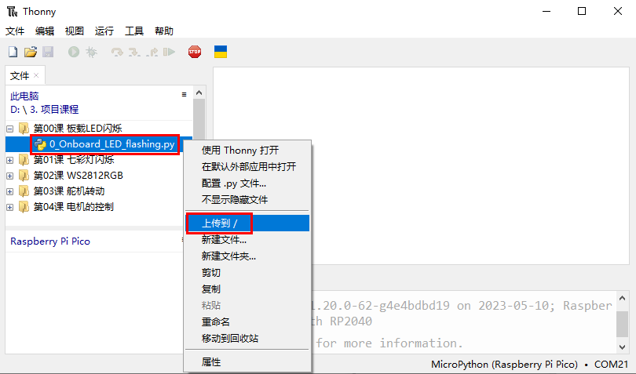


**下载代码至电脑**

在“Raspberry Pi Pico”中，鼠标右键单击选中“**0_Onboard_LED_flashing.py**”，选择“**下载到/**”将代码下载到你的电脑。


**删除Raspberry Pi Pico根目录中的文件**

在“Raspberry Pi Pico”中，鼠标右键单击选中“**0_Onboard_LED_flashing.py**”，选择“**删除**”，从Raspberry Pi Pico根目录中删除“**0_Onboard_LED_flashing.py**”。


**删除电脑目录中的文件**

在“**第00课 板载LED闪烁**”文件夹中，鼠标右键单击选中“**0_Onboard_LED_flashing.py**”，选择“**移动到回收站**”，即可从“**第00课 板载LED闪烁**”文件夹中删除。


**创建和保存代码**

（1）单击 “**文件**”→“**新建**” 创建并编写代码。

（2）在新建的文件中输入代码，这里我们以“**0_Onboard_LED_flashing.py**”代码为例。你也可以将“**第00课 板载LED闪烁**”文件夹中的“**0_Onboard_LED_flashing.py**”代码复制到新建的文件中。

（3）单击菜单栏上的“”, 你可以将代码保存到<span style="color: rgb(255, 76, 65);">此电脑</span>或<span style="color: rgb(255, 76, 65);">Raspberry Pi Pico</span>。

（4）我这里是选择“**Raspberry Pi Pico**”，在新弹出的窗口中输入“**main\.py**”并单击“**好的**”。


（5）你可以看到代码已经被上传到Raspberry Pi Pico板。

（6）单击“”，Raspberry Pi Pico板上的板载LED会周期性的闪烁。


八、模块加载（库文件安装）                              

Python的强大来源于模块，Python具有脚本语言中最丰富和强大的类库，足以支持绝大多数日常应用。我们把一些稍微复杂的传感器通过导入模块的方式，这样可以使我们学习更加简单。

方法很简单，只要将我们需要用的模块文件保存在Raspberry Pi Pico上就可以调用了，或者打开保存在我们电脑上的文件。例如，这里以“**库文件：<span style="color: rgb(255, 76, 65);">mecanumCar_v2.py</span>**”为例，其他库文件类似。


选择“文件”→“另存为...”，再选择“Raspberry Pi Pico”，然后在新弹出的窗口中输入“<span style="color: rgb(255, 76, 65);">mecanumCar_v2.py</span>”并单击“好的”。这样，“**库文件：<span style="color: rgb(255, 76, 65);">mecanumCar_v2.py</span>**”就另存到Raspberry Pi Pico板上即可（鼠标右键可以选择删除）。


如果界面的左边没有显示刚添加的库文件“mecanumCar_v2.py”，可以点击“视图”→“文件”，这样库文件在界面的左边会显示出来。


## 产品安装


安装1

安装所需零件:


安装:


完成:


安装2

安装所需零件:


安装:


完成:


安装3

安装所需零件：
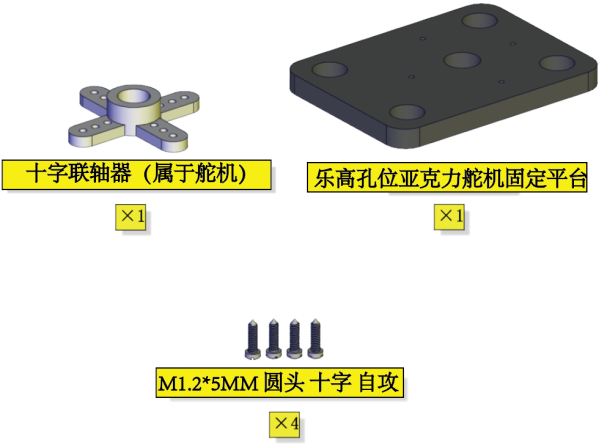

安装：


完成：


安装4

**舵机初始化：**
安装前需要先设置舵机角度为90°。设置舵机角度时，将舵机连接在Raspberry Pi Pico扩展板的G、V、GIO2，在Raspberry Pi Pico主控板上上传对应代码，外接电源供电后，舵机就转到90°的位置。
| 舵机 | Raspberry Pi Pico扩展板 |
| :--: | :--: |
| 棕线 | G |
| 红线 | V |
| 橙线 | G2 |


需要先添加库文件：<span style="color: rgb(255, 76, 65);">mecanumCar_v2.py</span>，添加方法请参照：“**开发环境设置**”文件。
```
'''
初始化舵机角度为90°
'''
from machine import Pin,I2C
import mecanumCar_v2
import time

i2c = I2C(0, sda = Pin(20), scl = Pin(21), freq = 400000)
#print("STC8G1K08 address：", machine.I2C.scan(i2c))
mecanumCar = mecanumCar_v2.Driver(i2c)

mecanumCar.set_angle(90) #转动到90度
time.sleep(1)

```
我们提供的初始化舵机角度的代码位置如下图：


安装所需零件：
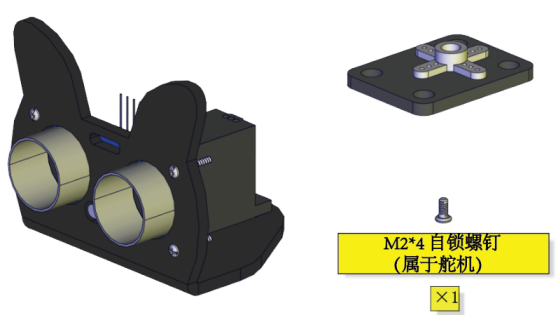

安装：
<span style="color: rgb(255, 76, 65);">(注意安装方向)</span>


完成：


安装5

安装所需零件：


安装：
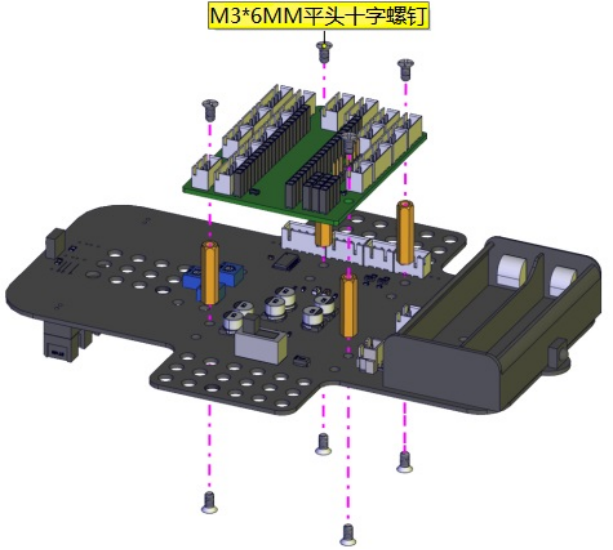

完成：


安装6

安装所需零件：
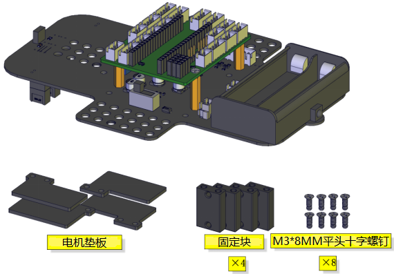

安装：
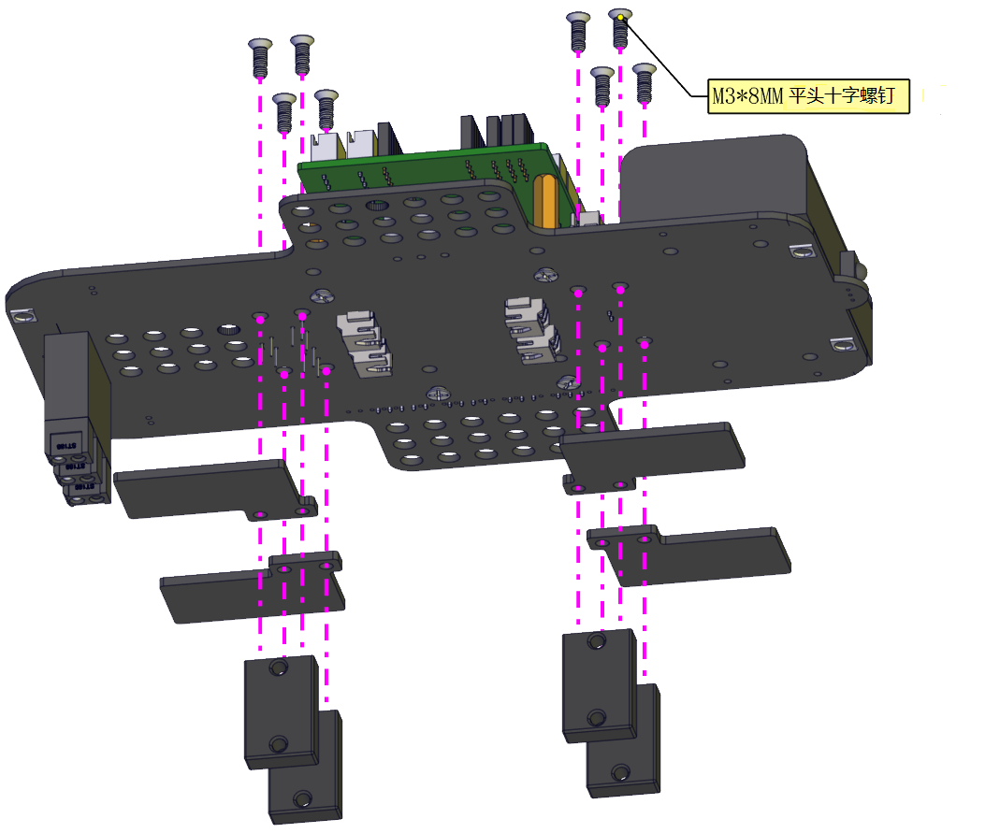

完成：
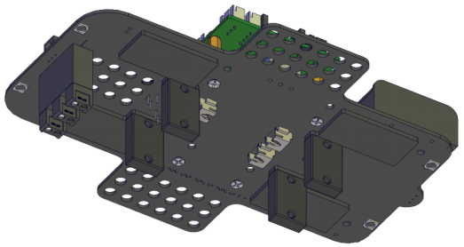


安装7

安装所需零件：


安装：
<span style="color: rgb(255, 76, 65);">（注意电机安装方向，线材方向朝内）</span>

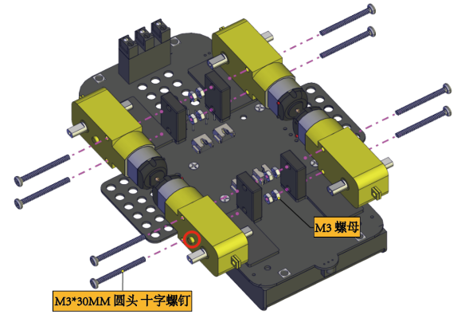

完成：


安装8

安装所需零件：


安装：
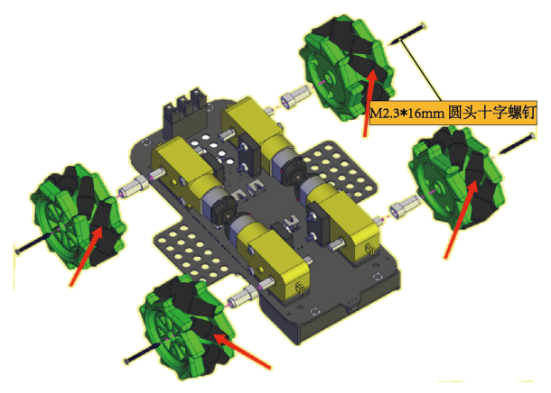

完成：


安装9

安装所需零件：
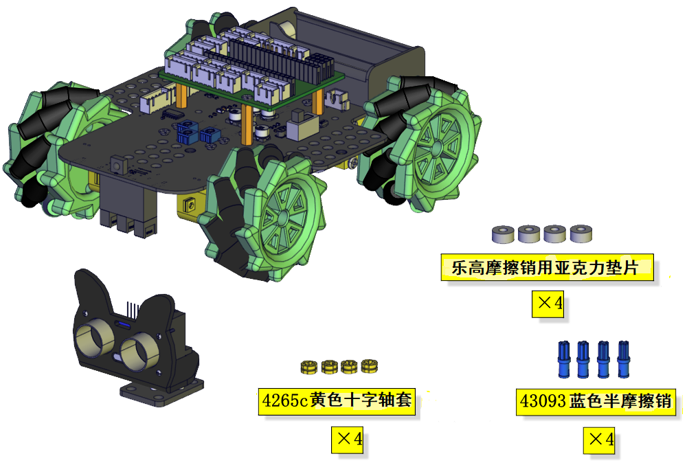

安装：
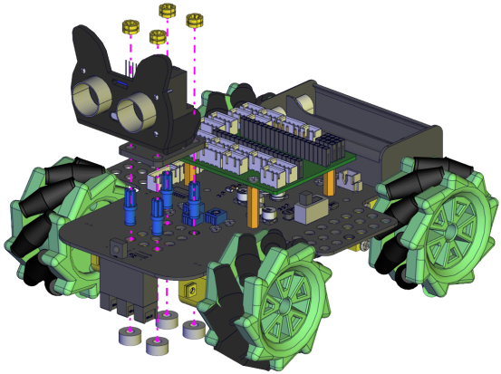

完成：


安装10

安装准备零件：
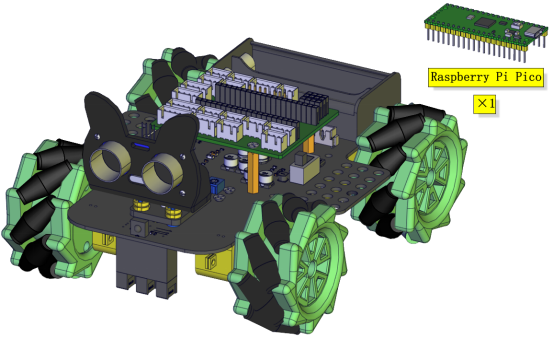

安装：
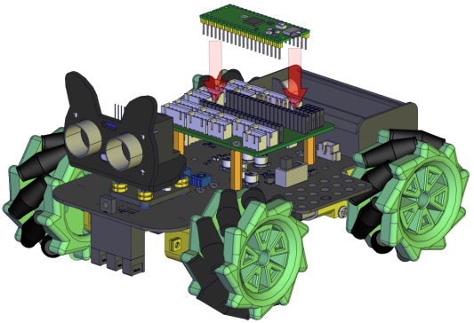

完成：


安装11

安装准备零件：


安装：


完成：


接线

舵机接线：
| 舵机 | Raspberry Pi Pico 扩展板 |
| :--: | :--: |
| 棕线 | G |
| 红线 | 5V |
| 橙线 | G2 |

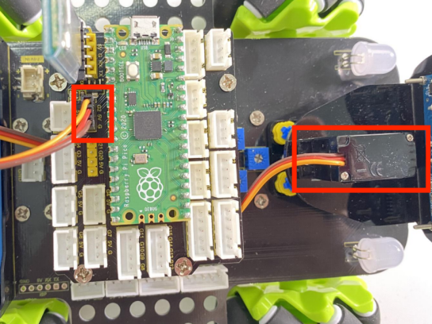

超声波模块接线：
| 超声波模块 | Raspberry Pi Pico 扩展板 |
| :--: | :--: |
| Vcc | 5V|
| Trig | G3 |
| Echo |G4|
|Gnd|G|

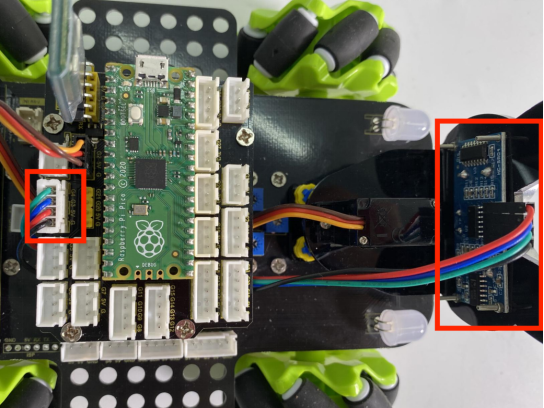

控制红外模块接线：
| 驱动板 |Raspberry Pi Pico 扩展板 |
| :--: | :--: |
| GND | G|
| 5V | 5V |
| S5 | G6|
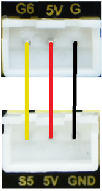
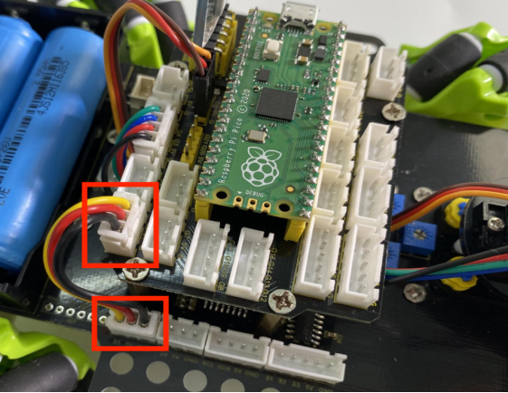

控制WS2812RGB接线：
| 驱动板 | Raspberry Pi Pico 扩展板 |
| :--: | :--: |
| GND | G|
| 5V | 5V |
| S4 | G7|
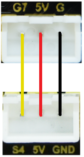
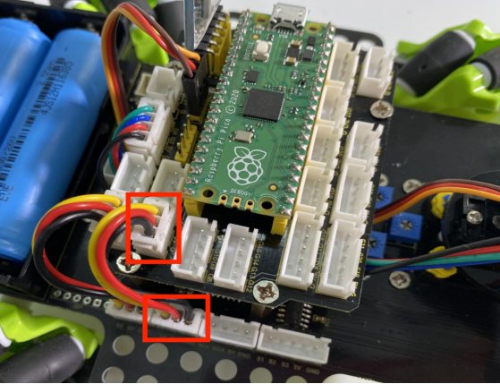

控制电机和七彩灯接线:
| 驱动板 | Raspberry Pi Pico 扩展板 |
| :--: | :--: |
| SCL | G21|
| SDA | G20 |
|5V | 5V|
|GND|G|


控制三路循迹模块接线:
| 驱动板 | Raspberry Pi Pico 扩展板 |
| :--: | :--: |
| S1 | G18|
| S2 | G17 |
|S3| G16|
| | |
|GND|G|
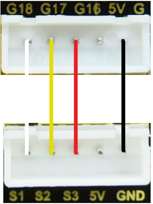
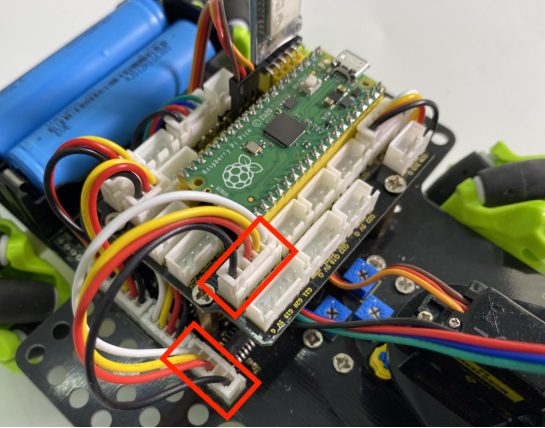

电源接线:


电机接到对应的接口上:


电池安装示范:


## 项目课程

### 第00课 板载LED闪烁


1.实验介绍：
Raspberry Pi Pico上有个板载LED，这个LED是固定接在Raspberry Pi Pico上的GP25引脚，在这个项目中，我们将来学习使板载LED闪烁的效果。


2.实验元件：
||  |
| :--: | :--: |
| Raspberry Pi Pico*1 |USB 线*1 |


3.实验接线：
在本项目中，用USB线将Raspberry Pi Pico和电脑连起来。连接方法请参照文档：<span style="color: rgb(255, 76, 65);">开发环境配置</span>


4.实验代码：
Raspberry Pi Pico板载LED是由GP25控制，当GP25输出高电平时，LED点亮; 当输出低时，LED灯关闭。

本教程中使用的代码保存在：“**..\4. Python 教程\3. 项目课程**” 的路径中。你可以把代码移到任何地方。例如，我们将代码保存在**D盘**中，<span style="color: rgb(0, 209, 0);">路径为D:\3. 项目课程</span>。


打开“**Thonny**”软件，点击“**此电脑**”→“**D:**”→“**3. 项目教程**”→“**第00课 板载LED闪烁**”，然后鼠标左键双击“**0_Onboard_LED_Flashing.py**”。


```
from machine import Pin
import time

led = Pin(25, Pin.OUT)   # 从引脚25创建LED对象，设置引脚25输出

try:
    while True:
        led.value(1)    # 点亮LED
        time.sleep(0.5) # 延时 0.5s
        led.value(0)    # 关闭LED
        time.sleep(0.5) # 延时 0.5s
except:
    pass

```


5.实验结果：
确保Raspberry Pi Pico主板已经连接到电脑上，单击“”。


利用USB线上电，单击“”，代码开始执行，你会看到的现象是：Raspberry Pi Pico的LED开始闪烁，循环进行。按“Ctrl+C”或单击“”退出程序。


### 第01课 七彩灯闪烁


1. 实验说明：
这是一个常用的LED，它是一个七彩LED，它采用7彩自动闪烁LED（外观白色，显示七彩）元件。七色LED模块可自动闪烁内置颜色。可以用来制作相当迷人的灯光效果。这个模块与普通LED驱动相同，当我们给它输入高电平时将自动闪烁七种颜色，而输入低电平时将停止闪烁。
我们已经将7彩LED集成到电机驱动底板，在这个项目中，我们用两个最基本的实验代码分别来控制这个七彩LED。LED模块信号端S为高电平时七彩LED开始自动闪烁，S为低电平时七彩LED熄灭不再闪烁。


2. 相关知识：                                                          
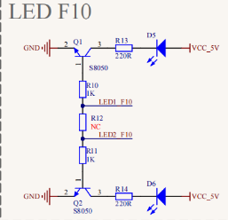

                  
两个七彩灯分别通过三极管来控制，信号端分别接到了P5.4和P5.5，所以我们只要控制这两个引脚输出高低电平即可控制两个七彩灯。


3. 添加库文件：
首先我们先确保安装了库文件，不然代码会编译出错，这里我们用到库文件“<span style="color: rgb(255, 76, 65);">mecanumCar_v2.py</span>”，如何添加库文件请参考“<span style="color: rgb(0, 209, 0);">开发环境配置</span>”文件。如果库文件已经添加好了，就跳过这一步骤。


4. 实验代码：

本教程中使用的代码保存在：“**..\4. Python 教程\3. 项目课程**” 的路径中。你可以把代码移到任何地方。例如，我们将代码保存在**D盘**中，<span style="color: rgb(0, 209, 0);">路径为D:\3. 项目课程</span>。


打开“**Thonny**”软件，点击“**此电脑**”→“**D:**”→“**3. 项目课程**”→“**第01课 七彩灯闪烁**”，然后鼠标左键双击“**1_LED.py**”。


```
'''
KEYES 4WD Raspberry Pi Pico 麦克纳姆轮智能小车
第01课
七彩灯闪烁
'''

from machine import Pin,I2C
import mecanumCar_v2
import time

i2c = I2C(0, sda = Pin(20), scl = Pin(21), freq = 400000) #iic0 sda-->20,scl-->21
mecanumCar = mecanumCar_v2.Driver(i2c) #创建麦克纳姆轮小车驱动类实例


## 主循环函数
while True:
    mecanumCar.right_led(1) #开启右边七彩灯闪烁
    mecanumCar.left_led(1)  #开启左边七彩灯闪烁
    time.sleep(3)           #延时3秒
    mecanumCar.right_led(0) #关闭右边七彩灯闪烁
    mecanumCar.left_led(0)  #关闭左边七彩灯闪烁
    time.sleep(1)           #延时1秒
```                                                 

5. 实验结果：
确保Raspberry Pi Pico主板已经连接到电脑上，单击“”。


安上电池，将电机驱动底板上的电源拨码开关拨到ON一端，开启电源。单击“”，代码开始执行，你会看到的现象是：小车底板的2个七彩LED闪烁3秒然后熄灭1秒，然后再次闪烁3秒再熄灭一秒。如此反复循环。按“Ctrl+C”或单击“”退出程序。

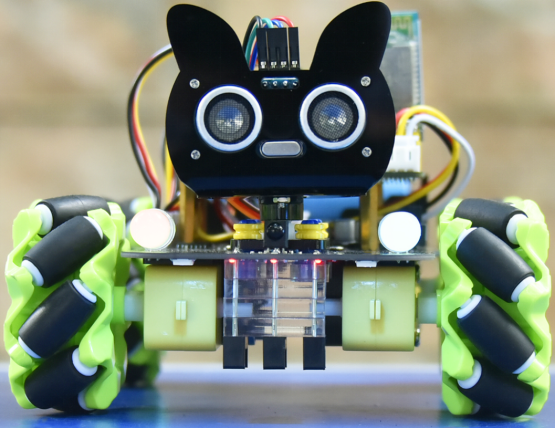
<span style="color: rgb(255, 76, 65);">注意：</span>要先安上电池，将电机驱动底板上的电源拨码开关拨到ON一端，开启电源。如果没有开启电源，则可能提示，这是因为底板没有上电，Raspberry Pi Pico没有检测到i2c器件。


6. 代码说明: 
| from machine import Pin,I2C| 导入machine模块的引脚与I2C功能，然后我们才能使用这些引脚与I2C功能|
| :--: | :--: |
|import mecanumCar_v2 | 导入mecanumCar_v2模块，用来驱动小车的 |
|import time | 导入time模块，用来延时之类的 |
|i2c = I2C(0, sda = Pin(20), scl = Pin(21), freq = 400000)| 创建i2c的类实例，用来设定i2c通讯引脚与频率，sda接GPIO20，scl接GPIO21，频率为400KHz |
| while True: | 主循环，相当于C语言的while(1)，这里面的代码反复循环运行 |
| |参数为1时，输出高电平到右边七彩灯的信号引脚，点亮LED；参数为0时，输出低电平到右边七彩灯的信号引脚，熄灭LED |
| | 参数为1时，输出高电平到左边七彩灯的信号引脚，点亮LED；参数为0时，输出低电平到左边七彩灯的信号引脚，熄灭LED |
|time.sleep(1)| 延时1秒，time.sleep_ms(ms)为毫秒延时，括号内为延时的毫秒数，time.sleep_us(us)为微秒延时，括号内为延时的微秒数|


### 第02课 WS2812RGB


1. 实验说明：                                                                                
在前一个项目中，我们详细的介绍了通过代码控制七彩LED闪烁。这节课我们使用WS2812灯珠来显示真正的多彩灯，理论上我们可以通过编程实现我们想要显示的任意的颜色。
但是这个2812 RGB 驱动原理与我们前面学习过的七彩LED不相同，但是也只需要一个引脚就能控制，这是一个集控制电路与发光电路于一体的智能外控LED光源。每个LED原件其外型与一个5050LED灯珠相同，每个元件即为一个像素点，我们这个电机驱动板上有四个灯珠即四个像素。在本项目中我们控制4个WS2812 RGB灯显示不同的状态。


2. 元件知识： 

这四个像素点灯珠都是串联起来的，其实不论多少个，我们都可以用一个引脚（控制引脚为<span style="color: rgb(255, 76, 65);">G7</span>）控制任意一个灯，并且让它显示任一种颜色。像素点内部包含了智能数字接口数据锁存信号整形放大驱动电路，还包含有高精度的内部振荡器和12V高压可编程定电流控制部分，有效保证了像素点光的颜色高度一致。数据协议采用单线归零码的通讯方式，像素点在上电复位以后，S端接受从控制器传输过来的数据，首先送过来的24bit数据被第一个像素点提取后，送到像素点内部的数据锁存器。这个2812RGB通讯协议与驱动已经在底层封装好了，我们直接调用函数的接口就可以使用。


3. 添加库文件：
首先我们先确保安装了库文件，不然代码会编译出错，这里我们用到库文件“<span style="color: rgb(255, 76, 65);">mecanumCar_v2.py</span>”，如何添加库文件请参考“<span style="color: rgb(0, 209, 0);">开发环境配置</span>”文件。如果库文件已经添加好了，就跳过这一步骤。


4. 实验代码1：                                                                  
本教程中使用的代码保存在：“**..\4. Python 教程\3. 项目课程**” 的路径中。你可以把代码移到任何地方。例如，我们将代码保存在**D盘**中，<span style="color: rgb(0, 209, 0);">路径为D:\3. 项目课程</span>。


打开“**Thonny**”软件，点击“**此电脑**”→“**D:**”→“**3. 项目课程**”→“**第02课 WS2812RGB**”，然后鼠标左键双击“**2.1_WS2812.py**”。             


```
'''
KEYES 4WD Raspberry Pi Pico 麦克纳姆轮智能小车
第02.1课
WS2812
'''

from machine import Pin,I2C
import mecanumCar_v2
import time

#创建一个用于控制小车类,名为mecanumCar
i2c = I2C(0, sda = Pin(20), scl = Pin(21), freq = 400000)
mecanumCar = mecanumCar_v2.Driver(i2c)

mecanumCar.pixels_set(0, (255, 0, 0))
mecanumCar.pixels_set(1, (0, 255, 0))
mecanumCar.pixels_set(2, (0, 0, 255))
mecanumCar.pixels_set(3, (255, 255, 255))
mecanumCar.pixels_show()

```

5. 实验结果1：                                                                  
确保Raspberry Pi Pico主板已经连接到电脑上，单击“”。              


安上电池，将电机驱动底板上的电源拨码开关拨到ON一端，开启电源。单击“”，代码开始执行，你会看到的现象是：底板的4个2812灯珠分别显示红、绿、蓝、白色。


6. 实验代码2：                                                                  
本教程中使用的代码保存在：“**..\4. Python 教程\3. 项目课程**” 的路径中。你可以把代码移到任何地方。例如，我们将代码保存在**D盘**中，<span style="color: rgb(0, 209, 0);">路径为D:\3. 项目课程</span>。


打开“**Thonny**”软件，点击“**此电脑**”→“**D:**”→“**3. 项目课程**”→“**第02课 WS2812RGB**”，然后鼠标左键双击“**2.2_WS2812.py**”。

              
```
'''
KEYES 4WD Raspberry Pi Pico 麦克纳姆轮智能小车
第02.2课
WS2812
'''

from machine import Pin,I2C
import mecanumCar_v2
import time
import random

#创建一个用于控制小车类,名为mecanumCar
i2c = I2C(0, sda = Pin(20), scl = Pin(21), freq = 400000)
mecanumCar = mecanumCar_v2.Driver(i2c)


## 主循环函数
while True:
    r = random.randint(0, 255) #从0~255直接取随机数
    g = random.randint(0, 255)
    b = random.randint(0, 255)
    for i in range(4):
        mecanumCar.pixels_set(i, (r, g, b)) #第i+1个灯珠颜色为随机(r,g,b)
        mecanumCar.pixels_show() #刷新显示
        time.sleep(0.1) #等待一会儿
        
```


7. 实验结果2： 
确保Raspberry Pi Pico主板已经连接到电脑上，单击“”。

安上电池，将电机驱动底板上的电源拨码开关拨到ON一端，开启电源。单击“”，代码开始执行，你会看到的现象是：底板的4个灯珠以随机颜色显示流水灯。

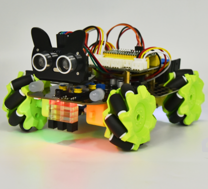


8. 代码说明：                                                                               
|import random| 导入random模块，这里使用到这个模块的取随机数函数|
| :--: | :--: | 
| mecanumCar = mecanumCar_v2.Driver(i2c) | 创建麦克纳姆轮小车驱动类实例，用来驱动小车|
| mecanumCar.pixels_set(num, (r, g, b)) | 设置灯珠的颜色，num为灯珠号，4颗灯珠号分别为0、1、2、3；r,g,b为灯珠显示的颜色|
| mecanumCar.show(); |刷新显示，如果不调用该函数，设置的颜色不会更新 |
| random.randint(0, 255)|返回0~255之间的随机数 |
| for i in range(4):| 变量i从0开始加到3，共执行四次，每次加1，这样就对应了我们的四颗灯珠号了 |

### 第03课 舵机转动


1. 实验说明：                                                                                
在前面的4WD Raspberry Pi Pico麦克纳姆轮智能小车安装步骤文档中，我们已经设置了舵机角度。舵机是一种可以非常精确地旋转的电机。目前已广泛应用于玩具车、遥控直升机、飞机、机器人等领域。在这个项目中，我们将来学习有关舵机转动。


2. 元件知识： 

**舵机：** 舵机是一种位置伺服的驱动器，主要是由外壳、电路板、无核心马达、齿轮与位置检测器所构成。其工作原理是由接收机或者单片机发出信号给舵机，其内部有一个基准电路，产生周期为20ms，宽度为1.5ms 的基准信号，将获得的直流偏置电压与电位器的电压比较，获得电压差输出。经由电路板上的IC 判断转动方向，再驱动无核心马达开始转动，透过减速齿轮将动力传至摆臂，同时由位置检测器送回信号，判断是否已经到达定位。适用于那些需要角度不断变化并可以保持的控制系统。当电机转速一定时，通过级联减速齿轮带动电位器旋转，使得电压差为0，电机停止转动。
舵机有多种规格，但它们都有三根连接线，分别是棕色、红色、橙色(不同品牌可能有不同的颜色)。棕色为GND，红色为电源正极，橙色为信号线

舵机的伺服系统由可变宽度的脉冲来进行控制，橙色的控制线是用来传送脉冲的。一般而言，PWM控制舵机的基准信号周期为20ms（50Hz），理论上脉宽应在1ms到2ms之间，对应控制舵机角度是0°～180°。但是，实际上更多控制舵机的脉宽范围是0.5ms 到2.5ms，具体需要自己实际调试下。

经过实测，舵机的脉冲范围为0.65ms~2.5ms。180度舵机，对应的控制关系是这样的：
|高电平时间|舵机角度|基准信号周期时间（20ms）|
| :--: | :--: | :--: |
|0.65ms|0度|0.65ms高电平+19.35ms低电平|
|1.5ms|90度|1.5ms高电平+18.5ms低电平|
|2.5ms|180度|2.5ms高电平+17.5ms低电平|

舵机的规格参数：
|工作电压：|DC 4.8V〜6V|
| :--: | :--: |
|可操作角度范围：|可操作角度范围：|
|脉波宽度范围：|500→2500 μsec|
|外观尺寸：|22.9*12.2*30mm|
|空载转速：|0.12±0.01 sec/60度（DC 4.8V）  0.1±0.01 sec/60度（DC 6V）|
|空载电流：|200±20mA（DC 4.8V）  220±20mA（DC 6V）|
|停止扭力：|1.3±0.01kg·cm（DC 4.8V）  1.5±0.1kg·cm（DC 6V）|
|停止电流：|≦850mA（DC 4.8V）  ≦1000mA（DC 6V）|
|待机电流：|3±1mA（DC 4.8V）  4±1mA（DC 6V）|
|重量:|9±1g (不带舵机轴)|
|使用温度：|-30℃~60℃|

<span style="color: rgb(255, 76, 65);">这里要注意，不要使用电脑和USB数据线供电，因为如果电流需求大于500mA，会有烧坏舵机的可能，推荐使用电池外置供电。</span>


3. 添加库文件：
首先我们先确保安装了库文件，不然代码会编译出错，这里我们用到库文件“<span style="color: rgb(255, 76, 65);">mecanumCar_v2.py</span>”，如何添加库文件请参考“<span style="color: rgb(0, 209, 0);">开发环境配置</span>”文件。如果库文件已经添加好了，就跳过这一步骤。


4. 实验代码：
本教程中使用的代码保存在：“**..\4. Python 教程\3. 项目课程**” 的路径中。你可以把代码移到任何地方。例如，我们将代码保存在**D盘**中，<span style="color: rgb(0, 209, 0);">路径为D:\3. 项目课程</span>。


打开“**Thonny**”软件，点击“**此电脑**”→“**D:**”→“**3. 项目课程**”→“**第03课 舵机转动**”，然后鼠标左键双击“**3_Servo.py**”。


```
'''
KEYES 4WD Raspberry Pi Pico 麦克纳姆轮智能小车
第03课
舵机转动
'''

from machine import Pin,I2C
import mecanumCar_v2
import time

i2c = I2C(0, sda = Pin(20), scl = Pin(21), freq = 400000)
#print("STC8G1K08 address：", machine.I2C.scan(i2c))
mecanumCar = mecanumCar_v2.Driver(i2c)

mecanumCar.set_angle(90) #转动到90度
time.sleep(1)

## 主循环函数
while True:
    for i in range(180):
        mecanumCar.set_angle(i) #从0转动到180度
        time.sleep_ms(20) #等待一会儿，不让它转动得那么快
    for i in range(180):
        mecanumCar.set_angle(180-i) #从180转动到0度
        time.sleep_ms(20) #等待一会儿，不让它转动得那么快
        
```

5. 实验结果：                                                                      

确保Raspberry Pi Pico主板已经连接到电脑上，单击“”。


安上电池，将电机驱动底板上的电源拨码开关拨到ON一端，开启电源。单击“”，代码开始执行，你会看到的现象是：舵机从0度到180度之间来回转动了。


6. 代码说明：
| for i in range(180): | 变量i从0到180（不包括180），每次加1 |
| :--: | :--: |
| mecanumCar.set_angle(angle)| 设置舵机转动到angle角度位置 |
| time.sleep_ms(20) | 毫秒延时函数，括号内为延时的毫秒数 |
| mecanumCar.set_angle(180-i) | 当i变量从0~180时，180-i就相当于从180~0了，此时即可设置舵机从180度转动到0度|


### 第04课 电机控制


1. 实验说明：                                                                                
要想让小车跑起来那必须要有电机，然后搭配车轮就可以了。我们这个套件上配有4个直流减速电机，即齿轮减速电机，是在普通直流电机的基础上，加上配套齿轮减速箱。齿轮减速箱的作用是，提供较低的转速，较大的力矩。同时，齿轮箱不同的减速比可以提供不同的转速和力矩。这大大提高了直流电机在自动化行业中的使用率，减速电机是指减速机和电机（马达）的集成体，这种集成体通常也可称为齿轮马达或齿轮电机。减速电机广泛应用于钢铁行业、机械行业等。使用减速电机的优点是简化设计、节省空间。
电机的驱动不比LED，它要求的电流比较大，如果我们使用IO口强制驱动电机，要么电机不转动，要么烧坏单片机，所以我们需要一个电机驱动芯片。在电机驱动底板板上已经包含了DRV8833电机驱动芯片，用来控制4个直流减速电机的转动方向和转动速度。下面也有电机驱动底板两个芯片的电路原理图。


2. 相关知识： 


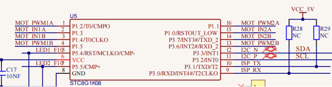
每个芯片控制4个引脚，每两个引脚控制一个电机，这样就使用了8个引脚控制了4个电机了。我们可以看到电机驱动与STC的接线图，我们驱动电机的时候使用IIC协议往STC这个芯片对应的寄存器地址写入脉宽值就可以输出pwm信号给电机驱动芯片了，我们已经写好了电机驱动的库文件，使用的时候只需要调用API函数就可以让小车走了，非常简单。


3. 添加库文件：
首先我们先确保安装了库文件，不然代码会编译出错，这里我们用到库文件“<span style="color: rgb(255, 76, 65);">mecanumCar_v2.py</span>”，如何添加库文件请参考“<span style="color: rgb(0, 209, 0);">开发环境配置</span>”文件。如果库文件已经添加好了，就跳过这一步骤。


4. 实验代码：
本教程中使用的代码保存在：“**..\4. Python 教程\3. 项目课程**” 的路径中。你可以把代码移到任何地方。例如，我们将代码保存在**D盘**中，<span style="color: rgb(0, 209, 0);">路径为D:\3. 项目课程</span>。


打开“**Thonny**”软件，点击“**此电脑**”→“**D:**”→“**3. 项目课程**”→“**第04课 电机的控制**”，然后鼠标左键双击“**4_Motor.py**”。


```
'''
KEYES 4WD Raspberry Pi Pico 麦克纳姆轮智能小车
第04课
电机的控制
'''

from machine import Pin,I2C
import mecanumCar_v2
import time

i2c = I2C(0, sda = Pin(20), scl = Pin(21), freq = 400000) #iic0 sda-->20,scl-->21
mecanumCar = mecanumCar_v2.Driver(i2c) #创建麦克纳姆轮小车驱动类实例

## 主循环函数
while True:
  mecanumCar.Advance()
  time.sleep(2)           #等待2秒
  
  mecanumCar.Back()       #后退
  time.sleep(2)
  
  mecanumCar.Turn_Left(); #左转
  time.sleep(2)

  mecanumCar.Turn_Right() #右转
  time.sleep(2)

  mecanumCar.stop();      #停止
  time.sleep(1)

```

5. 实验结果：                                                                                
确保Raspberry Pi Pico主板已经连接到电脑上，单击“”。


安上电池，将电机驱动底板上的电源拨码开关拨到ON一端，开启电源。单击“”，代码开始执行，你会看到的现象是：小车前进2秒然后后退2秒，然后左转2秒再右转2秒，最后停止一秒，如此反复循环。


6. 代码说明:
|mecanumCar.Advance();| 调用此函数时，4个电机向前转，小车前进|
| :--: | :--: | 
|mecanumCar.Back(); |调用此函数时，4个电机向后转，小车后退 |
|mecanumCar.Turn_Left(); | 调用此函数时，左边2个电机向后转，右边2个电机向前转，小车左旋转 |
| mecanumCar.Turn_Right(); |调用此函数时，左边2个电机向前转，右边2个电机向后转，小车右旋转|
|time.sleep(2) |等待2秒|


### 第05课 循迹传感器


1.实验说明：                                                                                 
循迹传感器实际上是红外传感器。 在小车驱动底板的前面有3路巡线，此处使用的组件是TCRT5000红外灯管。 其工作原理是利用红外光对颜色的不同反射率，然后将反射信号的强度转换为电流信号。 在检测过程中，黑色在高电平时处于活动状态，而白色在低电平时处于活动状态，即检测到黑色时或者近距离没有检测到物体时输出高电平，检测到白色或者光滑易反射光的物体时输出低电平。 检测高度为0-3厘米。 底板上方还有3个蓝色旋转电位器，通过旋转这些电位器，可以调节传感器的检测灵敏度。


2.相关知识：
- 工作电压: 3.3-5V (DC)
- 接口: 5PIN接口(左边循迹传感器接G16,中间循迹传感器接G17,右边循迹传感器接G18,5V,G)
- 输出信号: 数字信号
- 检测高度: 0-3 cm

**红外循迹传感器：** 红外循迹传感器的红外对管分为两部分，一部分是红外发射端，另一部分是红外接收端。

黑线或黑色物体对红外线有很好的吸收效果。当红外循迹发射端向黑线发射时，发射的红外线被吸收而未形成反射信号，红外循迹接收端未接收到信号，这样红外循迹输出高电平(1);白线或白色物体对红外线没有吸收作用，红外循迹发射端的红外信号会反射回接收端，这样红外循迹输出低电平(0)。

下表给出了小车底板上的红外循迹传感器检测不同颜色物体的所有情况下的数值。其中检测到黑线、黑色物体或无物体代表1，检测到白线或白色物体代表0。


|左红外循迹传感器|中间红外循迹传感器|右红外循迹传感器|值（二进制）|
| :--: | :--: |:--:| :--: |
|0|0|0|000|
|0|0|1|001|
|0|1|0|010|
|0|1|1|011|
|1|0|0|100|
|1|0|1|101|
|1|1|0|110|
|1|1|1|111|

<span style="color: rgb(255, 76, 65);">警告：反射式光学传感器(包括红外循迹)应避免在阳光等有红外干扰的环境中使用。阳光中含有许多不可见光，如红外线和紫外线。在强光环境下，反射式光学传感器不能正常工作。</span>


3.实验代码：
本教程中使用的代码保存在：“**..\4. Python 教程\3. 项目课程**” 的路径中。你可以把代码移到任何地方。例如，我们将代码保存在**D盘**中，<span style="color: rgb(0, 209, 0);">路径为D:\3. 项目课程</span>。


打开“**Thonny**”软件，点击“**此电脑**”→“**D:**”→“**3. 项目课程**”→“**第05课 循迹传感器**”，然后鼠标左键双击“**5_Tracking_Line.py**”。


```
'''
KEYES 4WD Raspberry Pi Pico 麦克纳姆轮智能小车
第05课
循迹传感器
'''

from machine import Pin
import time

l_pin = Pin(16, Pin.IN)
m_pin = Pin(17, Pin.IN)
r_pin = Pin(18, Pin.IN)


while True:
    l_val = l_pin.value() #读取左边巡线传感器的值
    m_val = m_pin.value() #读取中间巡线传感器的值
    r_val = r_pin.value() #读取右边巡线传感器的值
    print(l_val, end = ' ')
    print(m_val, end = ' ')
    print(r_val)
    time.sleep_ms(100)
    
```


4.实验结果：                                                                                
确保Raspberry Pi Pico主板已经连接到电脑上，单击“”。


安上电池，将电机驱动底板上的电源拨码开关拨到ON一端，开启电源。单击“”，代码开始执行。这样，在Shell窗口中，我们可以看到打印的三路巡线传感器接收到的数字信号，当我们用白纸去遮挡它的时候，输出0，用黑纸或者悬空小车的时候，输出1：


4.代码说明：

|| 三路循迹传感器引脚接口定义，这里我们左边接到GPIO16，中间接GPIO17，右边接GPIO18，引脚模式全部设置为输入，因为我们想要去读取循迹传感器输出的电平信号，所以我们设置为输入模式。|
| :--: | :--: |
|l_pin.value()|读取引脚的数字电平，当这个引脚为3.3V时我们读取到的值就是1，当这个引脚为0V时，我们读取到的值就是0，读取完我们这里用一个变量l_val保存了。 |
|print(l_val, end = ' ')| 打印读取到的l_val的值，后面使用end = ' '表示不换行 |
|print(r_val)|换行打印r_val的值|


### 第06课 循迹智能车
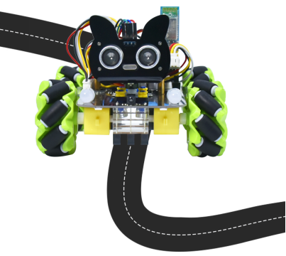


1. 实验说明：
前面我们学习了循迹传感器和电机驱动的原理和应用，下面我们要结合循迹传感器和电机驱动来做一款循迹小车。
循迹，意思就是循着轨迹，也就是我们经常会看到的走黑线的循迹小车，原理是利用循迹传感器对路面黑色轨迹进行检测，并将路面检测信号反馈给控制主板。控制板对采集到的信号予以分析判断，及时控制驱动电机以调整小车转向，从而使小车能够沿着黑色轨迹自动行驶，实现循迹小车自动寻迹的目的，我们来看看下面的流程图就清晰了：


2.实验原理：
|左红外循迹传感器|中间红外循迹传感器|右红外循迹传感器|值（二进制）|状态|
| :--: | :--: |:--:| :--: | :--: |
|0|0|0|000|停止|
|0|0|1|001|向右转|
|0|1|0|010|直走|
|0|1|1|011|向右转|
|1|0|0|100|向左转|
|1|0|1|101|停止|
|1|1|0|110|向左转|
|1|1|1|111|直走|


3. 实验流程图：


4. 添加库文件：
首先我们先确保安装了库文件，不然代码会编译出错，这里我们用到库文件“<span style="color: rgb(255, 76, 65);">mecanumCar_v2.py</span>”，如何添加库文件请参考“<span style="color: rgb(0, 209, 0);">开发环境配置</span>”文件。如果库文件已经添加好了，就跳过这一步骤。


5. 实验代码：
本教程中使用的代码保存在：“**..\4. Python 教程\3. 项目课程**” 的路径中。你可以把代码移到任何地方。例如，我们将代码保存在**D盘**中，<span style="color: rgb(0, 209, 0);">路径为D:\3. 项目课程</span>。


打开“**Thonny**”软件，点击“**此电脑**”→“**D:**”→“**3. 项目课程**”→“**第06课 循迹智能车**”，然后鼠标左键双击“**6_Line_Tracking_Robot.py**”。


```
'''
KEYES 4WD Raspberry Pi Pico 麦克纳姆轮智能小车
第06课
循迹智能车
'''

from machine import Pin,I2C
import mecanumCar_v2
import time

i2c = I2C(0, sda = Pin(20), scl = Pin(21), freq = 400000)
#print("STC8G1K08 address：", machine.I2C.scan(i2c))
mecanumCar = mecanumCar_v2.Driver(i2c)

l_pin = Pin(16, Pin.IN)
m_pin = Pin(17, Pin.IN)
r_pin = Pin(18, Pin.IN)


while True:
    l_val = l_pin.value()
    m_val = m_pin.value()
    r_val = r_pin.value()
    if m_val == 1:
        if l_val == 1 and r_val == 0:
            mecanumCar.Turn_Left()
        elif l_val == 0 and r_val == 1:
            mecanumCar.Turn_Right()
        else:
            mecanumCar.Advance()
    else:
        if l_val == 1 and r_val == 0:
            mecanumCar.Turn_Left()
        elif l_val == 0 and r_val == 1:
            mecanumCar.Turn_Right()
        else:
            mecanumCar.stop()

```


6. 实验结果：
确保Raspberry Pi Pico主板已经连接到电脑上，单击“”。


安上电池，将电机驱动底板上的电源拨码开关拨到ON一端，开启电源。单击“”，代码开始执行，你会看到的现象是：我们把小车放在黑色循迹图上，小车就能沿着黑线行驶了。


<span style="color: rgb(255, 76, 65);">特别注意：</span>

（1）小车循迹轨道，黑线的宽度必须大于等于3路循迹传感器模块的宽度，小车速度尽量应调低一些。

（2）测试小车时，不要在阳光明媚的太阳底下测试。测试过程中，如果出现问题，可在暗一点的环境中测试。


7. 代码说明: 
| if m_val == 1:| 引脚定义 |
| :--: | :--: |
| pinMode(SensorLeft, INPUT);  |如果m_val为1，即中间传感器检测到黑线 |
|if l_val == 1 and r_val == 0:  | 如果l_val为1并且r_val为0，即左边检测到黑，右边检测到白|
|elif l_val == 0 and r_val == 1: | 否则如果l_val为0并且r_val为1，即左边检测到白，右边检测到黑 |


### 第07课 超声波传感器


1. 实验说明：
小车上有个超声波传感器，超声波传感器是一种非常实惠的距离传感器，它可以检测前方是否存在障碍物，并且检测出传感器与障碍物的详细距离。

它的原理和蝙蝠飞行的原理一样，就是超声波传感器发送出一种频率很高的超声波信号，通常正常人耳朵的听力的声波范围是20Hz~20kHz，人类无法听到。这些超声波的信号若是碰到障碍物，就会立刻反射回来，在接收到返回的信息之后，通过判断发射信号和接收信号的时间差，计算出传感器和障碍物的距离。超声波传感器主要用于各种机器人项目中的物体躲避和测距，也常被用于水位传感，甚至作为一个停车传感器。
在本实验中，我们使用超声波传感器来测量距离，并将数据打印在串口监视器上。根据前面的接线图可知，超声波传感器模块集成端口是接在电机驱动底板上5V G G3 G4集合端口，Trig（T）引脚对应的是G3控制的；Echo（E）引脚对应的是G4控制的。


2. 元件知识：
**HC-SR04超声波传感器：** 像蝙蝠一样使用声纳来确定与物体的距离，它提供了精准的非接触范围检测，高精度和稳定的读数。它的操作不受阳光或黑色材料的影响，就像精密的照相机(在声学上像布料这样比较软的材料很难被探测到)。它带有超声波信号发射端和信号接收端。

我们看下超声波传感器模块的图片，两个像眼睛一样的东西，一个就是信号发射端（TRIG），一个就是信号接收端（ECHO）。    
   

**参数：**
- 工作电压:+5V DC
- 静态电流: <2mA
- 工作电流: 15mA
- 有效角度: <15°
- 距离范围: 2cm – 400 cm
- 精度: 0.3 cm
- 测量角度: 30 degree
- 触发输入脉宽: 10us

**原理：**

最常用的超声测距的方法是回声探测法，如图：

超声波发射器向某一方向发射超声波，在发射时刻的同时计数器开始计时，超声波在空气中传播，途中碰到障碍物面阻挡就立即反射回来，超声波接收器收到反射回的超声波就立即停止计时。超声波也是一种声波，其声速V与温度有关。一般情况下超声波在空气中的传播速度为340m/s，根据计时器记录的时间t，就可以计算出发射点距障碍物面的距离s，即：s=340t/2：
(1)采用IO口TRIG触发测距，给至少10us的高电平信号;
(2)模块自动发送8个40khz的方波，自动检测是否有信号返回；
(3)有信号返回，通过ECHO输出一个高电平，单片机读取到高电平持续的时间就是超声波从发射到返回的时间。

超声波模块的电路图：


3. 实验代码：
本教程中使用的代码保存在：“**..\4. Python 教程\3. 项目课程**” 的路径中。你可以把代码移到任何地方。例如，我们将代码保存在**D盘**中，<span style="color: rgb(0, 209, 0);">路径为D:\3. 项目课程</span>。


打开“**Thonny**”软件，点击“**此电脑**”→“**D:**”→“**3. 项目课程**”→“**第07课 超声波传感器**”，然后鼠标左键双击“**7_Ultrasonic_sensor.py**”。


```
'''
KEYES 4WD Raspberry Pi Pico 麦克纳姆轮智能小车
第07课
超声波传感器
'''

from machine import Pin,I2C
import mecanumCar_v2
import time

i2c = I2C(0, sda = Pin(20), scl = Pin(21), freq = 400000)
mecanumCar = mecanumCar_v2.Driver(i2c) 

while True:
    distance = mecanumCar.get_distance()
    print("distance is : {} cm".format(distance))
    time.sleep_ms(100)
    
```


4. 实验结果：
确保Raspberry Pi Pico主板已经连接到电脑上，单击“”。


安上电池，将电机驱动底板上的电源拨码开关拨到ON一端，开启电源。单击“”，代码开始执行，在Shell窗口中，你会看到超声波模块测得的距离，移动小车看到距离也在发生变化，如下图：


5. 代码说明: 

|mecanumCar.get_distance()| 获取超声波测得的距离，这里我们超声波的Trig引脚在GPIO3，Echo引脚在GPIO4，我们可在mecanumCar_v2文件中修改引脚号|
| :--: | :--: |
|print("distance is : {} cm".format(distance)) |字符串格式化打印，测到的距离distance在{}中显示 |
| time.sleep_ms(100) | 延时100毫秒 |


### 第08课 超声波跟随智能小车
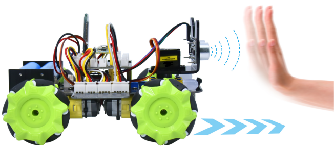


1. 实验说明：                                                                                
前面我们学习了使用循迹传感器和电机来制作了一个自动巡线智能小车，这节课我们使用超声波传感器和电机来制作一个自动跟随智能小车，我们通过超声波传感器检测智能车和前方障碍物的距离，然后根据这一个数据控制两个电机的转动，从而控制智能车的运动状态，我们来看看下面的程序流程图就很清晰了：


2. 实验流程图：                                                  

                           

3. 添加库文件：
首先我们先确保安装了库文件，不然代码会编译出错，这里我们用到库文件“<span style="color: rgb(255, 76, 65);">mecanumCar_v2.py</span>”，如何添加库文件请参考“<span style="color: rgb(0, 209, 0);">开发环境配置</span>”文件。如果库文件已经添加好了，就跳过这一步骤。


4. 实验代码：
本教程中使用的代码保存在：“**..\4. Python 教程\3. 项目课程**” 的路径中。你可以把代码移到任何地方。例如，我们将代码保存在**D盘**中，<span style="color: rgb(0, 209, 0);">路径为D:\3. 项目课程</span>。


打开“**Thonny**”软件，点击“**此电脑**”→“**D:**”→“**3. 项目课程**”→“**第08课 超声波跟随智能小车**”，然后鼠标左键双击“**8_Ultrasonic_follow_Robot.py**”。


```
'''
KEYES 4WD Raspberry Pi Pico 麦克纳姆轮智能小车
第08课
超声波跟随车
'''

from machine import Pin,I2C
import mecanumCar_v2
import time

i2c = I2C(0, sda = Pin(20), scl = Pin(21), freq = 400000) #iic0 sda-->20,scl-->21
mecanumCar = mecanumCar_v2.Driver(i2c) #创建麦克纳姆轮小车驱动类实例

while True:
    distance = mecanumCar.get_distance()
    if distance < 15:
        mecanumCar.Back()
    elif distance < 25:
        mecanumCar.stop()
    elif distance < 45:
        mecanumCar.Advance()
    else:
        mecanumCar.stop()
        
```


5. 实验结果：
确保Raspberry Pi Pico主板已经连接到电脑上，单击“”。


安上电池，将电机驱动底板上的电源拨码开关拨到ON一端，开启电源。单击“”，代码开始执行，你会看到的现象是：小车就能直线跟随了，注意这里只是直线跟随。我们用手掌放在超声波前面，慢慢向前，小车就会跟着我们的手掌移动。


<span style="color: rgb(255, 76, 65);">注意：</span>障碍物只能在小车的正前方移动，不能拐弯。


6. 代码说明: 

|distance = mecanumCar.get_distance()   | 定义一个整数变量distance用来保存测得的距离，后面根据这个距离来控制小车行驶|
| :--: | :--: |
|| 测得的前面距离小于15cm时，小车后退 |
|| 否则前面距离小于25cm时，小车停止|
|| 否则前面距离小于45cm时，小车前进 |
|| 否则前面距离大于等于45cm时，小车停止 |


### 第09课 超声波避障智能小车
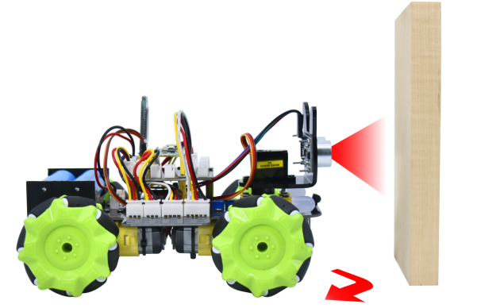


1. 实验说明：                                                                                
在上个项目中，我们制作了一个超声波跟随智能车。实际上，利用同样的硬件，同样的接线方法，我们只需要更改一个测试代码就可以将跟随智能车变为避障智能车。超声波避障智能车，就是通过超声波传感器检测前方障碍物的距离，然后舵机云台转动检测到左右两边的距离，然后根据这一个数据控制四个电机的转动，从而控制智能车的运动状态，从而实现避障。
我们来看看下面的程序流程图就很清晰了：


2. 实验流程图： 


3. 添加库文件：
首先我们先确保安装了库文件，不然代码会编译出错，这里我们用到库文件“<span style="color: rgb(255, 76, 65);">mecanumCar_v2.py</span>”，如何添加库文件请参考“<span style="color: rgb(0, 209, 0);">开发环境配置</span>”文件。如果库文件已经添加好了，就跳过这一步骤。


4. 实验代码：
本教程中使用的代码保存在：“**..\4. Python 教程\3. 项目课程**” 的路径中。你可以把代码移到任何地方。例如，我们将代码保存在**D盘**中，<span style="color: rgb(0, 209, 0);">路径为D:\3. 项目课程</span>。


打开“**Thonny**”软件，点击“**此电脑**”→“**D:**”→“**3. 项目课程**”→“**第09课 超声波避障智能小车**”，然后鼠标左键双击“**9_Ultrasonic_obstacle_avoidance_Robot.py**”。


```
'''
KEYES 4WD Raspberry Pi Pico 麦克纳姆轮智能小车
第09课
超声波避障智能车
'''

from machine import Pin,I2C
import mecanumCar_v2
import time

i2c = I2C(0, sda = Pin(20), scl = Pin(21), freq = 400000) #iic0 sda-->20,scl-->21
mecanumCar = mecanumCar_v2.Driver(i2c) #创建麦克纳姆轮小车驱动类实例

mecanumCar.set_angle(90)
time.sleep(0.5)
while True:
    distance = mecanumCar.get_distance()
    if distance <= 15:
        mecanumCar.stop()
        time.sleep(0.5)
        mecanumCar.set_angle(180)
        time.sleep(0.5)
        l_distance = mecanumCar.get_distance()
        time.sleep(0.1)
        mecanumCar.set_angle(0)
        time.sleep(0.5)
        r_distance = mecanumCar.get_distance()
        time.sleep(0.1)
        mecanumCar.set_angle(90)
        time.sleep(0.5)
        if l_distance > r_distance:
            mecanumCar.Turn_Left()
            time.sleep(0.3)
        else:
            mecanumCar.Turn_Right()
            time.sleep(0.3)
    else:
        mecanumCar.Advance()
        
```


5. 实验结果：
确保Raspberry Pi Pico主板已经连接到电脑上，单击“”。


安上电池，将电机驱动底板上的电源拨码开关拨到ON一端，开启电源。单击“”，代码开始执行，你会看到的现象是：小车就能自动避障了，注意这里速度不要调得太大。当小车行驶过程中前方遇到障碍物，小车将停止，然后舵机云台转动到左边，测下左边障碍物的距离；然后舵机云台转动到右边，测下右边障碍物的距离，然后判断左边与右边障碍物的距离，哪边距离更远，小车就往那边转弯，然后继续行驶。


6. 代码说明: 
|mecanumCar.set_angle(90)|在开始的时候我们先让舵机转动到90度位置|
| :--: | :--: |
|distance = mecanumCar.get_distance()  | 定义一个变量distance用来保存测得的距离，后面根据这个距离来控制小车行驶|
|if distance < 15:| 距离小于15cm时，开始停止，然后判断左右两边距离|
|| 超声波转动到左边，测左边的距离，保存 |
| |超声波转动到右边，测右边的距离，保存|
|| 舵机回正到90度位置 |
|if l_distance > r_distance:|判断左右两边距离，谁更大|
||否则，前方距离大于15cm时，小车继续直行|


### 第10课 红外遥控的原理


1. 实验简介：
红外遥控在日常生活中随处可见，它被用来控制各种家电，如电视、音响、录影机和卫星信号接收器。红外遥控是由红外发射和红外接收系统组成的，也就是一个红外遥控器、红外接收器和一个能解码的单片机组成的，小车上有个红外接收器。

在本实验中，使用红外接收器和红外遥控器相结合，读取红外遥控器上的按键值并将按键值打印在Shell窗口中。


2. 元件知识：
**红外(IR)遥控器：** 是一种具有一定数量按钮的设备。按下不同的按钮会使位于遥控器前端的红外发射管以不同的编码发送红外信号。红外遥控技术应用广泛，如电视、空调等。因此，在当今科技发达社会，红外遥控技术使你切换电视节目和调节空调温度都很方便。
我们使用的遥控器如下所示：
该红外遥控器采用NEC编码，信号周期为110ms。


**红外(IR)接收器：** 它是一种元件，可以接收红外光，所以可以用它来检测红外遥控器发出的红外光信号。红外接收器解调接收到的红外光信号，并将其转换回二进制，然后将信息传递给微控制器。
红外信号调制过程图：


**原理：** 遥控器发射的38KHz红外载波信号是由遥控器里的编码芯片对其进行编码。它是（NEC协议）以一段引导码，用户码，用户反码，数据码，数据反码组成，利用脉冲的时间间隔来区别是0还是1信号(560us低电平+560us高电平时被认为是信号0，560us低电平+1680us高电平时被认为是信号1)，而编码就是由这些0 、1信号组成。同一个遥控器的用户码是不变的，用数据吗不同来分辨遥控器按的键不同。当按下遥控器按键时，遥控器发送出红外载波信号，红外接收器接收到信号时程序对载波信号进行解码，通过数据码的不同来判断按下的是哪个键。单片机由接收到的01信号进行解码，由此判断遥控器按下的是什么键，为了方便接收数据，我们在小车前后都板载了红外接收头，我们这里是接到了Raspberry Pi Pico的GPIO6。
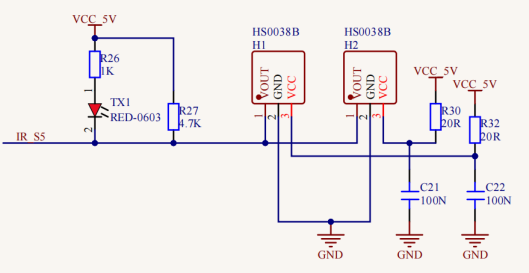


3. 添加库文件：
首先我们先确保安装了库文件，不然代码会编译出错，这里我们用到库文件“<span style="color: rgb(255, 76, 65);">mecanumCar_v2.py</span>”，如何添加库文件请参考“<span style="color: rgb(0, 209, 0);">开发环境配置</span>”文件。如果库文件已经添加好了，就跳过这一步骤。


4. 实验代码1：
本教程中使用的代码保存在：“**..\4. Python 教程\3. 项目课程**” 的路径中。你可以把代码移到任何地方。例如，我们将代码保存在**D盘**中，<span style="color: rgb(0, 209, 0);">路径为D:\3. 项目课程</span>。


打开“**Thonny**”软件，点击“**此电脑**”→“**D:**”→“**3. 项目课程**”→“**第10课 红外遥控的原理**”，然后鼠标左键双击“**10.1_IRremote.py**”。


```
'''
KEYES 4WD Raspberry Pi Pico 麦克纳姆轮智能小车
第10.1课
红外遥控
'''

import utime
from machine import Pin

ird = Pin(6,Pin.IN) #红外接收引脚接口GPIO6

#红外解码字典
act = {"1": "LLLLLLLLHHHHHHHHLHHLHLLLHLLHLHHH","2": "LLLLLLLLHHHHHHHHHLLHHLLLLHHLLHHH","3": "LLLLLLLLHHHHHHHHHLHHLLLLLHLLHHHH",
       "4": "LLLLLLLLHHHHHHHHLLHHLLLLHHLLHHHH","5": "LLLLLLLLHHHHHHHHLLLHHLLLHHHLLHHH","6": "LLLLLLLLHHHHHHHHLHHHHLHLHLLLLHLH",
       "7": "LLLLLLLLHHHHHHHHLLLHLLLLHHHLHHHH","8": "LLLLLLLLHHHHHHHHLLHHHLLLHHLLLHHH","9": "LLLLLLLLHHHHHHHHLHLHHLHLHLHLLHLH",
       "0": "LLLLLLLLHHHHHHHHLHLLHLHLHLHHLHLH","Up": "LLLLLLLLHHHHHHHHLHHLLLHLHLLHHHLH","Down": "LLLLLLLLHHHHHHHHHLHLHLLLLHLHLHHH",
       "Left": "LLLLLLLLHHHHHHHHLLHLLLHLHHLHHHLH","Right": "LLLLLLLLHHHHHHHHHHLLLLHLLLHHHHLH","Ok": "LLLLLLLLHHHHHHHHLLLLLLHLHHHHHHLH",
       "*": "LLLLLLLLHHHHHHHHLHLLLLHLHLHHHHLH","#": "LLLLLLLLHHHHHHHHLHLHLLHLHLHLHHLH"}

def read_ircode(ird):
    wait = 1
    complete = 0
    seq0 = []
    seq1 = []

    while wait == 1:
        if ird.value() == 0:
            wait = 0
    while wait == 0 and complete == 0:
        start = utime.ticks_us()
        while ird.value() == 0:
            ms1 = utime.ticks_us()
        diff = utime.ticks_diff(ms1,start)
        seq0.append(diff)
        while ird.value() == 1 and complete == 0:
            ms2 = utime.ticks_us()
            diff = utime.ticks_diff(ms2,ms1)
            if diff > 10000:
                complete = 1
        seq1.append(diff)

    code = ""
    for val in seq1:
        if val < 2000:
            if val < 700:
                code += "L"
            else:
                code += "H"
    # print(code)
    command = ""
    for k,v in act.items():
        if code == v:
            command = k
    if command == "":
        command = code
    return command

while True:
    command = read_ircode(ird)
    print(command)
    utime.sleep(0.5)
    
```


5. 实验结果1：
确保Raspberry Pi Pico主板已经连接到电脑上，单击“”。


安上电池，将电机驱动底板上的电源拨码开关拨到ON一端，开启电源。单击“”，代码开始执行，拿出遥控器，对准红外接收器按下遥控器上的按键（即：发送信号），在Shell窗口中即可看相应按键的键值，如果按键时间过长，容易出现乱码。


<span style="color: rgb(255, 76, 65);">特别注意：</span>

（1）有些红外遥控不带电池，需要自己配置，电池型号为CR2025。
（2）测试前需要确保红外遥控是OK的，有一个小诀窍测试红外遥控是否OK。打开手机摄像头拍照，红外遥控多准手机摄像头按下按键。如果在手机上看到有紫光闪烁，就代表红外遥控是OK的。


6. 实验代码2：
使用一个OK键来控制七彩灯的亮灭。

本教程中使用的代码保存在：“**..\4. Python 教程\3. 项目课程**” 的路径中。你可以把代码移到任何地方。例如，我们将代码保存在**D盘**中，<span style="color: rgb(0, 209, 0);">路径为D:\3. 项目课程</span>。


打开“**Thonny**”软件，点击“**此电脑**”→“**D:**”→“**3. 项目课程**”→“**第10课 红外遥控的原理**”，然后鼠标左键双击“**10.2_IRremote.py**”。


```
'''
KEYES 4WD Raspberry Pi Pico 麦克纳姆轮智能小车
第10.2课
红外遥控控制七彩灯
'''

from machine import Pin,I2C
import mecanumCar_v2
import time

i2c = I2C(0, sda = Pin(20), scl = Pin(21), freq = 400000) #iic0 sda-->20,scl-->21
mecanumCar = mecanumCar_v2.Driver(i2c) #创建麦克纳姆轮小车驱动类实例

ird = Pin(6,Pin.IN) #红外接收引脚接口GPIO6

#红外解码字典
act = {"1": "LLLLLLLLHHHHHHHHLHHLHLLLHLLHLHHH","2": "LLLLLLLLHHHHHHHHHLLHHLLLLHHLLHHH","3": "LLLLLLLLHHHHHHHHHLHHLLLLLHLLHHHH",
       "4": "LLLLLLLLHHHHHHHHLLHHLLLLHHLLHHHH","5": "LLLLLLLLHHHHHHHHLLLHHLLLHHHLLHHH","6": "LLLLLLLLHHHHHHHHLHHHHLHLHLLLLHLH",
       "7": "LLLLLLLLHHHHHHHHLLLHLLLLHHHLHHHH","8": "LLLLLLLLHHHHHHHHLLHHHLLLHHLLLHHH","9": "LLLLLLLLHHHHHHHHLHLHHLHLHLHLLHLH",
       "0": "LLLLLLLLHHHHHHHHLHLLHLHLHLHHLHLH","Up": "LLLLLLLLHHHHHHHHLHHLLLHLHLLHHHLH","Down": "LLLLLLLLHHHHHHHHHLHLHLLLLHLHLHHH",
       "Left": "LLLLLLLLHHHHHHHHLLHLLLHLHHLHHHLH","Right": "LLLLLLLLHHHHHHHHHHLLLLHLLLHHHHLH","Ok": "LLLLLLLLHHHHHHHHLLLLLLHLHHHHHHLH",
       "*": "LLLLLLLLHHHHHHHHLHLLLLHLHLHHHHLH","#": "LLLLLLLLHHHHHHHHLHLHLLHLHLHLHHLH"}

def read_ircode(ird):
    wait = 1
    complete = 0
    seq0 = []
    seq1 = []

    while wait == 1:
        if ird.value() == 0:
            wait = 0
    while wait == 0 and complete == 0:
        start = time.ticks_us()
        while ird.value() == 0:
            ms1 = time.ticks_us()
        diff = time.ticks_diff(ms1,start)
        seq0.append(diff)
        while ird.value() == 1 and complete == 0:
            ms2 = time.ticks_us()
            diff = time.ticks_diff(ms2,ms1)
            if diff > 10000:
                complete = 1
        seq1.append(diff)

    code = ""
    for val in seq1:
        if val < 2000:
            if val < 700:
                code += "L"
            else:
                code += "H"
    # print(code)
    command = ""
    for k,v in act.items():
        if code == v:
            command = k
    if command == "":
        command = code
    return command

while True:
    command = read_ircode(ird)
    if command == "Left":
        mecanumCar.left_led(1)
    elif command == "Right":
        mecanumCar.right_led(1)
    elif command == "Ok":
        mecanumCar.left_led(0)
        mecanumCar.right_led(0)


```

7. 实验结果2：
确保Raspberry Pi Pico主板已经连接到电脑上，单击“”。


安上电池，将电机驱动底板上的电源拨码开关拨到ON一端，开启电源。单击“”，代码开始执行，按下红外遥控的按键，则亮左边的七彩灯，按下红外遥控的按键，则亮右边的七彩灯，按下按键，则关闭两个七彩灯。


8. 代码说明: 
|import utime | 导入utime模块，与time模块差不多 |
| :--: | :--: |
|from machine import Pin | 从machine导入引脚功能Pin |
|ird = Pin(6, Pin\.IN)| 红外接收模块接GPIO6，设置为输入|
|act | act为定义的解码的字典，有关字典的定义：https://docs.python.org/3/tutorial/datastructures.html#dictionaries|
| def read_ircode(ird):| 定义一个红外遥控解码函数，参数为红外接收引脚 |
||定义两个空的列表，分别用来存放低电平，高电平的时间，列表的定义：https://docs.python.org/3/tutorial/introduction.html#lists|
|| 等待低电平到来 |
||低电平来了之后，等待高电平出现，并把时间记录下来，utime.ticks_us()返回运行的微秒数|
||diff记录低电平保持的时间，然后使用列表的append()方法添加到seq0|
||高电平来了之后，等待低电平出现，并把时间记录下来，diff记录高电平保持的时间，utime.ticks_diff返回时间差|
|if diff > 10000:|如果时间过长，强制退出|
|seq1.append(diff)|将高电平保持时间使用列表的append()方法添加到seq1|
|for val in seq1:|循环遍历seq1中记录的时间，因为NEC协议种信号0与信号1的低电平时间相同，不同的是高电平时间|
||如果列表中的元素小于700，在code这个字符串后添加“L”|
||如果列表中的元素大于700且小于2000，在code这个字符串后添加“H”|
|for k,v in act.items():|遍历act字典的键和值|
||如果遍历到了相同的值，将键赋给command这个字符串变量保存|
||如果command为空，说明没解码成功，则将乱码赋给command|
|return command|返回这个command值|
||循环检测，解码|
|print(command)|打印键值|


### 第11课 红外遥控智能车


1. 实验说明：                                                                                   
前面我们已经测试出红外遥控器各个按键对应的键值，这个项目我们就是使用红外遥控器来控制小车了，我们可以通过代码设置（键值），让对应的按键控制智能车对应的运动状态。


2. 实验流程图：
                                                        

                        

3. 添加库文件：
首先我们先确保安装了库文件，不然代码会编译出错，这里我们用到库文件“<span style="color: rgb(255, 76, 65);">mecanumCar_v2.py</span>”，如何添加库文件请参考“<span style="color: rgb(0, 209, 0);">开发环境配置</span>”文件。如果库文件已经添加好了，就跳过这一步骤。


4. 实验代码：
本教程中使用的代码保存在：“**..\4. Python 教程\3. 项目课程**” 的路径中。你可以把代码移到任何地方。例如，我们将代码保存在**D盘**中，<span style="color: rgb(0, 209, 0);">路径为D:\3. 项目课程</span>。


打开“**Thonny**”软件，点击“**此电脑**”→“**D:**”→“**3. 项目课程**”→“**第11课 红外遥控智能车**”，然后鼠标左键双击“**11_IRremote_Control_Robot.py**”。


```
'''
KEYES 4WD Raspberry Pi Pico 麦克纳姆轮智能小车
第11课
红外遥控智能车
'''

from machine import Pin,I2C
import mecanumCar_v2
import time

i2c = I2C(0, sda = Pin(20), scl = Pin(21), freq = 400000) #iic0 sda-->20,scl-->21
mecanumCar = mecanumCar_v2.Driver(i2c) #创建麦克纳姆轮小车驱动类实例

ird = Pin(6,Pin.IN) #红外接收引脚接口GPIO6

#红外解码字典
act = {"1": "LLLLLLLLHHHHHHHHLHHLHLLLHLLHLHHH","2": "LLLLLLLLHHHHHHHHHLLHHLLLLHHLLHHH","3": "LLLLLLLLHHHHHHHHHLHHLLLLLHLLHHHH",
       "4": "LLLLLLLLHHHHHHHHLLHHLLLLHHLLHHHH","5": "LLLLLLLLHHHHHHHHLLLHHLLLHHHLLHHH","6": "LLLLLLLLHHHHHHHHLHHHHLHLHLLLLHLH",
       "7": "LLLLLLLLHHHHHHHHLLLHLLLLHHHLHHHH","8": "LLLLLLLLHHHHHHHHLLHHHLLLHHLLLHHH","9": "LLLLLLLLHHHHHHHHLHLHHLHLHLHLLHLH",
       "0": "LLLLLLLLHHHHHHHHLHLLHLHLHLHHLHLH","Up": "LLLLLLLLHHHHHHHHLHHLLLHLHLLHHHLH","Down": "LLLLLLLLHHHHHHHHHLHLHLLLLHLHLHHH",
       "Left": "LLLLLLLLHHHHHHHHLLHLLLHLHHLHHHLH","Right": "LLLLLLLLHHHHHHHHHHLLLLHLLLHHHHLH","Ok": "LLLLLLLLHHHHHHHHLLLLLLHLHHHHHHLH",
       "*": "LLLLLLLLHHHHHHHHLHLLLLHLHLHHHHLH","#": "LLLLLLLLHHHHHHHHLHLHLLHLHLHLHHLH"}

def read_ircode(ird):
    wait = 1
    complete = 0
    seq0 = []
    seq1 = []

    while wait == 1:
        if ird.value() == 0:
            wait = 0
    while wait == 0 and complete == 0:
        start = time.ticks_us()
        while ird.value() == 0:
            ms1 = time.ticks_us()
        diff = time.ticks_diff(ms1,start)
        seq0.append(diff)
        while ird.value() == 1 and complete == 0:
            ms2 = time.ticks_us()
            diff = time.ticks_diff(ms2,ms1)
            if diff > 10000:
                complete = 1
        seq1.append(diff)

    code = ""
    for val in seq1:
        if val < 2000:
            if val < 700:
                code += "L"
            else:
                code += "H"
    # print(code)
    command = ""
    for k,v in act.items():
        if code == v:
            command = k
    if command == "":
        command = code
    return command

while True:
    command = read_ircode(ird)
    if command == "Up":
        mecanumCar.Advance()
    elif command == "Down":
        mecanumCar.Back()
    elif command == "Left":
        mecanumCar.Turn_Left()
    elif command == "Right":
        mecanumCar.Turn_Right()
    elif command == "Ok":
        mecanumCar.stop()
```


5.实验结果：
确保Raspberry Pi Pico主板已经连接到电脑上，单击“”。


安上电池，将电机驱动底板上的电源拨码开关拨到ON一端，开启电源。单击“”，代码开始执行。

这样，红外遥控对准扩展板的红外接收头，按下按键，即可控制小车运动。其中，按键控制小车前进，按键控制小车向左转，按键控制小车向右转，按键控制小车后退，按键控制小车停止。

<span style="color: rgb(255, 76, 65);">注意：</span>测试时，红外遥控需正对小车扩展板后面的红外接收头，距离最好不超过5米左右，我们在车底板前后各使用一个红外接收，使得更容易接收到正确信号。


6. 代码说明:
|command = read_ircode(ird)| 红外遥控解码，键值保存在command| 
| :--: | :--: | 
|if command == "Up":|匹配到64时，执行小车停止程序 |
| case 70: mecanumCar.Advance(); | 如果按下了前进键，小车前进|
| elif command == "Down":| 否则如果按下了向后键，小车后退|
| elif command == "Left":| 否则如果按下了向左键，小车左转|
|elif command == "Right": | 否则如果按下了向右键，小车右转|
|elif command == "Ok":|否则如果按下了OK键，小车停止|


### 第12课 读取蓝牙数据


1. 实验说明：                                                                                
我们这个套件中有一个DX-BT24 5.1蓝牙模块，这个款蓝牙模块配置 256Kb 空间，遵循 V5.1 BLE蓝牙规范。支持AT指令，用户可根据需要更改串口波特率、设备名称等参数，使用灵活。支持UART接口，并支持蓝牙串口透传， 具有成本低、体积小、功耗低、收发灵敏性高等优点，只需配备少许的外围元件就能实现其强大功能。
在前面课程中，我们只是基本让该套件的模块/传感器实现单个功能，那我们能不能把所有功能合在一起呢？当然可以，在这一课程中，我们使用BT24蓝牙模块用一个代码把小车所有模块都结合起来，这里包含前面课程中讲到的除了红外遥控的所有功能，我们利用手机APP连接蓝牙模块，从而操控各种功能，简单方便。我们先通过APP连接蓝牙来读取APP界面上各按钮发送的控制字符。


2. 模块相关资料：                                                                              
- 蓝牙协议：Bluetooth Specification V5.1 BLE
- 工作频率：2.4GHz ISM band
- 通信接口：UART
- 供电电源：5V/3.3V
- 通信距离: 40m
- 外观尺寸：27(L)mm x 13 (W)mm x 2(H) mm
- 蓝牙名称：BT24
- 串口参数：9600、8数据位、1停止位、无校验、无流控
- 工作温度：MIN:-40℃ - MAX:+85℃

DX-BT24模块同时支持BT5.1 BLE协议，可以同具备BLE蓝牙功能的Android/iOS设备直接连接，支持后台程序常驻运行。主要用于短距离的数据无线传输领域。避免繁琐的连接线连接，能直接替代串口线。BT24模块成功应用领域：
 ※ 蓝牙无线数据传输；		 ※ 手机、电脑周边设备；  ※ 手持 POS 设备； ※ 医疗设备无线数据传输；	 
 ※ 智能家居控制；  ※ 蓝牙打印机； ※ 蓝牙遥控玩具； ※ 共享单车；

蓝牙接口说明：
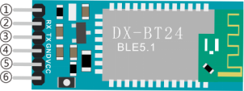
①STATE：状态脚
②RX：接收脚
③TX：发送脚
④GND：接地脚
⑤VCC：电源脚
⑥EN：使能脚
将蓝牙模块连接到开发板：
| 开发板 | BT24蓝牙模块 |
| :--: | :--: |
| TX | RX|
| RX | TX |
| VCC | 5V |
| GND(G) | GND |


3. 安装Android（或iOS）手机/平板蓝牙APP                                                   
我们设计控制4WD Raspberry Pi Pico 麦克纳姆轮智能小车的APP控件如下图所示：


当Micro:bit主板上的蓝牙模块与Android（或iOS）系统手机/平板上的蓝牙APP通过蓝牙连接好后，按下控制键，Android（或iOS）系统手机/平板上的APP通过蓝牙就会发送相应的数值。编程时，可以为控制键设置相应的值。所以在实验中，我们会对每个控制键进行测试，在串口监视器中得到相应的值。

**Android系统APP安装步骤：**

1.下载mecanum_robot.apk文件
A. 我们资料包中有提供Android apk安装包，在下图位置：

现将文件夹中的keyes arm.apk文件转移到安卓系统手机或平板电脑上。

B.或者，使用手机浏览器中的扫描功能对着二维码扫描识别或者输入网址：http://8.210.52.206/mecanum_robot.apk 进行下载，识别成功后就可以进入下载mecanum_robot.apk页面，点击“**下载**”下载mecanum_robot应用程序。


2.点击“**允许**”进入安装界面，点击“**继续安装**”就可以安装好mecanum_robot应用程序。


3.点击“**打开**”或点击手机桌面上的应用程序mecanum_robot就可以打开APP，界面如下所示：


4.先<span style="color: rgb(255, 76, 65);">开启手机/平板的蓝牙</span>，再打开App，点击APP界面右上角的按钮（控件）进行蓝牙搜索，在搜索结果中寻找“BT24”对话框，在“BT24”对话框中点击“connect”即可连接蓝牙。当对话框的“connect”变成“is connected”，说明蓝牙连接成功。
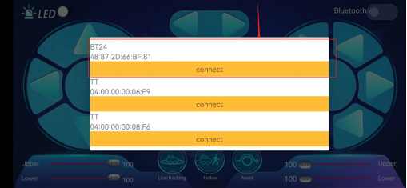

 
**IOS系统APP安装步骤：**
a.打开App Store。


b.在搜索框输入**mecanum_robot**，点击搜索，再点击“”，就可以下载mecanum_robot的蓝牙APP。。

c.下载安装完APP后，点击“**打开**”或点击手机桌面上的应用程序mecanum_robot就可以打开APP，界面如下所示：


接下来连接蓝牙，其步骤和上面的Android系统APP类似。
                                                                             

4. 实验代码：
本教程中使用的代码保存在：“**..\4. Python 教程\3. 项目课程**” 的路径中。你可以把代码移到任何地方。例如，我们将代码保存在**D盘**中，<span style="color: rgb(0, 209, 0);">路径为D:\3. 项目课程</span>。


打开“**Thonny**”软件，点击“**此电脑**”→“**D:**”→“**3. 项目课程**”→“**第11课 红外遥控智能车**”，然后鼠标左键双击“**11_IRremote_Control_Robot.py**”。


```
'''
KEYES 4WD Raspberry Pi Pico 麦克纳姆轮智能小车
第12课
APP Test
'''

from machine import Pin,UART,I2C
import mecanumCar_v2
import time

i2c = I2C(0, sda = Pin(20), scl = Pin(21), freq = 400000) #iic0 sda-->20,scl-->21
mecanumCar = mecanumCar_v2.Driver(i2c) #创建麦克纳姆轮小车驱动类实例

#设置蓝牙串口波特率为9600，8位数据位，无校验位，1位停止位，tx-->GPIO0,rx-->GPIO1
uart = UART(0,baudrate = 9600,bits = 8,parity = None,stop = 1,tx = machine.Pin(0),rx = machine.Pin(1))
buf=bytearray(6) #定义一个串口接收缓冲区


## 主循环函数
while True:
    if uart.any():
        uart.readinto(buf)
        #print(buf.decode())
        ble_val = chr(buf[0]) #打印接收到的第一个字符
        print(ble_val)
        
```
<span style="color: rgb(255, 76, 65);">上传代码之前，确保蓝牙模块已经从扩展板上拔下来，否则会导致代码上传不成功。</span>


5. 实验结果：                                                                                
确保Raspberry Pi Pico主板已经连接到电脑上，单击“”。


安上电池，将电机驱动底板上的电源拨码开关拨到ON一端，开启电源。单击“”，代码开始执行。

插上蓝牙，注意蓝牙不要插反了。打开手机APP连接好蓝牙对准蓝牙模块按下手机APP上的按钮，我们可以看到在在Shell窗口中打印APP按钮对应的控制字符，如下图。

 

6. 代码说明: 

|from machine import UART|导入UART串口模块才能使用串口功能 |
| :--: | :--: |
|uart = UART(0,baudrate = 9600,bits = 8,parity = None,stop = 1,tx = machine.Pin(0),rx = machine.Pin(1))|创建一个串口示例，设置串口为0，波特率为9600,8位数据位，一位停止位，无校验位，串口引脚为0和1 |
|buf=bytearray(6)|定义一个串口接收缓冲区，可存放6个字节|
|if uart.any():| 如果接收到数据 |
|uart.readinto(buf)|将数据读到buf中 |
|ble_val = chr(buf[0])|将buf中的第一个字节转成字符格式，赋给ble_val|
|print(ble_val)|打印ble_val这个字符|


### 第13课 蓝牙APP控制智能车
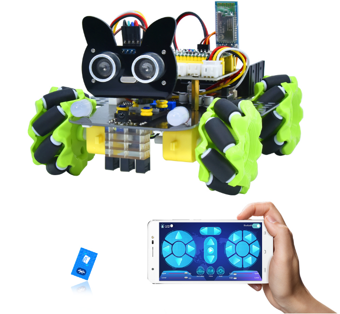


1. 实验说明：                                                                                
在上一课程中，我们已经介绍了蓝牙APP的使用和各按钮的功能，并且通过蓝牙APP连接蓝牙来读取了APP界面上各按钮发送的控制字符，在本课程中，主要是通过蓝牙APP连接蓝牙实现APP控制4WD智能车的多种功能。


2. 添加库文件：
首先我们先确保安装了库文件，不然代码会编译出错，这里我们用到库文件“<span style="color: rgb(255, 76, 65);">mecanumCar_v2.py</span>”，如何添加库文件请参考“<span style="color: rgb(0, 209, 0);">开发环境配置</span>”文件。如果库文件已经添加好了，就跳过这一步骤。


3. 实验代码：
本教程中使用的代码保存在：“**..\4. Python 教程\3. 项目课程**” 的路径中。你可以把代码移到任何地方。例如，我们将代码保存在**D盘**中，<span style="color: rgb(0, 209, 0);">路径为D:\3. 项目课程</span>。


打开“**Thonny**”软件，点击“**此电脑**”→“**D:**”→“**3. 项目课程**”→“**第13课 蓝牙APP控制智能车**”，然后鼠标左键双击“**11_IRremote_Control_Robot.py**”。


```
'''
KEYES 4WD Raspberry Pi Pico 麦克纳姆轮智能小车
第13课
APP 控制智能车
'''

from machine import Pin,UART,I2C
import mecanumCar_v2
import time

i2c = I2C(0, sda = Pin(20), scl = Pin(21), freq = 400000) #iic0 sda-->20,scl-->21
#print("STC8G1K08 address：", machine.I2C.scan(i2c))
mecanumCar = mecanumCar_v2.Driver(i2c) #创建麦克纳姆轮小车驱动类实例

#设置蓝牙串口波特率为9600，8位数据位，无校验位，1位停止位，tx-->GPIO0,rx-->GPIO1
uart = UART(0,baudrate = 9600,bits = 8,parity = None,stop = 1,tx = machine.Pin(0),rx = machine.Pin(1))
buf=bytearray(6) #定义一个串口接收缓冲区


l_pin = Pin(16, Pin.IN)
m_pin = Pin(17, Pin.IN)
r_pin = Pin(18, Pin.IN)


def map(value, fromLow, fromHigh, toLow, toHigh):
    return (toHigh-toLow)*(value-fromLow) // (fromHigh-fromLow) + toLow


## 循迹
def Line_Tracking():
    while True:
        l_val = l_pin.value()
        m_val = m_pin.value()
        r_val = r_pin.value()
        if m_val == 1:
            if l_val == 1 and r_val == 0:
                mecanumCar.Turn_Left()
            elif l_val == 0 and r_val == 1:
                mecanumCar.Turn_Right()
            else:
                mecanumCar.Advance()
        else:
            if l_val == 1 and r_val == 0:
                mecanumCar.Turn_Left()
            elif l_val == 0 and r_val == 1:
                mecanumCar.Turn_Right()
            else:
                mecanumCar.stop()
        if uart.any():
            uart.readinto(buf)
            ble_val = chr(buf[0])
            if ble_val == 's':
                mecanumCar.stop()
                break

## 超声波跟随
def ult_following():
    while True:
        distance = mecanumCar.get_distance()
        if distance <= 15:
            mecanumCar.Back()
        elif distance <= 25:
            mecanumCar.stop()
        elif distance <= 45:
            mecanumCar.Advance()
        else:
            mecanumCar.stop()
        if uart.any():
            uart.readinto(buf)
            ble_val = chr(buf[0])
            if ble_val == 's':
                mecanumCar.stop()
                break


## 超声波避障
def ult_avoiding():
    while True:
        distance = mecanumCar.get_distance()
        if distance <= 15:
            mecanumCar.stop()
            time.sleep(0.5)
            mecanumCar.set_angle(180)
            time.sleep(0.5)
            l_distance = mecanumCar.get_distance()
            time.sleep(0.1)
            mecanumCar.set_angle(0)
            time.sleep(0.5)
            r_distance = mecanumCar.get_distance()
            time.sleep(0.1)
            mecanumCar.set_angle(90)
            time.sleep(0.5)
            if l_distance > r_distance:
                mecanumCar.Turn_Left()
                time.sleep(0.3)
            else:
                mecanumCar.Turn_Right()
                time.sleep(0.3)
        else:
            mecanumCar.Advance()
        
        if uart.any():
            uart.readinto(buf)
            ble_val = chr(buf[0])
            if ble_val == 's':
                mecanumCar.stop()
                break

## 2812灯珠显示
color_num = 0
def showColor():
    global color_num
    if color_num > 6:
        color_num = 0
    if color_num < 0:
        color_num = 6
    if color_num == 0:
        mecanumCar.pixels_fill((255, 0, 0))
        #mecanumCar.pixels_show()
    elif color_num == 1:
        mecanumCar.pixels_fill((255, 80, 0))
        #mecanumCar.pixels_show()
    elif color_num == 2:
        mecanumCar.pixels_fill((255, 255, 0))
        #mecanumCar.pixels_show()
    elif color_num == 3:
        mecanumCar.pixels_fill((0, 255, 0))
        #mecanumCar.pixels_show()
    elif color_num == 4:
        mecanumCar.pixels_fill((0, 0, 255))
        #mecanumCar.pixels_show()
    elif color_num == 5:
        mecanumCar.pixels_fill((0, 255, 255))
        #mecanumCar.pixels_show()
    elif color_num == 6:
        mecanumCar.pixels_fill((160, 32, 240))
        #mecanumCar.pixels_show()
    mecanumCar.pixels_show()


mecanumCar.set_angle(90) #初始舵机角度为90度
time.sleep(1)
## 主循环函数
while True:
    if uart.any(): #判断串口接收是否有数据
        uart.readinto(buf)
        #print(buf.decode())
        ble_val = chr(buf[0])
        print(ble_val)
        if ble_val == 's':
            mecanumCar.stop()
        elif ble_val == 'a':
            mecanumCar.Advance()
        elif ble_val == 'c':
            mecanumCar.Back()
        elif ble_val == 'd':
            mecanumCar.Turn_Right()
        elif ble_val == 'b':
            mecanumCar.Turn_Left()
        elif ble_val == 'k':
            mecanumCar.L_Move()
        elif ble_val == 'h':
            mecanumCar.R_Move()
        elif ble_val == 'l':
            mecanumCar.LU_Move()
        elif ble_val == 'j':
            mecanumCar.LD_Move()
        elif ble_val == 'g':
            mecanumCar.RU_Move()
        elif ble_val == 'i':
            mecanumCar.RD_Move()
        elif ble_val == 'e':
            mecanumCar.drift_left()
        elif ble_val == 'f':
            mecanumCar.drift_right()
        elif ble_val == 't':
            mecanumCar.left_led(1)
            mecanumCar.right_led(1)
        elif ble_val == 'u':
            mecanumCar.left_led(0)
            mecanumCar.right_led(0)
        elif ble_val == 'p':
            Line_Tracking()
        elif ble_val == 'q':
            ult_following()
        elif ble_val == 'r':
            ult_avoiding()
        elif ble_val == 'm':
            color_num += 1
            showColor()
        elif ble_val == 'n':
            color_num -= 1
            showColor()
        elif ble_val == 'o':
            mecanumCar.pixels_fill((0, 0, 0))
            mecanumCar.pixels_show()   
        
        #  下面是速度调节，稍微复杂一点，格式分两次发送 例如为：
        #  v#
        #  50#
        #  所以我们需要先读第一个字符，第二次再读数值

        elif ble_val == 'v': #第一次读到v，是左前方电机
            speed_temp = 0
            flag = 1
            while flag == 1:
                if uart.any(): #再次判断是否有数据
                    uart.readinto(buf) #再次读取到buf
                    for i in buf:
                        if chr(i) == '#': #遇到'#'停止读取
                            flag = 0
                            break
                        else:
                            speed_temp = speed_temp * 10 + (i-48)  #将数字字符转为整数
                    speed_temp = map(speed_temp, 0, 100, 0, 255) #将数值从0~100映射到0~255
                    #print("speed_Upper_L = ", speed_temp) #调试输出
                    mecanumCar.set_speed(speed_Upper_L = speed_temp) #更新左前方电机速度
        
        elif ble_val == 'x':
            speed_temp = 0
            flag = 1
            while flag == 1:
                if uart.any():
                    uart.readinto(buf)
                    for i in buf:
                        if chr(i) == '#':
                            flag = 0
                            break
                        else:
                            speed_temp = speed_temp * 10 + (i-48)
                    speed_temp = map(speed_temp, 0, 100, 0, 255)
                    #print("speed_Upper_R = ", speed_temp)
                    mecanumCar.set_speed(speed_Upper_R = speed_temp)
                
        elif ble_val == 'w':
            speed_temp = 0
            flag = 1
            while flag == 1:
                if uart.any():
                    uart.readinto(buf)
                    for i in buf:
                        if chr(i) == '#':
                            flag = 0
                            break
                        else:
                            speed_temp = speed_temp * 10 + (i-48)
                    speed_temp = map(speed_temp, 0, 100, 0, 255)
                    #print("speed_Lower_L = ", speed_temp)
                    mecanumCar.set_speed(speed_Lower_L = speed_temp)
        
        elif ble_val == 'y':
            speed_temp = 0
            flag = 1
            while flag == 1:
                if uart.any():
                    uart.readinto(buf)
                    for i in buf:
                        if chr(i) == '#':
                            flag = 0
                            break
                        else:
                            speed_temp = speed_temp * 10 + (i-48)
                    speed_temp = map(speed_temp, 0, 100, 0, 255)
                    #print("speed_Lower_R = ", speed_temp)
                    mecanumCar.set_speed(speed_Lower_R = speed_temp)
                    
```
<span style="color: rgb(255, 76, 65);">上传代码之前，确保蓝牙模块已经从扩展板上拔下来，否则会导致代码上传不成功。</span>


5. 实验结果：                                                                                
确保Raspberry Pi Pico主板已经连接到电脑上，单击“”。


安上电池，将电机驱动底板上的电源拨码开关拨到ON一端，开启电源。单击“”，代码开始执行。

插上蓝牙，注意蓝牙不要插反了。就可以使用手机APP来控制如下玩法。（<span style="color: rgb(255, 76, 65);">有关APP具体的下载安装方法及使用方法，请参考**第12课 读取蓝牙数据** </span>）
<span style="color: rgb(255, 76, 65);">注意：</span>当我们断电后重新上电不会继续运行此代码，除非我们把代码以<span style="color: rgb(255, 76, 65);">**main\.py**</span>命名保存在Raspberry Pi Pico主板上！
（1）点击开启七彩灯，再次点击这个按钮七彩灯就会关闭。
（2）点击会进入循迹模式，当想退出该模式时，再次点击该按钮。
（3）点击会进入跟随模式、当想退出该模式时，再次点击该按钮。
（4）点击会进入避障模式，当想退出该模式时，再次点击该按钮。
（5）拉动这两个条幅回改变左边两个电机的速度，右边也是相同的操作方法。
（6）这几个按钮是用来切换底板下面4个2812灯珠颜色的，中间按钮为关闭功能。
（7）剩下其他的按钮全都是用来操控小车行驶的，跟其他按钮不同的是，这些按钮当我们按下时小车行驶，松开按钮时小车停止。


<span style="color: rgb(255, 76, 65);">注意：</span>是用来进行调速的，当进行调速时，应该拖动拉条；不能点击，如果点击的话可能调速不成功。


6. 代码说明:
|from machine import UART|导入UART串口模块才能使用串口功能 |
| :--: | :--: |
|uart = UART(0,baudrate = 9600,bits = 8,parity = None,stop = 1,tx = machine.Pin(0),rx = machine.Pin(1))|创建一个串口示例，设置串口为0，波特率为9600,8位数据位，一位停止位，无校验位，串口引脚为0和1 |
|buf=bytearray(6)|定义一个串口接收缓冲区，可存放6个字节|
|if uart.any():| 如果接收到数据 |
|uart.readinto(buf)|将数据读到buf中 |
|ble_val = chr(buf[0])|将buf中的第一个字节转成字符格式，赋给ble_val|
|print(ble_val)|打印ble_val这个字符|
|def map(value, fromLow, fromHigh, toLow, toHigh):|定义一个映射函数，用来将APP上的0 ~ 100映射到0 ~ 255的范围|
|mecanumCar.set_speed(speed_Upper_L = speed_temp)|电机速度设置函数，可分别设置4个参数：speed_Upper_L，speed_Lower_L，speed_Upper_R，speed_Lower_R|


