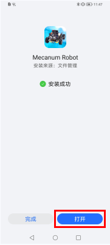

# APP

## Android 系统 APP

1.下载mecanum_robot.apk文件
A. 我们资料包中有提供Android apk安装包，在下图位置：

现将文件夹中的keyes arm.apk文件转移到安卓系统手机或平板电脑上。

B.或者，使用手机浏览器中的扫描功能对着二维码扫描识别或者输入网址：http://8.210.52.206/mecanum_robot.apk 进行下载，识别成功后就可以进入下载mecanum_robot.apk页面，点击“**下载**”下载mecanum_robot应用程序。

2.点击“**允许**”进入安装界面，点击“**继续安装”**就可以安装好mecanum_robot应用程序。

3.点击“**打开**”或点击手机桌面上的应用程序mecanum_robot就可以打开APP，界面如下所示：

4.先开启手机/平板的蓝牙，再打开App，点击APP界面右上角的按钮（控件）进行蓝牙搜索，在搜索结果中寻找“BT24”对话框，在“BT24”对话框中点击“connect”即可连接蓝牙。当对话框的“connect”变成“is connected”，说明蓝牙连接成功。

## MacOS  系统 APP

a.打开App Store。

b.在搜索框输入**mecanum_robot**，点击搜索，再点击“”，就可以下载mecanum_robot的蓝牙APP。

c.下载安装完APP后，点击“**打开**”或点击手机桌面上的应用程序mecanum_robot就可以打开APP，界面如下所示：

d.先开启手机/平板的蓝牙，再打开App，点击APP界面右上角的按钮（控件）进行蓝牙搜索，在搜索结果中寻找“BT24”对话框，在“BT24”对话框中点击“connect”即可连接蓝牙。当对话框的“connect”变成“is connected”，说明蓝牙连接成功。

